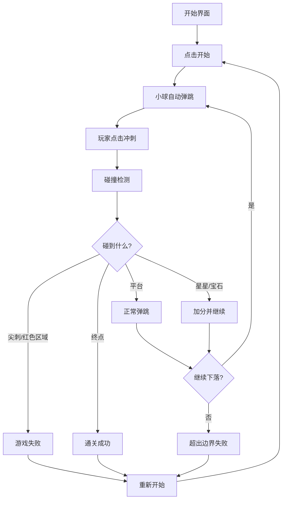

## 1. 产品概述

硬核弹跳球闯关游戏，玩家控制小球在平台间不断弹跳，通过点击屏幕触发向下冲刺加速，巧妙穿过平台缝隙和障碍物，避开尖刺和危险区域，收集星星和宝石获得高分，最终到达底部终点完成通关。

- 核心玩法：弹跳+冲刺+躲避+收集
- 目标用户：喜欢挑战类、休闲益智游戏的玩家
- 产品价值：提供紧张刺激的闯关体验，考验玩家的反应能力和操作技巧

## 2. 核心功能

### 2.1 用户角色

| 角色 | 注册方式 | 核心权限 |
|------|----------|----------|
| 玩家 | 无需注册 | 开始游戏、控制小球、查看分数、重新开始 |

### 2.2 功能模块

1. **游戏主界面**：游戏画布、分数显示、操作提示
2. **游戏核心系统**：小球物理引擎、碰撞检测、关卡生成
3. **交互控制系统**：点击冲刺加速、自动弹跳
4. **元素系统**：平台、尖刺、星星、宝石、终点
5. **状态管理**：开始、游戏中、通关、失败

### 2.3 页面详情

| 页面名称 | 模块名称 | 功能描述 |
|----------|----------|----------|
| 游戏主页面 | 游戏画布 | Canvas渲染游戏场景，包含所有游戏元素 |
| 游戏主页面 | HUD信息栏 | 显示当前分数、收集的星星和宝石数量 |
| 游戏主页面 | 开始界面 | 游戏标题、开始按钮、操作说明 |
| 游戏主页面 | 通关界面 | 显示通关信息、最终得分、重新开始按钮 |
| 游戏主页面 | 失败界面 | 显示失败信息、当前得分、重新开始按钮 |

## 3. 核心流程

玩家进入游戏 → 点击开始按钮 → 小球自动在平台间弹跳 → 玩家点击屏幕触发冲刺加速 → 小球穿过平台缝隙 → 收集星星和宝石得分 → 避开尖刺和危险区域 → 到达底部终点通关 / 碰到危险区域失败 → 点击重新开始从关卡起点重新游戏

## 4. 用户界面设计

### 4.1 设计风格

- **主色调**：深蓝色夜空背景 (#0f172a) 搭配霓虹色调
- **辅助色**：
  - 小球：青色渐变 (#06b6d4 → #22d3ee)
  - 平台：蓝紫色 (#3b82f6 → #8b5cf6)
  - 尖刺/危险区域：红色渐变 (#ef4444 → #dc2626)
  - 星星：金黄色 (#fbbf24 → #f59e0b)
  - 宝石：紫色/绿色渐变 (#a855f7 → #10b981)
  - 终点：彩虹渐变色
- **按钮风格**：圆角胶囊形，带发光效果，悬停时有缩放动画
- **字体**：使用 'Press Start 2P' 像素风字体搭配 'Orbitron' 现代科技感字体
- **布局风格**：全屏游戏画布，顶部HUD信息栏，居中弹出式状态界面
- **视觉效果**：粒子特效、发光效果、拖尾效果、屏幕震动

### 4.2 页面设计概述

| 页面名称 | 模块名称 | UI元素 |
|----------|----------|--------|
| 游戏主页面 | 游戏画布 | 深蓝色渐变背景，动态星星粒子，小球拖尾效果 |
| 游戏主页面 | HUD信息栏 | 半透明深色背景，发光文字，图标+分数组合 |
| 游戏主页面 | 开始界面 | 大标题发光动画，按钮脉冲效果，操作说明卡片 |
| 游戏主页面 | 通关界面 | 彩虹色标题，烟花粒子特效，统计信息展示 |
| 游戏主页面 | 失败界面 | 红色警告效果，震动动画，重试按钮 |

### 4.3 响应性

- 桌面端优先设计，自适应各种屏幕尺寸
- 支持鼠标点击和触摸操作
- 游戏画布按比例缩放，保持16:9的游戏区域
- 移动端优化触摸区域大小

### 4.4 动画与特效

- 小球弹跳时的挤压形变动画
- 冲刺时的速度线和拖尾效果
- 收集星星宝石的粒子爆炸效果
- 失败时的屏幕红闪和震动
- 通关时的烟花和彩带效果
- 平台的悬浮微动效果
