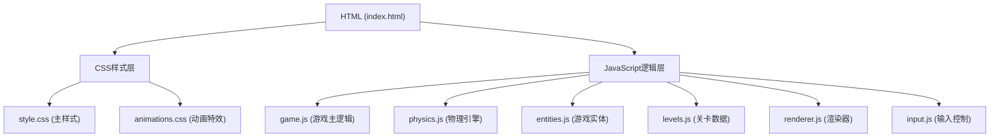

## 1. 架构设计



## 2. 技术描述

- **前端技术栈**：原生 HTML5 + CSS3 + Vanilla JavaScript (ES6+)
- **渲染引擎**：HTML5 Canvas 2D API
- **物理系统**：自研轻量级物理引擎（重力、弹跳、碰撞检测）
- **动画系统**：CSS3 Animations + Canvas requestAnimationFrame
- **无需后端**：纯前端游戏，数据存储在浏览器内存中

**目录结构**：
```
弹跳球闯关/
├── index.html          # 主HTML文件
├── css/                # CSS样式目录
│   ├── style.css       # 主样式文件
│   └── animations.css  # 动画特效样式
├── js/                 # JavaScript逻辑目录
│   ├── game.js         # 游戏主控制器
│   ├── physics.js      # 物理引擎与碰撞检测
│   ├── entities.js     # 游戏实体类定义
│   ├── levels.js       # 关卡数据配置
│   ├── renderer.js     # Canvas渲染器
│   └── input.js        # 输入事件处理
└── .trae/documents/    # 项目文档
```

## 3. 文件职责定义

| 文件 | 职责 | 核心功能 |
|------|------|----------|
| index.html | 页面结构 | Canvas画布、UI层元素、资源引入 |
| css/style.css | 全局样式 | 布局、HUD、按钮、弹窗样式 |
| css/animations.css | 动画特效 | 发光、脉冲、弹跳、震动等动画 |
| js/game.js | 游戏主控 | 游戏循环、状态管理、流程控制 |
| js/physics.js | 物理系统 | 重力计算、速度更新、碰撞检测 |
| js/entities.js | 实体定义 | Ball、Platform、Spike、Star、Gem、Goal类 |
| js/levels.js | 关卡数据 | 多关卡平台布局、障碍物位置、收集品分布 |
| js/renderer.js | 渲染系统 | Canvas绘制、渐变、粒子特效、拖尾效果 |
| js/input.js | 输入控制 | 鼠标点击、触摸事件、键盘事件处理 |

## 4. 核心数据结构

### 4.1 游戏实体基类
```javascript
class Entity {
  x: number;           // X坐标
  y: number;           // Y坐标
  width: number;       // 宽度
  height: number;      // 高度
  type: string;        // 实体类型
  active: boolean;     // 是否激活
}
```

### 4.2 小球类
```javascript
class Ball extends Entity {
  vx: number;          // X方向速度
  vy: number;          // Y方向速度
  radius: number;      // 半径
  isDashing: boolean;  // 是否在冲刺
  dashCooldown: number;// 冲刺冷却
  trail: Array;        // 拖尾粒子数组
  squash: number;      // 弹跳挤压形变
}
```

### 4.3 游戏状态
```javascript
const GameState = {
  MENU: 'menu',        // 主菜单
  PLAYING: 'playing',  // 游戏中
  WIN: 'win',          // 通关
  FAIL: 'fail'         // 失败
};
```

### 4.4 关卡数据结构
```javascript
interface Level {
  id: number;
  name: string;
  platforms: Array<{x, y, width, height, hasSpike, spikeSide}>;
  stars: Array<{x, y}>;
  gems: Array<{x, y, color}>;
  goal: {x, y, width, height};
  startPos: {x, y};
}
```

## 5. 核心算法

### 5.1 碰撞检测算法 (AABB + 圆形)
```javascript
// 矩形与圆形碰撞检测
function circleRectCollision(circle, rect) {
  const closestX = Math.max(rect.x, Math.min(circle.x, rect.x + rect.width));
  const closestY = Math.max(rect.y, Math.min(circle.y, rect.y + rect.height));
  const distanceX = circle.x - closestX;
  const distanceY = circle.y - closestY;
  return (distanceX * distanceX + distanceY * distanceY) < (circle.radius * circle.radius);
}
```

### 5.2 物理更新循环
```javascript
function updatePhysics(dt) {
  // 应用重力
  ball.vy += GRAVITY * dt;
  
  // 限制最大下落速度
  ball.vy = Math.min(ball.vy, MAX_FALL_SPEED);
  
  // 更新位置
  ball.x += ball.vx * dt;
  ball.y += ball.vy * dt;
  
  // 碰撞检测与响应
  handleCollisions();
}
```

### 5.3 冲刺加速机制
```javascript
function dash() {
  if (!ball.isDashing && ball.dashCooldown <= 0) {
    ball.isDashing = true;
    ball.vy = DASH_SPEED;  // 瞬间向下加速
    ball.dashCooldown = DASH_COOLDOWN_TIME;
    createDashParticles();  // 创建冲刺特效
  }
}
```

## 6. 性能优化

1. **对象池模式**：粒子特效使用对象池，避免频繁创建销毁
2. **分层渲染**：背景层、游戏层、特效层、UI层分离
3. **视口裁剪**：只渲染可视区域内的实体
4. **requestAnimationFrame**：使用浏览器原生帧率控制
5. **离屏Canvas**：静态背景预渲染到离屏Canvas
6. **时间步长**：使用固定时间步长更新物理，确保跨设备一致性
