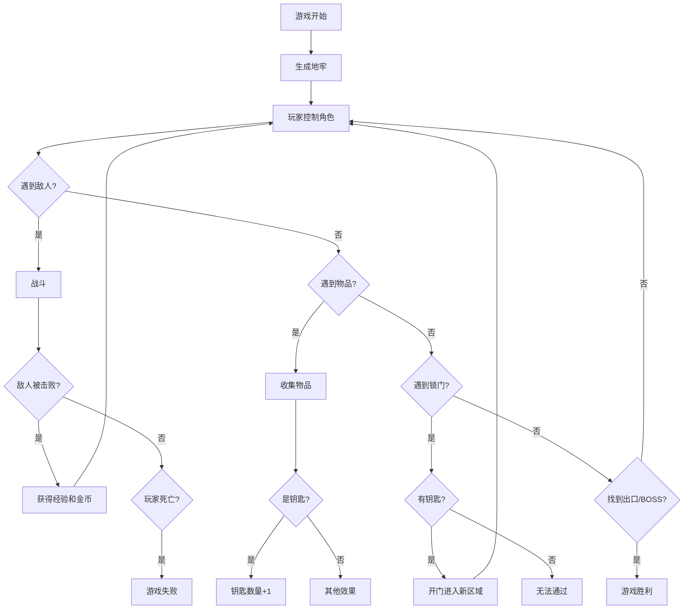

## 1. 产品概述

地牢迷宫冒险是一款俯视视角的2D网页游戏，玩家控制角色在由房间和走廊组成的地牢中探索，击败敌人收集宝藏，寻找出口或挑战BOSS以完成通关。

- 主要目的：提供经典地牢探险体验，融合战斗、收集、探索等元素
- 目标用户：休闲游戏玩家，经典RPG爱好者
- 产品价值：纯前端实现，无需下载，即开即玩的高品质网页游戏

## 2. 核心功能

### 2.1 用户角色

| 角色 | 注册方式 | 核心权限 |
|------|----------|----------|
| 玩家 | 无需注册 | 进行游戏，体验所有游戏功能 |

### 2.2 功能模块

1. **游戏主界面**：地牢地图渲染、角色显示、敌人显示、物品显示
2. **角色控制系统**：方向键移动、近战攻击
3. **战斗系统**：玩家攻击敌人、敌人AI、伤害计算、经验金币获取
4. **物品系统**：钥匙收集、门解锁
5. **状态系统**：血条、魔法值、等级、金币显示
6. **关卡系统**：地牢生成、出口/BOSS通关条件

### 2.3 页面详情

| 页面名称 | 模块名称 | 功能描述 |
|----------|----------|----------|
| 游戏开始页 | 开始界面 | 游戏标题、开始按钮、操作说明 |
| 游戏主界面 | 游戏画布 | 渲染地牢地图、角色、敌人、物品 |
| 游戏主界面 | HUD状态栏 | 显示血条、魔法值、等级、经验、金币、钥匙数量 |
| 游戏主界面 | 控制面板 | 移动端虚拟方向键、攻击按钮 |
| 游戏结束页 | 结算界面 | 显示游戏结果、得分、重新开始按钮 |

## 3. 核心流程

玩家打开游戏 → 点击开始按钮 → 进入地牢 → 使用方向键移动探索 → 遇到敌人进行战斗 → 收集钥匙和金币 → 找到钥匙打开锁门 → 探索新区域 → 找到出口或击败BOSS → 游戏胜利

## 4. 用户界面设计

### 4.1 设计风格

- **主色调**：深紫色(#1a0a2e)作为地牢背景，金色(#ffd700)作为强调色，血红色(#dc143c)表示生命值
- **辅助色**：深蓝色(#1e3a5f)表示魔法值，绿色(#228b22)表示经验值
- **按钮风格**：复古像素风格，带有轻微3D凸起效果，圆角4px
- **字体**：使用Press Start 2P像素字体，营造复古游戏氛围
- **布局风格**：固定分辨率游戏画布居中显示，HUD信息环绕画布
- **图标风格**：像素艺术风格，使用emoji和CSS绘制游戏元素

### 4.2 页面设计概述

| 页面名称 | 模块名称 | UI元素 |
|----------|----------|--------|
| 开始界面 | 标题区域 | 大号像素字体标题、闪烁动画、地牢背景图案 |
| 开始界面 | 按钮区域 | 开始游戏按钮、操作说明文字 |
| 游戏主界面 | 画布区域 | 居中的游戏地图，20x15网格，每个格子32px |
| 游戏主界面 | 顶部HUD | 血条、魔法条、等级数字 |
| 游戏主界面 | 底部HUD | 金币数量、钥匙数量、经验条 |
| 游戏主界面 | 控制区域 | 虚拟方向键(移动端)、攻击按钮 |
| 结算界面 | 结果展示 | 胜利/失败文字、最终得分、统计数据 |
| 结算界面 | 操作按钮 | 重新开始、返回主菜单 |

### 4.3 响应式设计

- 桌面优先设计，游戏画布固定尺寸
- 移动端适配：自动缩放画布，添加虚拟按键
- 支持触摸屏操作：点击移动，滑动攻击
- 窗口大小变化时保持游戏居中

### 4.4 视觉效果

- **地牢氛围**：昏暗的背景，火把光照效果，墙壁纹理
- **动画效果**：角色移动动画、攻击挥砍动画、敌人受伤闪烁、金币收集特效
- **粒子效果**：击败敌人时的爆炸粒子、升级时的光环效果
- **音效提示**：攻击声、受伤声、收集物品声、开门声(可选)
