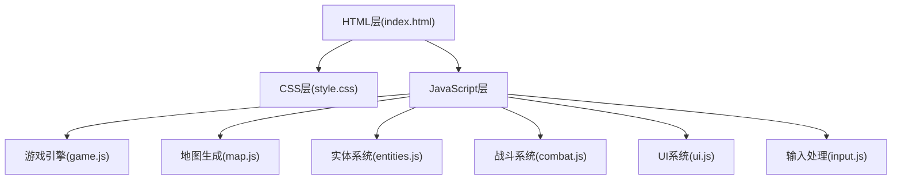

## 1. 架构设计



## 2. 技术描述

- **前端技术栈**：纯HTML5 + CSS3 + 原生JavaScript (ES6+)
- **渲染方式**：HTML5 Canvas 2D API
- **目录结构**：
  - `index.html` - 主页面文件
  - `css/style.css` - 样式文件
  - `js/game.js` - 游戏主逻辑
  - `js/map.js` - 地图生成
  - `js/entities.js` - 玩家/敌人/物品实体
  - `js/combat.js` - 战斗系统
  - `js/ui.js` - 用户界面
  - `js/input.js` - 输入处理
- **初始化工具**：无，纯原生实现，无需npm依赖
- **后端**：无，纯前端游戏
- **数据库**：无，使用localStorage保存游戏进度(可选)

## 3. 目录结构定义

| 路径 | 用途 |
|------|------|
| `/index.html` | 游戏主HTML文件，包含canvas和UI元素 |
| `/css/` | 样式文件目录 |
| `/css/style.css` | 主样式文件 |
| `/js/` | JavaScript文件目录 |
| `/js/game.js` | 游戏主循环和状态管理 |
| `/js/map.js` | 地牢地图生成算法 |
| `/js/entities.js` | 玩家、敌人、物品类定义 |
| `/js/combat.js` | 战斗计算和伤害系统 |
| `/js/ui.js` | HUD显示和界面更新 |
| `/js/input.js` | 键盘和触摸输入处理 |
| `/assets/` | 资源目录(可选，如音效) |

## 4. 核心数据结构

### 4.1 游戏状态

```javascript
const GameState = {
  MENU: 'menu',
  PLAYING: 'playing',
  PAUSED: 'paused',
  VICTORY: 'victory',
  DEFEAT: 'defeat'
};
```

### 4.2 玩家数据

```javascript
class Player {
  x: number;           // X坐标
  y: number;           // Y坐标
  hp: number;          // 生命值
  maxHp: number;       // 最大生命值
  mp: number;          // 魔法值
  maxMp: number;       // 最大魔法值
  level: number;       // 等级
  exp: number;         // 经验值
  expToLevel: number;  // 升级所需经验
  gold: number;        // 金币
  keys: number;        // 钥匙数量
  attack: number;      // 攻击力
  defense: number;     // 防御力
  direction: string;   // 朝向: up/down/left/right
  isAttacking: boolean;// 是否在攻击
}
```

### 4.3 敌人数据

```javascript
class Enemy {
  x: number;
  y: number;
  type: 'skeleton' | 'slime' | 'bat' | 'boss';
  hp: number;
  maxHp: number;
  attack: number;
  exp: number;
  gold: number;
  speed: number;
}
```

### 4.4 地图瓦片类型

```javascript
const TileType = {
  WALL: 0,
  FLOOR: 1,
  DOOR_LOCKED: 2,
  DOOR_OPEN: 3,
  EXIT: 4,
  CHEST: 5
};
```

## 5. 核心算法

### 5.1 地牢生成算法

- 使用随机房间生成算法
- 房间之间用走廊连接
- 确保地图连通性
- 放置敌人、钥匙、物品

### 5.2 寻路算法

- 敌人使用简单的追踪AI
- 玩家在视野范围内时敌人追击
- 使用曼哈顿距离计算移动方向

### 5.3 碰撞检测

- 基于网格的碰撞检测
- 检查目标位置是否可通行
- 处理门和钥匙的逻辑

## 6. 性能优化

- 使用requestAnimationFrame实现流畅动画
- 只渲染可见区域
- 实体对象池复用
- 事件委托处理输入
