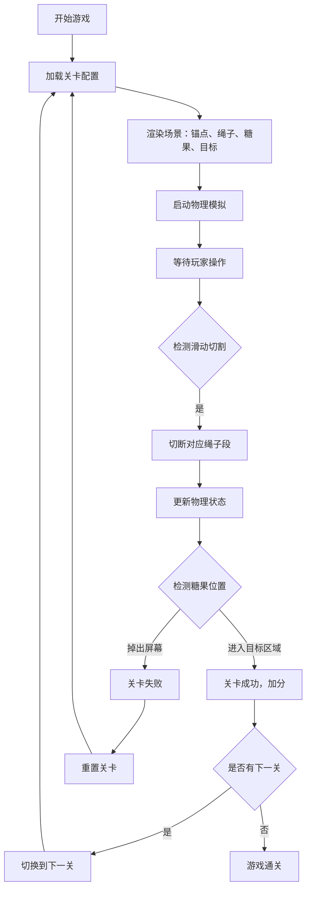

## 1. 产品概述

切绳子是一款经典的物理益智游戏，玩家通过切断悬挂物体的绳子，利用物理重力和摆动规律，将糖果引导到小怪物的嘴里。游戏考验玩家的空间想象力和物理预判能力。

- **主要目的**：提供休闲益智娱乐，锻炼玩家的物理思维和策略规划能力
- **目标用户**：全年龄段休闲游戏爱好者，尤其适合儿童和家庭用户
- **产品价值**：寓教于乐，在游戏中学习物理规律，体验解决难题的成就感

## 2. 核心功能

### 2.1 用户角色

| 角色 | 注册方式 | 核心权限 |
|------|----------|----------|
| 普通玩家 | 无需注册 | 开始游戏、选择关卡、切断绳子、查看得分 |

### 2.2 功能模块

1. **游戏主界面**：游戏画布、关卡信息、得分显示、操作按钮
2. **物理引擎系统**：绳子模拟、重力系统、碰撞检测、物体运动
3. **关卡系统**：多关卡设计、不同绳子布局、难度递进
4. **交互系统**：鼠标/触摸滑动切断绳子、游戏重置、关卡切换

### 2.3 页面详情

| 页面名称 | 模块名称 | 功能描述 |
|---------|----------|----------|
| 游戏主页面 | 游戏画布 | 渲染绳子、糖果、锚点、小怪物目标区域，实时物理模拟 |
| 游戏主页面 | 信息栏 | 显示当前关卡编号、累计得分、重置按钮、下一关按钮 |
| 游戏主页面 | 交互控制 | 鼠标/触摸滑动检测绳子切割，响应游戏状态变化 |

## 3. 核心流程

玩家滑动鼠标或手指划过绳子时，系统检测切割点并切断对应绳子段，糖果在重力作用下自由摆动或掉落，玩家需要预判轨迹将糖果送入目标区域。

## 4. 用户界面设计

### 4.1 设计风格

- **主色调**：温暖明亮的糖果色，使用橙色(#FF6B35)作为主色，天蓝色(#4ECDC4)作为辅助色，营造轻松愉悦的游戏氛围
- **按钮风格**：圆润3D按钮，带有微妙的阴影和悬停动画效果
- **字体**：使用圆润可爱的字体 "Baloo 2" 搭配 "Comic Neue"，适合休闲益智游戏风格
- **布局风格**：居中游戏画布，顶部信息栏简洁明了，游戏元素居中展示
- **视觉效果**：绳子采用渐变色，糖果带有光泽效果，切割时产生粒子特效

### 4.2 页面设计概述

| 页面名称 | 模块名称 | UI元素 |
|---------|----------|--------|
| 游戏主页面 | 信息栏 | 关卡标签、得分数字、功能按钮、渐变背景 |
| 游戏主页面 | 游戏画布 | 棕色木质纹理背景、发光锚点、渐变绳索、彩色糖果、可爱小怪物目标 |
| 游戏主页面 | 状态提示 | 成功/失败弹窗、动画过渡效果、粒子特效 |

### 4.3 响应式设计

- **桌面优先**：主要针对桌面浏览器优化，Canvas画布自适应窗口大小
- **移动端适配**：支持触摸事件，按钮尺寸适合手指点击，布局自动适配屏幕
- **触摸优化**：增大滑动检测区域，提高切割检测的精准度和响应速度

### 4.4 视觉特效

- **环境氛围**：木质纹理背景搭配柔和的径向渐变光照，营造温馨的游戏场景
- **动画效果**：糖果摆动时的弹性效果、绳子切断时的粒子飞溅、成功时的庆祝动画
- **交互反馈**：鼠标悬停按钮的缩放效果、切割时的视觉反馈
