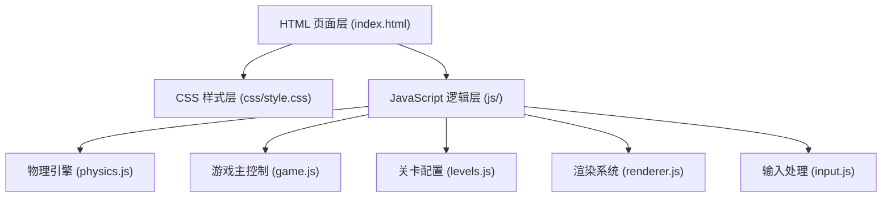

## 1. 架构设计



项目采用纯前端HTML5 Canvas实现，无需后端服务。代码按功能模块分离，便于维护和扩展。

## 2. 技术描述

- **前端技术栈**：原生 HTML5 + CSS3 + JavaScript (ES6+)，无需任何框架依赖
- **图形渲染**：HTML5 Canvas 2D API，实现高性能游戏画面渲染
- **物理引擎**：自研Verlet积分物理系统，模拟绳子弹性和刚体运动
- **构建工具**：无，纯静态文件，直接在浏览器运行
- **第三方依赖**：Google Fonts 在线字体（Baloo 2, Comic Neue）

## 3. 目录结构

| 路径 | 用途 |
|------|------|
| `/index.html` | 游戏主页面，包含Canvas和UI元素 |
| `/css/style.css` | 游戏样式文件，包含布局、动画、响应式设计 |
| `/js/physics.js` | 物理引擎模块，实现Verlet积分、约束求解 |
| `/js/game.js` | 游戏主控制器，管理游戏状态、关卡切换、得分系统 |
| `/js/levels.js` | 关卡配置数据，定义各关锚点、绳子布局、目标位置 |
| `/js/renderer.js` | 渲染模块，负责绘制绳子、糖果、锚点、目标等元素 |
| `/js/input.js` | 输入处理模块，处理鼠标和触摸事件，检测绳子切割 |
| `/assets/` | 资源目录（可选，存放图片等静态资源） |

## 4. 核心数据结构

### 4.1 物理系统数据结构

```javascript
// 质点（Verlet积分）
interface Point {
    x: number;          // 当前x坐标
    y: number;          // 当前y坐标
    oldX: number;       // 上一帧x坐标
    oldY: number;       // 上一帧y坐标
    pinned: boolean;    // 是否固定（锚点）
    mass: number;       // 质量
}

// 约束（绳子段）
interface Constraint {
    p1: Point;          // 连接的质点1
    p2: Point;          // 连接的质点2
    length: number;     // 原长
    stiffness: number;  // 刚度
    cut: boolean;       // 是否已切断
}

// 绳子
interface Rope {
    points: Point[];    // 质点列表
    constraints: Constraint[];  // 约束列表
    color: string;      // 绳子颜色
}
```

### 4.2 关卡数据结构

```javascript
interface Level {
    id: number;                 // 关卡编号
    name: string;               // 关卡名称
    anchors: {x: number, y: number}[];  // 锚点位置（相对坐标0-1）
    ropes: {anchorIndex: number, segments: number, length: number}[];  // 绳子配置
    candy: {x: number, y: number, radius: number};  // 糖果初始位置
    target: {x: number, y: number, radius: number}; // 目标区域
    score: number;              // 通关得分
}
```

## 5. 核心算法

### 5.1 Verlet 积分物理模拟

- 使用位置积分而非速度积分，更稳定且适合绳子模拟
- 每帧更新：`newX = 2*currentX - oldX + acceleration * dt²`
- 约束松弛：多次迭代满足距离约束，模拟绳子弹性

### 5.2 绳子切割检测

- 记录鼠标/触摸滑动轨迹，形成线段
- 对每条绳子段（约束），检测是否与滑动线段相交
- 相交则标记约束为切断状态，并生成粒子特效

### 5.3 碰撞检测

- 圆形碰撞检测：糖果（圆）与目标区域（圆）的距离判断
- 边界检测：判断糖果是否掉出游戏区域

## 6. 性能优化

- 固定时间步长更新物理状态，确保不同设备上运行一致
- Canvas离屏渲染静态背景，减少每帧重绘开销
- 限制最大绳子段数和物理迭代次数，保证60fps帧率
