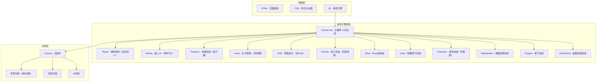
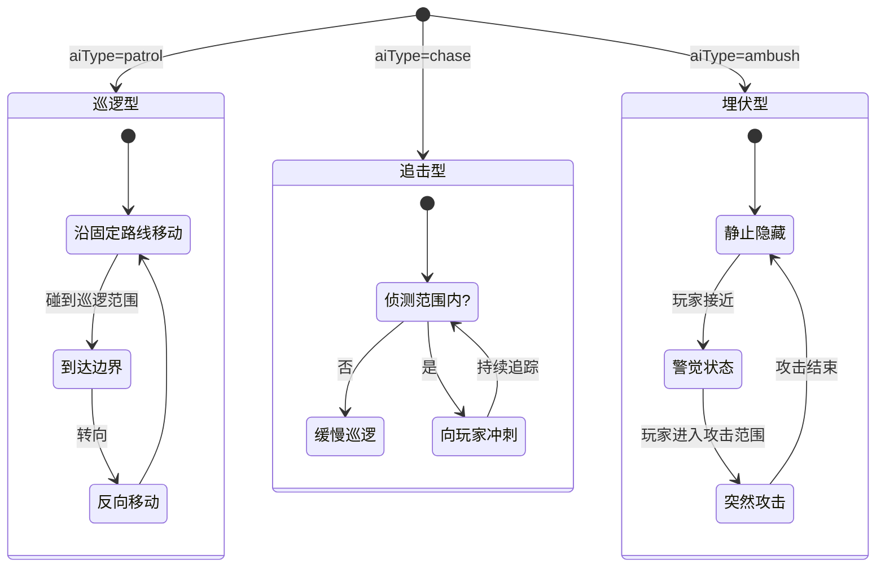

## 1. 架构设计



## 2. 技术说明

- 前端：纯 HTML5 + CSS3 + JavaScript（ES6+）
- 渲染引擎：HTML5 Canvas 2D
- 无后端，纯前端单页游戏
- 无外部依赖，纯原生实现
- 存档系统：localStorage 存储解锁的角色和地图
- 文件结构：html/、css/、js/ 三个目录分离

## 3. 路由定义

| 路由 | 用途 |
|------|------|
| / | 游戏主页面（单页应用，通过状态机切换界面） |

## 4. 文件结构

```
├── index.html                  # 入口页面（引用 css 和 js）
├── css/
│   └── style.css               # 全局样式、动画、布局
├── js/
│   ├── main.js                 # 入口脚本，初始化游戏
│   ├── game.js                 # Game 类：主循环、状态管理
│   ├── player.js               # Player 类：角色控制（支持双人P1/P2）
│   ├── enemy.js                # Enemy 类：3种AI（巡逻/追击/埋伏）
│   ├── treasure.js             # Treasure 类：宝物 + 氧气罐
│   ├── level.js                # Level 类：4种地图背景渲染
│   ├── hud.js                  # HUD 类：单人/双人界面
│   ├── particle.js             # Particle 类：粒子特效 + 光影
│   ├── utils.js                # 工具函数
│   ├── boss.js                 # Boss 类：Boss 战斗系统
│   ├── cave.js                 # Cave 类：隐藏洞穴系统
│   ├── character.js            # Character 类：可解锁角色系统
│   ├── mapsystem.js            # MapSystem 类：地图选择系统
│   ├── oxygen.js               # Oxygen 类：氧气系统
│   └── fishschool.js           # FishSchool 类：鱼群动画系统
└── .trae/
    └── documents/              # 项目文档
```

## 5. 核心类设计

### 5.1 Game 类（增强）

```
- state: 'menu' | 'modeSelect' | 'characterSelect' | 'mapSelect' | 'playing' | 'bossFight' | 'inCave' | 'levelComplete' | 'gameOver'
- mode: 'single' | 'coop'
- currentMap: 'reef' | 'trench' | 'shipwreck' | 'volcano'
- currentLevel: number
- score: number
- players: Player[]          # 1-2个玩家
- enemies: Enemy[]
- treasures: Treasure[]
- oxygenTanks: OxygenTank[]
- particles: ParticleSystem
- level: Level
- hud: HUD
- boss: Boss | null
- cave: Cave | null
- fishSchools: FishSchool[]
- selectedCharacters: string[]  # P1/P2 选中的角色ID
- unlockedCharacters: string[]
- unlockedMaps: string[]
+ init(): void
+ update(dt): void
+ render(): void
+ changeState(state): void
+ saveProgress(): void
+ loadProgress(): void
```

### 5.2 Player 类（增强）

```
- id: 'P1' | 'P2'
- x, y: number
- width, height: number
- speed: number
- baseSpeed: number
- invincible: boolean
- invincibleTimer: number
- direction: {x, y}
- characterId: string            # spongebob, patrick, squidward, krabs, sandy
- healthModifier: number         # 派大星：0.5
- oxygenModifier: number         # 章鱼哥：0.7
- scoreModifier: number          # 蟹老板：2.0 for coins
- speedModifier: number          # 珊迪：1.25
- color: string                  # 角色主题色
+ handleInput(keys, playerId): void
+ update(dt): void
+ render(ctx): void
+ takeDamage(): boolean
```

### 5.3 Character 类（新增）

```
- id: string
- name: string
- description: string
- ability: string
- unlocked: boolean
- unlockCondition: string
- color: string
- modifiers: {health, oxygen, score, speed}
+ renderCard(ctx, x, y, selected): void
```

### 5.4 Enemy 类（增强）

```
- x, y: number
- type: 'jellyfish' | 'shark' | 'octopus'
- aiType: 'patrol' | 'chase' | 'ambush'   # 巡逻/追击/埋伏
- speed: number
- direction: number
- patrolRange: {min, max}
- chaseRange: number
- ambushTimer: number
- ambushState: 'hidden' | 'alert' | 'attack'
+ update(dt, player): void
+ render(ctx): void
```

### 5.5 Treasure 类（增强）

```
- x, y: number
- type: 'pearl' | 'coin' | 'rarePearl' | 'oxygenTank'
- value: number
- collected: boolean
- bobOffset: number
+ update(dt, time): void
+ render(ctx): void
```

### 5.6 Level 类（增强）

```
- levelNumber: number
- mapType: 'reef' | 'trench' | 'shipwreck' | 'volcano'
- requiredTreasures: number
- enemyConfig: {patrol, chase, ambush}
+ generate(): {enemies, treasures, oxygenTanks}
+ isComplete(collected): boolean
+ renderBackground(ctx, time): void  # 4种主题背景
```

### 5.7 Oxygen 系统（新增）

```
- current: number              # 0-100
- max: number
- drainRate: number            # 每秒消耗
- lowThreshold: number         # 20% 警报
+ update(dt, oxygenModifier): void
+ replenish(amount): void
+ isLow(): boolean
+ isEmpty(): boolean
+ render(ctx, x, y, width, height): void
```

### 5.8 Boss 类（新增）

```
- x, y: number
- width, height: number
- health: number
- maxHealth: number
- type: 'giantJellyfish' | 'kraken' | 'anglerfish' | 'lavacrab'
- attackPattern: number
- attackTimer: number
- enraged: boolean
+ update(dt, players): void
+ render(ctx): void
+ takeDamage(amount): boolean
+ renderHealthBar(ctx, canvasWidth): void
```

### 5.9 Cave 类（新增）

```
- x, y: number
- width, height: number
- discovered: boolean
- entered: boolean
- treasures: Treasure[]
- enemies: Enemy[]
+ update(dt): void
+ render(ctx): void
+ renderInterior(ctx, time): void
```

### 5.10 FishSchool 类（新增）

```
- fish: {x, y, vx, vy, size, color}[]
- centerX, centerY: number
- targetX, targetY: number
+ update(dt): void
+ render(ctx): void
```

### 5.11 MapSystem 类（新增）

```
- maps: Map[]
- currentMapIndex: number
+ renderMapSelect(ctx, canvasWidth, canvasHeight): void
+ selectMap(index): void
```

### 5.12 HUD 类（增强）

```
+ render(ctx, gameState, players, oxygen, score, collected, required, level, mapName, boss): void
+ renderSinglePlayerHUD(...): void
+ renderCoopHUD(...): void
```

## 6. 游戏状态机（增强）

```mermaid
stateDiagram-v2
    "主菜单" --> "模式选择" : 点击开始
    "模式选择" --> "角色选择" : 单人/双人
    "角色选择" --> "地图选择" : 确认角色
    "地图选择" --> "游戏中" : 选择地图
    "游戏中" --> "Boss战" : 收集达标
    "游戏中" --> "隐藏洞穴" : 进入洞穴
    "游戏中" --> "游戏结束" : 生命/氧气为0
    "隐藏洞穴" --> "游戏中" : 离开洞穴
    "Boss战" --> "过关" : 击败Boss
    "Boss战" --> "游戏结束" : 生命为0
    "过关" --> "游戏中" : 进入下一关
    "过关" --> "角色解锁" : 达成条件
    "游戏结束" --> "主菜单" : 重新开始
```

## 7. 敌人 AI 状态机



## 8. 存档系统

使用 localStorage 存储：
- `unlockedCharacters`: `["spongebob", "patrick"]` 等
- `unlockedMaps`: `["reef", "trench"]` 等
- `highScores`: `{"reef": 1500, "trench": 2000}` 等

## 9. 性能要求

- 目标帧率：60 FPS
- 使用 requestAnimationFrame 驱动游戏循环
- 碰撞检测使用 AABB 矩形碰撞
- 粒子数量上限 200，鱼群上限 50 条
- Canvas 尺寸自适应窗口
- 双人模式下性能优化：共享碰撞检测循环
