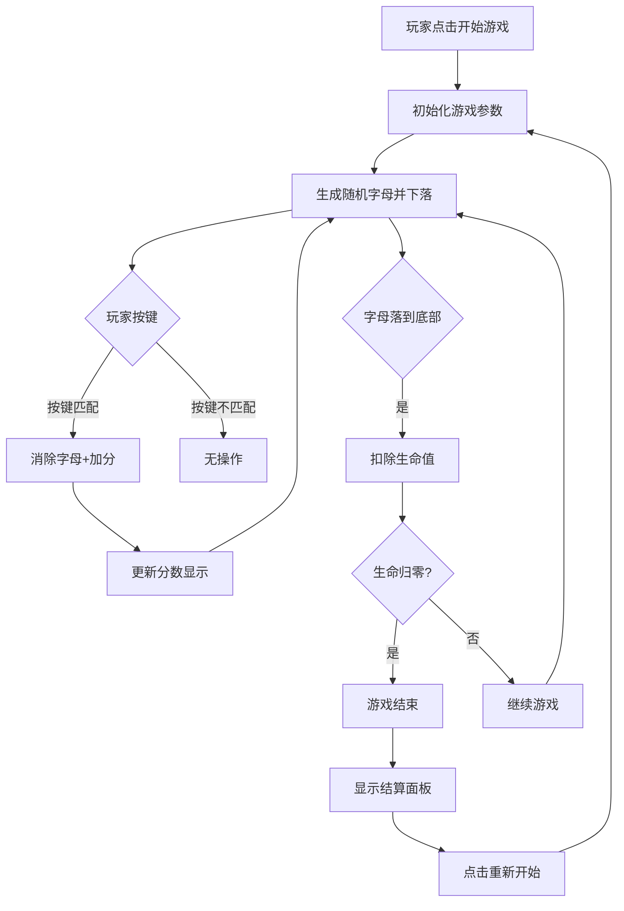

## 1. 产品概述

"单词风暴"是一款趣味打字练习游戏，通过击落从天而降的字母来提升玩家的打字速度和准确性。

- 核心玩法：字母从屏幕顶部随机位置下落，玩家按下对应键盘按键消除字母并获得分数
- 目标用户：打字初学者、想提升打字速度的用户、休闲游戏爱好者
- 产品价值：寓教于乐，在游戏中提升打字技能，同时提供紧张刺激的游戏体验

## 2. 核心功能

### 2.1 用户角色

| 角色 | 注册方式 | 核心权限 |
|------|----------|----------|
| 玩家 | 无需注册 | 开始游戏、查看分数、重新开始 |

### 2.2 功能模块

1. **游戏主界面**：游戏区域、状态显示面板、开始/暂停控制
2. **字母生成系统**：随机字母生成、下落位置随机化
3. **碰撞检测系统**：键盘输入匹配、字母消除判定
4. **计分系统**：得分计算、连击奖励
5. **生命系统**：生命值管理、伤害判定
6. **难度递增系统**：下落速度随时间加快
7. **数据统计面板**：实时显示得分、生命值、打字速度(WPM)

### 2.3 页面详情

| 页面名称 | 模块名称 | 功能描述 |
|----------|----------|----------|
| 游戏主页面 | 顶部状态栏 | 显示得分、剩余生命、WPM速度 |
| 游戏主页面 | 游戏区域 | 字母下落动画展示、消除特效 |
| 游戏主页面 | 开始/结束面板 | 游戏开始按钮、游戏结束结算弹窗 |
| 游戏主页面 | 键盘提示区 | 高亮显示当前可击落的字母按键 |

## 3. 核心流程

## 5. 新增功能模块（v2.0）

### 5.1 多种游戏模式

| 模式名称 | 玩法说明 | 难度 | 适用场景 |
|----------|----------|------|----------|
| 字母模式 | 单个英文字母下落，按键消除 | ⭐ | 打字入门 |
| 单词模式 | 完整英文单词下落，需依次输入所有字母 | ⭐⭐ | 进阶练习 |
| 短句模式 | 完整句子下落，需按顺序输入整句 | ⭐⭐⭐ | 高级练习 |
| 代码模式 | 代码片段下落，包含特殊符号（;{}()=+等） | ⭐⭐⭐⭐ | 程序员练习 |

### 5.2 多语言支持

| 语言 | 输入方式 | 字符集 |
|------|----------|--------|
| 英语（默认） | 直接输入 | A-Z, 标点符号 |
| 中文拼音 | 输入拼音对应字母，自动匹配汉字 | A-Z，拼音组合 |
| 日语罗马音 | 输入罗马音对应字母 | A-Z，罗马音组合 |
| 法语 | 直接输入，支持带重音字符 | A-Z, éèêëàâäîïôöùûüÿç |

### 5.3 连击暴击系统

- 连续正确击中累积连击数
- 连击档位：
  - 10连击：🔥 火热状态，得分 x1.5
  - 25连击：⚡ 闪电状态，得分 x2.0
  - 50连击：💥 暴击状态，得分 x3.0，触发全屏特效
  - 100连击：👑 传奇状态，得分 x5.0，特殊称号
- 暴击触发时屏幕震动、颜色闪烁、特殊音效提示

### 5.4 Boss单词系统

- 每隔一定时间或分数出现Boss单词
- Boss特点：
  - 超长单词（15-25个字母）
  - 体积更大，颜色更醒目
  - 带有血条显示
  - 需分阶段输入，每输入一部分削减一定血量
  - 下落速度更慢，但血量更高
- 击败Boss奖励：大量分数、额外生命、临时增益效果

### 5.5 排行榜与每日挑战

- **本地排行榜**：保存历史最高分、最高连击、最高WPM
- **每日挑战**：
  - 每日更新专属单词库
  - 特殊主题日（如：编程日、动物日、美食日）
  - 完成挑战获得特殊徽章
- **成就系统**：
  - 初次胜利、连击达人、速度之王等
  - 解锁成就获得奖励

### 5.6 自定义与个性化

- **主题切换**：
  - 赛博霓虹（默认）
  - 极简黑白
  - 复古像素
  - 森林绿意
  - 深海幽蓝
  - 落日橙红
- **自定义词库**：
  - 支持导入TXT/JSON格式词库
  - 单词分类管理
  - 可分享词库配置

### 5.7 多人模式（规划中）

- **双人对战**：同屏竞速，先达目标分数者胜
- **团队协作**：2-4人组队，共同击落字母，共享生命值
- **在线对战**：匹配全球玩家实时对战（需后端支持）

## 6. 新功能用户界面设计

### 6.1 开始面板新增

- 模式选择卡片（4种模式横向排列）
- 语言选择下拉菜单
- 主题切换按钮
- 每日挑战入口
- 排行榜入口
- 设置按钮

### 6.2 游戏区域新增

- 连击状态指示器（左侧悬浮，显示当前连击档位和倍率）
- Boss血条（Boss出现时顶部显示）
- 暴击特效层（全屏闪光、震动效果）
- 输入进度提示（单词/短句模式显示已输入/总字符数）

### 6.3 结算面板新增

- 详细统计：准确率、最高连击、平均WPM
- 成就解锁提示
- 排行榜名次显示
- 分享成绩按钮
- 保存本局数据

## 7. 用户界面设计

### 7.1 设计风格

- **主色调**：深邃藏蓝 (#0a0e27) 作为背景，搭配霓虹紫 (#7b2cbf)、霓虹青 (#00f5d4)、霓虹粉 (#ff006e) 作为字母颜色
- **辅助色**：警告红 (#ef233c) 用于生命值低时提示，成功绿 (#06d6a0) 用于消除特效
- **按钮风格**：霓虹发光效果，圆角矩形，悬浮时有脉冲动画
- **字体**：'Orbitron' 作为数字显示字体（科技感），'Rajdhani' 作为正文字体
- **布局风格**：全屏沉浸式游戏界面，顶部状态栏半透明悬浮
- **视觉效果**：字母带发光效果，消除时有粒子爆炸动画，背景有星空粒子流动

### 7.2 页面设计概览

| 页面名称 | 模块名称 | UI元素 |
|----------|----------|---------|
| 游戏主页面 | 顶部状态栏 | 半透明深色背景、发光数字、图标与文字组合 |
| 游戏主页面 | 游戏区域 | 渐变星空背景、下落发光字母、消除粒子特效 |
| 游戏主页面 | 开始面板 | 居中霓虹标题、发光开始按钮、游戏说明文字 |
| 游戏主页面 | 结束面板 | 半透明遮罩、最终得分展示、重新开始按钮 |
| 游戏主页面 | 模式选择 | 4张模式卡片，带图标和说明 |
| 游戏主页面 | 连击指示器 | 左侧悬浮，显示连击数和倍率 |
| 游戏主页面 | Boss血条 | Boss出现时顶部进度条 |

### 7.3 响应式设计

- 采用桌面端优先设计，全屏体验最佳
- 移动端自适应：缩放游戏区域，调整字体大小
- 键盘操作仅支持桌面端，移动端提供虚拟键盘备选

### 7.4 动画与交互

- 字母下落：平滑CSS动画，根据难度调整时长
- 字母消除：缩放+淡出+粒子爆炸组合效果
- 按键反馈：按下时按键区高亮闪烁
- 生命值减少：屏幕边缘红色闪烁警告
- 得分增加：数字向上浮动并渐隐
- 背景：缓慢流动的星空粒子效果
- 连击升级：档位切换时的特效动画
- Boss出现：入场动画、警告效果
