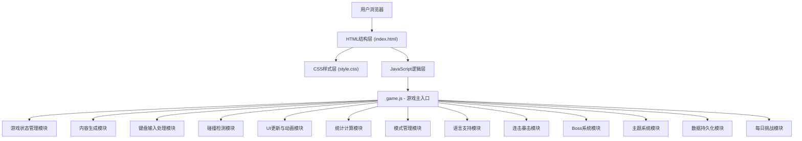
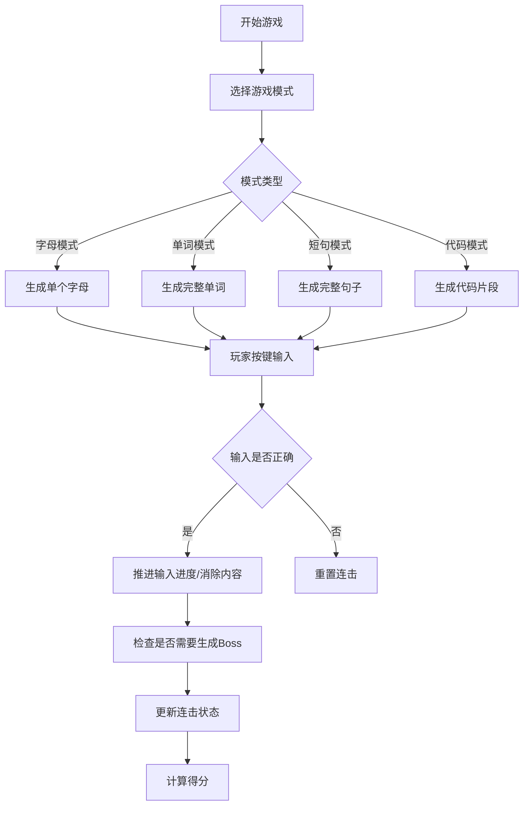

## 1. 架构设计（v2.0）



## 2. 技术选型

- **前端**：原生 HTML5 + CSS3 + JavaScript (ES6+)
  - 无需框架，轻量高效，适合简单游戏场景
  - CSS3 动画实现字母下落和视觉效果
  - DOM 元素实现游戏渲染（便于CSS动画控制）
  - Web Animations API 实现复杂动画时序
  - localStorage 实现本地数据持久化
- **字体**：Google Fonts - Orbitron (数字显示)、Rajdhani (正文)
- **图标**：纯CSS实现或emoji，避免额外依赖
- **数据存储**：localStorage 存储排行榜、自定义词库、用户设置

## 3. 目录结构（v2.0）

```
打字游戏单词风暴/
├── index.html              # 主HTML文件
├── css/
│   └── style.css          # 样式文件（包含动画、主题变量）
├── js/
│   └── game.js            # 游戏核心逻辑（单文件模块化）
├── data/
│   ├── words-en.js        # 英文词库
│   ├── words-code.js      # 代码词库
│   ├── words-sentences.js # 短句词库
│   ├── pinyin-map.js      # 拼音映射表
│   └── romaji-map.js      # 罗马音映射表
├── assets/                # 静态资源（可选）
│   └── sounds/            # 音效文件（可选）
└── .trae/
    └── documents/
        ├── prd.md
        └── tech-architecture.md
```

## 4. 核心数据结构（v2.0）

### 4.1 游戏状态对象

```javascript
const gameState = {
  isPlaying: false,
  score: 0,
  lives: 3,
  level: 1,
  letters: [],             // 下落内容数组
  totalTyped: 0,
  totalKeystrokes: 0,      // 总按键数（用于准确率计算）
  startTime: null,
  gameStartTime: 0,
  fallSpeed: 3,
  spawnInterval: 1500,
  combo: 0,
  maxCombo: 0,
  lastSpawnTime: 0,
  lastDifficultyIncrease: 0,
  
  // v2.0 新增
  gameMode: 'letter',      // letter/word/sentence/code
  language: 'en',          // en/zh/ja/fr
  theme: 'cyberpunk',      // cyberpunk/minimal/pixel/forest/ocean/sunset
  currentBoss: null,       // 当前Boss对象
  bossSpawnCounter: 0,     // Boss生成计数器
  comboTier: 0,            // 连击档位 0-3
  comboMultiplier: 1,      // 连击倍率
  isDailyChallenge: false, // 是否每日挑战模式
  customWordList: [],      // 自定义词库
  accuracy: 100,           // 准确率
};
```

### 4.2 下落内容对象（统一抽象）

```javascript
const fallingItem = {
  id: uniqueId,
  type: 'letter',          // letter/word/sentence/code/boss
  content: 'A',            // 显示内容
  expectedInput: 'A',      // 期望输入（用于多语言映射）
  currentIndex: 0,         // 当前输入进度（单词/短句模式）
  x: 100,
  y: -50,
  element: DOMElement,
  color: '#7b2cbf',
  createdAt: timestamp,
  fallStartTime: timestamp,
  isBoss: false,
  bossHp: 0,
  bossMaxHp: 0,
  language: 'en'
};
```

### 4.3 连击档位配置

```javascript
const COMBO_TIERS = [
  { threshold: 0,  multiplier: 1,   name: '普通',   icon: '',   effect: null },
  { threshold: 10, multiplier: 1.5, name: '火热',   icon: '🔥', effect: 'heat' },
  { threshold: 25, multiplier: 2,   name: '闪电',   icon: '⚡', effect: 'lightning' },
  { threshold: 50, multiplier: 3,   name: '暴击',   icon: '💥', effect: 'critical' },
  { threshold: 100, multiplier: 5,  name: '传奇',   icon: '👑', effect: 'legendary' }
];
```

### 4.4 主题配置

```javascript
const THEMES = {
  cyberpunk: {
    name: '赛博霓虹',
    bgPrimary: '#0a0e27',
    bgSecondary: '#1a1f3a',
    colors: ['#7b2cbf', '#00f5d4', '#ff006e', '#fee440', '#00bbf9'],
    textPrimary: '#ffffff',
    accent: '#00f5d4'
  },
  minimal: {
    name: '极简黑白',
    bgPrimary: '#ffffff',
    bgSecondary: '#f0f0f0',
    colors: ['#000000', '#333333', '#666666', '#999999', '#cccccc'],
    textPrimary: '#000000',
    accent: '#000000'
  },
  pixel: {
    name: '复古像素',
    bgPrimary: '#1a1a2e',
    bgSecondary: '#16213e',
    colors: ['#e94560', '#0f3460', '#533483', '#e94560', '#ffd460'],
    textPrimary: '#ffffff',
    accent: '#e94560'
  },
  forest: {
    name: '森林绿意',
    bgPrimary: '#1b4332',
    bgSecondary: '#2d6a4f',
    colors: ['#52b788', '#95d5b2', '#74c69d', '#40916c', '#b7e4c7'],
    textPrimary: '#ffffff',
    accent: '#52b788'
  },
  ocean: {
    name: '深海幽蓝',
    bgPrimary: '#03045e',
    bgSecondary: '#023e8a',
    colors: ['#0077b6', '#00b4d8', '#90e0ef', '#48cae4', '#0096c7'],
    textPrimary: '#ffffff',
    accent: '#00b4d8'
  },
  sunset: {
    name: '落日橙红',
    bgPrimary: '#3d0066',
    bgSecondary: '#5c0099',
    colors: ['#ff6b35', '#f7c59f', '#efa94a', '#d62828', '#f77f00'],
    textPrimary: '#ffffff',
    accent: '#ff6b35'
  }
};
```

### 4.5 排行榜记录

```javascript
const LeaderboardEntry = {
  score: 0,
  maxCombo: 0,
  wpm: 0,
  accuracy: 0,
  gameMode: 'letter',
  date: timestamp,
  duration: 0
};
```

## 5. 新增模块设计（v2.0）

### 5.1 模式管理模块

- **职责**：管理4种游戏模式的切换和规则
- **核心函数**：
  - `setGameMode(mode)` - 设置游戏模式
  - `generateContentForMode()` - 根据模式生成对应内容
  - `getInputTarget()` - 获取当前期望输入的字符
  - `validateInput(input)` - 验证输入是否正确

### 5.2 语言支持模块

- **职责**：多语言字符映射和输入验证
- **核心函数**：
  - `setLanguage(lang)` - 设置语言
  - `getDisplayChar(input)` - 获取显示字符
  - `getExpectedInput(displayChar)` - 获取期望的键盘输入
  - `validateLanguageInput(input, expected)` - 语言特定输入验证

### 5.3 连击暴击模块

- **职责**：连击计数、档位判断、倍率计算、特效触发
- **核心函数**：
  - `incrementCombo()` - 增加连击
  - `resetCombo()` - 重置连击
  - `getCurrentTier()` - 获取当前连击档位
  - `calculateScore(baseScore)` - 计算带倍率的得分
  - `triggerTierEffect(tier)` - 触发档位特效

### 5.4 Boss系统模块

- **职责**：Boss生成、血量管理、阶段输入、奖励发放
- **核心函数**：
  - `shouldSpawnBoss()` - 判断是否应该生成Boss
  - `spawnBoss()` - 生成Boss
  - `damageBoss(amount)` - 对Boss造成伤害
  - `defeatBoss()` - Boss击败处理
  - `updateBossUI()` - 更新Boss血条

### 5.5 主题系统模块

- **职责**：主题切换、CSS变量管理
- **核心函数**：
  - `setTheme(themeName)` - 设置主题
  - `applyTheme(theme)` - 应用主题到DOM
  - `getAvailableThemes()` - 获取可用主题列表

### 5.6 数据持久化模块

- **职责**：本地存储、排行榜管理、词库管理
- **核心函数**：
  - `saveScore(entry)` - 保存分数到排行榜
  - `getLeaderboard(mode, limit)` - 获取排行榜
  - `saveCustomWordList(words)` - 保存自定义词库
  - `loadCustomWordList()` - 加载自定义词库
  - `saveSettings(settings)` - 保存用户设置

### 5.7 每日挑战模块

- **职责**：每日单词生成、挑战进度、奖励系统
- **核心函数**：
  - `getDailyChallenge()` - 获取今日挑战
  - `isDailyCompleted()` - 检查今日是否完成
  - `getDaySeed()` - 生成每日随机种子
  - `getDailyTheme()` - 获取今日主题

## 6. 核心流程（v2.0）

### 6.1 游戏模式判断流程



## 7. 新增游戏常量配置（v2.0）

```javascript
const CONFIG = {
  // ... 原有配置 ...
  
  // 游戏模式
  GAME_MODES: ['letter', 'word', 'sentence', 'code'],
  DEFAULT_MODE: 'letter',
  
  // 语言支持
  LANGUAGES: ['en', 'zh', 'ja', 'fr'],
  DEFAULT_LANGUAGE: 'en',
  
  // 连击系统
  COMBO_TIERS: [
    { threshold: 0,  multiplier: 1,   name: '普通', icon: '' },
    { threshold: 10, multiplier: 1.5, name: '火热', icon: '🔥' },
    { threshold: 25, multiplier: 2,   name: '闪电', icon: '⚡' },
    { threshold: 50, multiplier: 3,   name: '暴击', icon: '💥' },
    { threshold: 100, multiplier: 5,  name: '传奇', icon: '👑' }
  ],
  
  // Boss系统
  BOSS_SPAWN_INTERVAL: 60000,      // 60秒生成一个Boss
  BOSS_HP_MULTIPLIER: 3,           // Boss血量 = 字母数 * 3
  BOSS_FALL_SPEED_MULTIPLIER: 0.6, // Boss下落速度倍率
  BOSS_REWARD_SCORE: 500,          // 击败Boss基础奖励
  BOSS_REWARD_LIFE_CHANCE: 0.3,    // 击败Boss回血概率
  
  // 排行榜
  LEADERBOARD_MAX_ENTRIES: 10,
  
  // 主题
  DEFAULT_THEME: 'cyberpunk',
  
  // 每日挑战
  DAILY_CHALLANGE_TARGET_SCORE: 1000
};
```

## 8. 性能优化（v2.0）

- 使用 CSS `transform` 而非 `top/left` 实现移动，触发GPU加速
- 字母消除后及时移除DOM元素和事件监听
- 限制屏幕上最大字母数量，避免性能下降
- 使用 `will-change` 优化动画性能
- 使用 Web Animations API 统一动画时序
- 防抖处理高频UI更新
- 词库数据懒加载，按需加载不同模式的词库
- localStorage 操作使用节流，避免频繁IO

## 9. 数据存储规范

### 9.1 localStorage 键名

```javascript
const STORAGE_KEYS = {
  LEADERBOARD: 'wordstorm_leaderboard',
  CUSTOM_WORDS: 'wordstorm_custom_words',
  SETTINGS: 'wordstorm_settings',
  DAILY_PROGRESS: 'wordstorm_daily_progress',
  ACHIEVEMENTS: 'wordstorm_achievements'
};
```

### 9.2 数据版本管理

- 所有存储数据包含 `version` 字段
- 提供数据迁移函数，支持版本升级
- 数据格式变化时自动兼容旧版本数据
