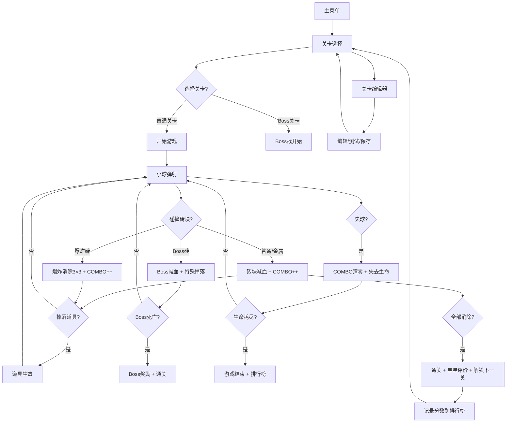

## 1. 产品概述

击球砖块弹射是一款经典街机风格的休闲网页游戏。玩家通过操控底部发射平台左右移动，弹射小球击碎上方排列的砖块，消除全部砖块即可通关。

**v2.0 升级定位**：从简单的单人游戏升级为具有深度策略性的砖块消除游戏，引入多种砖块、道具系统、多关卡递进、Boss战、COMBO连击机制与关卡编辑功能。

- 目标用户：休闲游戏爱好者，寻求快速放松和挑战的玩家
- 核心价值：提供直觉式操控、流畅物理反弹与渐进式难度体验
- 升级价值：丰富的策略深度、持续的成长感、高度可重玩性

## 2. 核心功能（v2.0 新增）

### 2.1 功能模块（新增）

3. **关卡选择页**：10+预制关卡、已解锁状态、最高分数显示
4. **关卡编辑器**：拖拽放置砖块、保存/导出/导入关卡、测试功能
5. **排行榜页**：本地/社区关卡高分排行榜、玩家名称输入

### 2.2 新增砖块类型

| 砖块类型 | 外观标识 | 生命值 | 特殊效果 | 分值 |
|----------|----------|--------|----------|------|
| 普通砖 | 纯色霓虹 | 1 | 无 | 10-60 |
| 金属砖 | 银色金属纹理+数字 | 2-5 | 需多次撞击，每次减血 | 200-500 |
| 爆炸砖 | 红色爆炸图标+光晕 | 1 | 消除时引爆周围3×3范围 | 150 |
| Boss砖 | 巨型砖块+血条 | 50+ | 每关1个，需持续攻击，掉落特殊道具 | 5000 |
| 不可破坏 | 黑色实心+锁图标 | ∞ | 永远无法消除，仅可被爆炸砖波及 | 0 |

### 2.3 道具系统

| 道具类型 | 图标 | 效果 | 持续时间 |
|----------|------|------|----------|
| 加宽平台 | 📏 | 平台宽度×2 | 15秒 |
| 多球 | 🔮 | 小球分裂为3个 | 永久（持续到失球） |
| 射击弹 | 🔫 | 平台发射子弹消除砖块 | 10秒 |
| 磁力吸引 | 🧲 | 小球被平台吸引，可控性增强 | 12秒 |
| 减速球 | 🐢 | 小球速度降低50% | 8秒 |
| 穿透球 | ⚡ | 小球穿透砖块不反弹 | 6秒 |

### 2.4 页面详情（扩展）

| 页面名称 | 模块名称 | 功能描述 |
|----------|----------|----------|
| 游戏主页面 | HUD扩展 | 显示：分数、生命、关卡、COMBO倍率、道具状态计时 |
| 游戏主页面 | COMBO特效 | 连击时屏幕中央显示"COMBO xN"动画文字 |
| 游戏主页面 | 道具掉落 | 击碎特殊砖块掉落道具图标，下落到平台可拾取 |
| 游戏主页面 | Boss血条 | Boss关显示Boss砖块巨型血条在屏幕顶部 |
| 关卡选择页 | 关卡网格 | 10+关卡卡片，显示：编号、星星评价、最高分、锁定状态 |
| 关卡选择页 | 编辑器入口 | "创建关卡"按钮进入编辑模式 |
| 关卡编辑器 | 砖块调色板 | 左侧显示所有可用砖块类型供选择 |
| 关卡编辑器 | 编辑画布 | 网格区域拖拽放置/删除砖块 |
| 关卡编辑器 | 操作按钮 | 测试、保存、导出、导入、清空 |
| 排行榜页 | 排行列表 | 显示各关卡前10名玩家+分数 |
| 排行榜页 | 输入名称 | 通关后可输入玩家名称记录分数 |

## 3. 核心流程（扩展）



## 4. 关卡系统设计

### 4.1 关卡递进难度

| 关卡 | 砖块行数 | 金属砖 | 爆炸砖 | 特殊机制 |
|------|----------|--------|--------|----------|
| 1-3 | 5-6 | 0-2个 | 0个 | 新手教学，只有普通砖 |
| 4-6 | 6-7 | 3-5个 | 1-2个 | 引入金属砖和爆炸砖 |
| 7-9 | 7-8 | 5-8个 | 2-3个 | 复杂布局，移动砖块 |
| 10 | 8+ | 8+ | 3+ | Boss关卡 - 巨型Boss砖 |
| 11-20 | 8-10 | 递增 | 递增 | 社区/编辑器关卡 |

### 4.2 评分系统

- ⭐ 1星：通关即可
- ⭐⭐ 2星：剩余生命≥2
- ⭐⭐⭐ 3星：剩余生命≥3 + COMBO≥10x

## 5. 用户界面设计（扩展）

### 5.1 设计风格升级

- **新增色彩**：金属银（#c0c0c0）、爆炸红（#ff4444）、Boss紫（#9333ea）、道具金（#fbbf24）
- **COMBO特效**：数字递增动画，颜色随倍率变化（蓝→绿→黄→红→金）
- **道具图标**：发光霓虹风格图标，下落时带拖尾
- **Boss砖**：巨型砖块（占4-8格），带血条和脉冲光晕

### 5.2 新增UI元素

| 元素 | 位置 | 样式 |
|------|------|------|
| COMBO显示 | 屏幕中央偏上 | 大号Orbitron字体，脉冲动画 |
| 道具状态栏 | HUD下方 | 图标 + 倒计时进度条 |
| Boss血条 | 屏幕最顶部 | 渐变紫色条，Boss名称 |
| 关卡选择卡片 | 网格布局 | 卡片式，带缩略图和星星 |
| 编辑器调色板 | 左侧抽屉 | 可滚动砖块列表 |

## 6. 关卡编辑器规格

### 6.1 编辑功能
- 网格大小：12列 × 10行
- 支持：放置/删除/移动砖块
- 右键：循环切换砖块类型
- 撤销/重做功能

### 6.2 数据格式（JSON）
```json
{
  "name": "我的关卡",
  "author": "玩家名",
  "grid": [
    [0,1,1,2,0,...],
    ...
  ]
}
```
