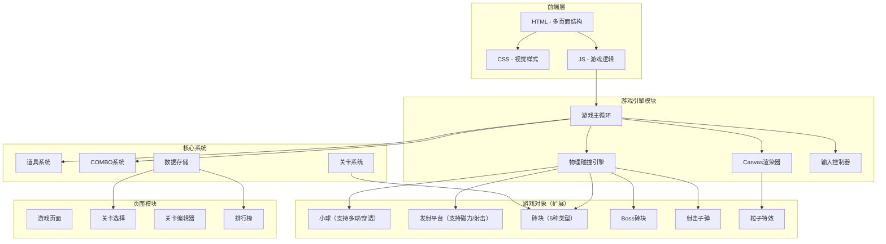

## 1. 架构设计（v2.0 扩展）



## 2. 技术说明（v2.0 扩展）

- **前端**：纯 HTML5 + CSS3 + TypeScript，无框架依赖
- **渲染引擎**：HTML5 Canvas 2D API
- **构建工具**：Vite
- **数据持久化**：LocalStorage（关卡进度、排行榜、自定义关卡）
- **后端**：无
- **数据库**：LocalStorage

## 3. 项目结构（v2.0 扩展）

```
击球砖块弹射/
├── index.html                     # 入口（游戏页面）
├── level-select.html              # 关卡选择页面
├── editor.html                    # 关卡编辑器页面
├── css/
│   └── style.css                  # 全局样式
├── js/
│   ├── main.ts                    # 游戏入口
│   ├── game.ts                    # 游戏状态（扩展）
│   ├── ball.ts                    # 小球（支持多球数组）
│   ├── paddle.ts                  # 平台（扩展：道具状态）
│   ├── brick.ts                   # 砖块（扩展：5种类型）
│   ├── powerup.ts                 # 道具系统（新增）
│   ├── combo.ts                   # COMBO系统（新增）
│   ├── levels.ts                  # 关卡数据（新增）
│   ├── collision.ts               # 碰撞检测（扩展）
│   ├── renderer.ts                # 渲染引擎（扩展特效）
│   ├── particles.ts               # 粒子特效（扩展）
│   ├── bullet.ts                  # 射击子弹（新增）
│   ├── boss.ts                    # Boss砖块（新增）
│   ├── storage.ts                 # 本地存储（新增）
│   ├── editor.ts                  # 关卡编辑器（新增）
│   └── input.ts                   # 输入控制
├── data/
│   └── levels.json                # 预制关卡数据
├── package.json
├── tsconfig.json
└── vite.config.ts
```

## 4. 核心数据结构（v2.0 扩展）

### 4.1 砖块类型定义

```typescript
type BrickType = 'normal' | 'metal' | 'explosive' | 'boss' | 'unbreakable'

interface BrickData {
  x: number
  y: number
  width: number
  height: number
  type: BrickType
  hp: number
  maxHp: number
  color: string
  glowColor: string
  alive: boolean
  points: number
  dropPowerUp: boolean
}
```

### 4.2 道具系统

```typescript
type PowerUpType = 'widen' | 'multiball' | 'shoot' | 'magnet' | 'slow' | 'pierce'

interface PowerUpData {
  x: number
  y: number
  dy: number
  type: PowerUpType
  color: string
  icon: string
  collected: boolean
}

interface ActivePowerUp {
  type: PowerUpType
  duration: number
  maxDuration: number
}
```

### 4.3 COMBO系统

```typescript
interface ComboSystem {
  multiplier: number
  comboCount: number
  lastHitTime: number
  comboTimeout: number
  displayX: number
  displayY: number
  displayAlpha: number
}
```

### 4.4 关卡数据结构

```typescript
interface LevelData {
  id: number
  name: string
  grid: number[][]
  hasBoss: boolean
  bossHp?: number
  unlocked: boolean
  stars: number
  highScore: number
}
```

### 4.5 射击子弹

```typescript
interface BulletData {
  x: number
  y: number
  dy: number
  active: boolean
}
```

### 4.6 Boss砖块

```typescript
interface BossData {
  x: number
  y: number
  width: number
  height: number
  hp: number
  maxHp: number
  alive: boolean
  phase: number
  pulsePhase: number
}
```

## 5. 碰撞检测扩展

| 碰撞组合 | 处理逻辑 |
|----------|----------|
| 小球 ↔ 普通砖 | 砖块消除，加分，COMBO++，可能掉落道具 |
| 小球 ↔ 金属砖 | 砖块减血，不减分，金属颗粒特效 |
| 小球 ↔ 爆炸砖 | 砖块消除，触发3×3范围爆炸 |
| 小球 ↔ 不可破坏 | 小球反弹，砖块不受影响 |
| 小球 ↔ Boss砖 | Boss减血，特殊粒子，高概率掉落道具 |
| 子弹 ↔ 砖块 | 等同于小球碰撞，但无反弹 |
| 道具 ↔ 平台 | 道具激活，开始计时 |

## 6. 预制关卡数据格式

```typescript
// 网格值: 0=空, 1=普通, 2=金属2血, 3=金属3血, 4=爆炸, 5=不可破坏
const LEVELS = [
  {
    id: 1,
    name: "初学者",
    grid: [
      [0,1,1,1,1,1,1,1,1,0],
      [0,1,1,1,1,1,1,1,1,0],
      [0,0,1,1,1,1,1,1,0,0],
    ],
    hasBoss: false
  }
]
```

## 7. LocalStorage 存储键

| 键名 | 用途 |
|------|------|
| `bb_unlocked_levels` | 已解锁关卡ID数组 |
| `bb_level_scores` | 各关卡最高分对象 |
| `bb_level_stars` | 各关卡星星数 |
| `bb_custom_levels` | 自定义关卡JSON数组 |
| `bb_player_name` | 玩家名称 |
