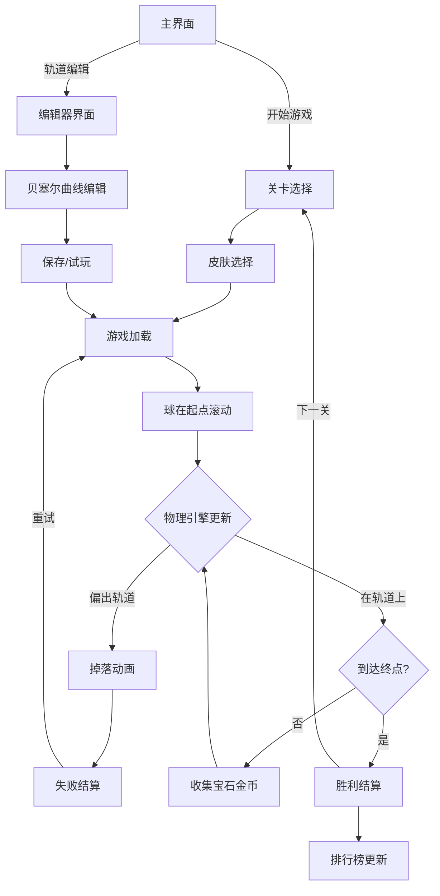

## 1. 产品概述

一款3D平衡球走钢丝挑战游戏。v2.0新增完整物理引擎、多关卡系统、球体皮肤、轨道编辑器、收集物系统、排行榜竞速和多输入方式支持。

- 目标用户：休闲游戏爱好者、挑战类游戏玩家、创意关卡设计者
- 核心价值：物理真实感 + 多样化关卡 + 自定义创作 + 竞技排行

## 2. 核心功能

### 2.1 功能模块

1. **游戏主界面**: 关卡选择、皮肤选择、操作说明、最佳记录
2. **关卡选择**: 高架桥/雪山索道/科幻管道三个主题关卡
3. **皮肤选择**: 木球/铁球/水晶球等，各具不同物理属性
4. **游戏场景**: 3D钢丝轨道、平衡球、环境背景、收集物
5. **游戏HUD**: 计时器、速度、进度条、收集物计数、幽灵车指示
6. **轨道编辑器**: 贝塞尔曲线控制点编辑、实时预览、保存/加载
7. **结算界面**: 完成时间、星级评定、收集物统计、排行榜
8. **排行榜**: 本地排行榜、幽灵车竞速

### 2.2 页面详情

| 页面名称 | 模块名称 | 功能描述 |
|----------|----------|----------|
| 游戏主界面 | 标题区域 | 游戏标题、版本号 |
| 游戏主界面 | 主菜单 | 开始游戏/轨道编辑/操作说明 |
| 关卡选择 | 关卡卡片 | 三大主题关卡缩略图和难度标识 |
| 关卡选择 | 皮肤选择 | 球体皮肤列表，显示物理属性 |
| 关卡选择 | 记录展示 | 各关卡最佳时间和星级 |
| 游戏场景 | 物理引擎 | 重力、惯性、摩擦力、向心力模拟 |
| 游戏场景 | 3D轨道 | 主题化轨道渲染，弯道/坡度/窄道 |
| 游戏场景 | 球体控制 | 键盘/触摸/陀螺仪/手柄操控 |
| 游戏场景 | 收集物 | 轨道上宝石和金币，碰撞收集 |
| 游戏场景 | 幽灵车 | 最佳记录透明投影球体竞速 |
| 游戏HUD | 计时器 | 实时显示已用时间 |
| 游戏HUD | 速度表 | 当前速度指示 |
| 游戏HUD | 进度条 | 距终点进度 |
| 游戏HUD | 收集物 | 宝石/金币收集计数 |
| 游戏HUD | 幽灵差值 | 与幽灵车的时间差 |
| 轨道编辑器 | 控制点列表 | 贝塞尔曲线控制点坐标编辑 |
| 轨道编辑器 | 3D预览 | 实时预览轨道形状 |
| 轨道编辑器 | 工具栏 | 添加/删除点、保存、试玩 |
| 结算界面 | 结果展示 | 完成/失败状态 |
| 结算界面 | 星级评定 | 1-3星动画 |
| 结算界面 | 收集统计 | 宝石/金币收集数 |
| 结算界面 | 排行榜 | 本地排名列表 |
| 结算界面 | 操作按钮 | 重试/下一关/返回 |

## 3. 核心流程

## 4. 用户界面设计

### 4.1 设计风格

沿用v1.0霓虹科技风，三个关卡各有主题色：
- 高架桥：暖橙(#ff8c42) + 城市夕阳
- 雪山索道：冰蓝(#4fc3f7) + 白雪
- 科幻管道：霓虹紫(#b388ff) + 深空

### 4.2 新增UI元素

| 页面名称 | 模块名称 | UI元素 |
|----------|----------|--------|
| 关卡选择 | 关卡卡片 | 大图缩略图，难度星级，主题色边框 |
| 皮肤选择 | 皮肤卡片 | 3D预览球，属性条(重量/摩擦/弹性) |
| 游戏HUD | 收集物 | 宝石图标+计数，金币图标+计数 |
| 游戏HUD | 幽灵差值 | +/-时间差，半透明字 |
| 编辑器 | 控制面板 | 左侧控制点列表，右侧3D预览 |
| 编辑器 | 工具栏 | 顶部按钮组(添加/删除/保存/试玩) |
| 结算 | 收集统计 | 宝石x/N，金币x/N |
| 结算 | 排行榜 | 滚动列表，排名/时间/星级 |

## 5. 物理引擎设计

### 5.1 力学模型

| 物理量 | 公式 | 说明 |
|--------|------|------|
| 重力 | F = mg | 球体受重力影响，质量m由皮肤决定 |
| 摩擦力 | F = μmg | 摩擦系数μ由轨道材质和球体皮肤共同决定 |
| 惯性 | F = ma | 加速度取决于合力和质量 |
| 向心力 | F = mv²/r | 弯道处产生侧向力，v为速度，r为曲率半径 |
| 坡度力 | F = mgsinθ | 上坡减速，下坡加速 |

### 5.2 球体皮肤物理属性

| 皮肤 | 质量 | 摩擦系数 | 弹性 | 特殊效果 |
|------|------|----------|------|----------|
| 木球 | 0.6 | 0.8 | 0.2 | 高摩擦，易控制 |
| 铁球 | 1.5 | 0.4 | 0.1 | 重，惯性大，弯道侧力强 |
| 水晶球 | 0.8 | 0.3 | 0.5 | 低摩擦滑行，弹性高 |
| 橡胶球 | 1.0 | 0.9 | 0.8 | 最高摩擦，最易控制 |

## 6. 关卡设计

### 6.1 高架桥关卡
- 视觉：城市天际线，暖橙夕阳光照，钢架结构轨道
- 难度：中等，宽轨道，平缓弯道
- 特色：城市风，轨道两侧有建筑剪影

### 6.2 雪山索道关卡
- 视觉：雪山背景，冰蓝色调，雪花粒子效果
- 难度：较高，冰雪轨道低摩擦，陡坡
- 特色：低摩擦滑行，风速影响，雪粒效果

### 6.3 科幻管道关卡
- 视觉：深空背景，霓虹紫光，管道透明外壳
- 难度：最高，窄管道，急弯，速度区
- 特色：加速带，能量环，反重力段

## 7. 收集物系统

| 收集物 | 外观 | 分值 | 放置策略 |
|--------|------|------|----------|
| 金币 | 旋转金色圆片 | 10分 | 轨道中心线，易收集 |
| 宝石 | 多彩菱形，发光 | 50分 | 轨道边缘，需冒险偏移 |
| 能量球 | 蓝色脉冲球 | 加速3秒 | 关键位置，策略选择 |

## 8. 排行榜与幽灵车

- 排行榜：localStorage存储每关前10名记录
- 幽灵车：记录最佳运行的位置序列(每帧采样)，结算时保存
- 竞速：游戏中显示半透明幽灵球，HUD显示时间差

## 9. 输入方式

| 输入方式 | API | 支持平台 |
|----------|-----|----------|
| 键盘 | KeyboardEvent | 全平台 |
| 触摸 | TouchEvent + 事件委托 | 移动端 |
| 陀螺仪 | DeviceOrientationEvent | 移动端 |
| 游戏手柄 | Gamepad API | 桌面端 |
