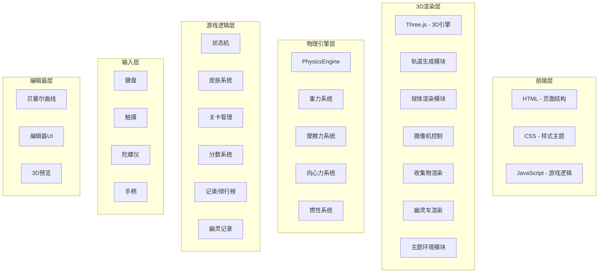

## 1. 架构设计



## 2. 技术说明

- **前端**: 原生 HTML5 + CSS3 + JavaScript (ES6+)
- **3D引擎**: Three.js r128 (CDN)
- **项目结构**: HTML/CSS/JS 分目录
- **存储**: localStorage (记录/排行/自定义轨道)
- **后端**: 无（纯前端游戏）

## 3. 目录结构

```
平衡球走钢丝/
├── index.html
├── css/
│   └── style.css
├── js/
│   ├── main.js             # 游戏入口、状态机、关卡/皮肤选择
│   ├── scene.js             # 3D场景、渲染循环、主题切换
│   ├── track.js             # 轨道生成（样条+关卡数据）
│   ├── levels.js            # 关卡定义（路径点+主题+收集物布局）
│   ├── ball.js              # 球体渲染+皮肤
│   ├── physics.js           # 物理引擎（重力/摩擦/惯性/向心力）
│   ├── camera.js            # 摄像机跟随
│   ├── input.js             # 键盘/触摸/陀螺仪/手柄
│   ├── collectibles.js      # 收集物系统
│   ├── ghost.js             # 幽灵车记录和回放
│   ├── leaderboard.js       # 排行榜管理
│   ├── editor.js            # 轨道编辑器
│   ├── skins.js             # 皮肤定义和属性
│   ├── ui.js                # UI界面管理
│   └── utils.js             # 工具函数
```

## 4. 模块设计

### 4.1 物理引擎 (physics.js)
核心物理更新，每帧计算各力并合成：

```
update(dt, inputState, ballSkin, trackData):
  1. 计算重力分量 → 沿坡度方向和垂直轨道方向分解
  2. 计算摩擦力 → 与运动方向相反，系数=轨道μ × 皮肤μ
  3. 计算向心力 → 弯道曲率产生侧向力 F=mv²/r
  4. 合力计算 → F_net = F_gravity + F_friction + F_centripetal + F_input
  5. 加速度 → a = F_net / mass
  6. 更新速度 → v += a × dt
  7. 更新位置 → s += v × dt
  8. 边界检测 → 偏移超出轨道宽度则标记掉落
```

### 4.2 皮肤系统 (skins.js)
定义皮肤数据结构：
```javascript
{
  id: 'wood',
  name: '木球',
  color: 0x8B4513,
  metalness: 0.1,
  roughness: 0.8,
  mass: 0.6,
  friction: 0.8,
  bounce: 0.2,
  emissive: 0x000000
}
```

### 4.3 关卡系统 (levels.js)
每关定义：路径点数组、主题参数、收集物布局、星级阈值
```javascript
{
  id: 'bridge',
  name: '高架桥',
  points: [...],
  theme: { bg, fog, lights, trackColor, ... },
  collectibles: [{ type, t, offset }],
  starThresholds: [0, 150, 100],
  trackWidth: 1.4
}
```

### 4.4 收集物系统 (collectibles.js)
- 根据关卡数据在轨道上放置3D收集物
- 碰撞检测：球体与收集物的距离判定
- 收集动画：缩小消失+发光
- 统计：实时更新收集计数

### 4.5 幽灵车 (ghost.js)
- 录制：每帧采样球体位置(progress, lateralOffset)，存入数组
- 回放：读取记录数组，创建半透明球体按帧回放
- 保存：通关时如果破纪录，将幽灵数据存入localStorage
- 显示：游戏中显示半透明幽灵球，HUD显示时间差

### 4.6 排行榜 (leaderboard.js)
- localStorage按关卡存储前10名
- 每条记录：时间、星级、收集物数、日期、幽灵数据
- 结算界面展示排行列表

### 4.7 轨道编辑器 (editor.js)
- 贝塞尔曲线：使用CubicBezierCurve3，4个控制点一段
- UI：左侧控制点坐标列表(可编辑)，右侧3D实时预览
- 操作：添加段、删除段、拖拽控制点、保存、加载、试玩
- 存储：自定义轨道序列化为JSON存入localStorage

### 4.8 输入系统 (input.js) - v2.0增强
- 键盘：方向键/WASD（已有）
- 触摸：事件委托（已有）
- 陀螺仪：DeviceOrientationEvent，beta/gamma映射为左右倾斜
- 手柄：Gamepad API，左摇杆X轴映射为左右，支持振动反馈

### 4.9 主题渲染 (scene.js增强)
- 每个关卡切换场景背景、雾效、灯光颜色
- 高架桥：暖色环境光，城市背景
- 雪山：冷蓝环境光，雪花粒子系统
- 科幻：霓虹紫光，深空星域

## 5. 数据存储格式

### 排行榜 localStorage Key
- `bb_leaderboard_{levelId}` → JSON数组

### 幽灵数据 localStorage Key
- `bb_ghost_{levelId}` → JSON (positions数组)

### 自定义轨道 localStorage Key
- `bb_custom_tracks` → JSON数组

### 皮肤解锁状态
- `bb_skins_unlocked` → JSON (皮肤ID数组)
