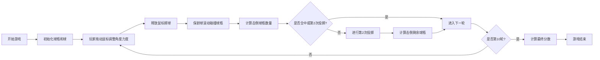

## 1. 产品概述

本项目是一个基于Web的保龄球游戏，玩家通过鼠标操作控制保龄球的投掷角度和力度，击倒球瓶获得分数。游戏遵循标准保龄球规则，支持完整的10轮比赛，包含全中(strike)和补中(spare)计分机制。

- **核心目标**：提供一个直观、有趣的保龄球游戏体验
- **目标用户**：休闲游戏玩家，保龄球爱好者
- **市场价值**：轻量级Web游戏，无需安装即可游玩

## 2. 核心功能

### 2.1 用户角色

| 角色 | 注册方式 | 核心权限 |
|------|----------|----------|
| 玩家 | 无需注册 | 进行游戏、查看分数 |

### 2.2 功能模块

1. **游戏主界面**：球道展示、保龄球、球瓶
2. **投掷控制系统**：鼠标拖动调整角度和力度
3. **物理碰撞系统**：保龄球与球瓶的碰撞检测
4. **计分系统**：标准保龄球计分规则
5. **计分板UI**：实时显示每轮分数和总分

### 2.3 页面详情

| 页面名称 | 模块名称 | 功能描述 |
|----------|----------|----------|
| 游戏主页面 | 球道区域 | 显示保龄球道，10个球瓶三角形排列 |
| 游戏主页面 | 投掷控制 | 鼠标拖动调整掷球角度和力度指示器 |
| 游戏主页面 | 计分板 | 显示10轮分数，strike/spare标记，总分 |
| 游戏主页面 | 控制按钮 | 开始游戏、重置、重新开始 |

## 3. 核心流程

## 4. 用户界面设计

### 4.1 设计风格

- **主色调**：深木纹色 (#5D4037) 作为球道背景，深绿色 (#1B5E20) 作为保龄球瓶颜色
- **辅助色**：保龄球白色，辅助线条浅灰色
- **按钮风格**：圆润立体按钮，带悬停效果
- **字体**：使用 'Bangers' 或 'Roboto' 等具有运动感的字体
- **布局风格**：居中布局，球道占主要区域，计分板在下方

### 4.2 页面设计概述

| 页面名称 | 模块名称 | UI元素 |
|----------|----------|--------|
| 游戏主页面 | 球道区域 | 木纹球道、10个三角形排列的球瓶、白色保龄球 |
| 游戏主页面 | 投掷控制 | 角度指示器弧线、力度条（红色渐变） |
| 游戏主页面 | 计分板 | 10列x3行表格，显示轮次、每次投掷、累计分数 |
| 游戏主页面 | 信息区域 | 当前轮次提示、投掷状态提示 |

### 4.3 响应性

- 桌面端优先设计
- 适配不同屏幕尺寸，球道等比例缩放
- 触摸设备支持触摸拖动操作

### 4.4 动画与交互

- 保龄球滚动动画
- 球瓶被击倒的物理动画
- 力度条动态变化效果
- 分数更新时的闪烁效果
- 投掷时的轨迹预览
