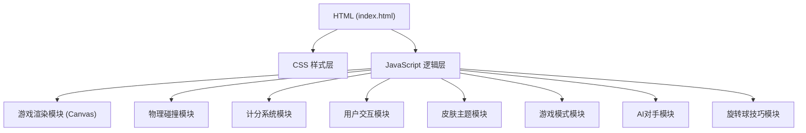
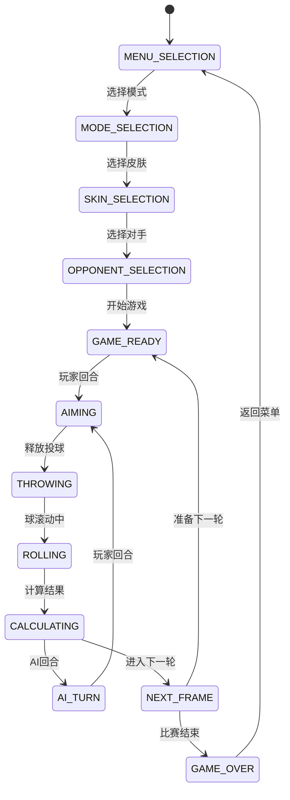

## 1. 架构设计



## 2. 技术描述

- **前端技术栈**：原生 HTML5 + CSS3 + JavaScript (ES6+)
- **渲染方式**：Canvas 2D API
- **目录结构**：
  - `html/` - HTML文件
  - `css/` - 样式文件
  - `js/` - JavaScript脚本文件

## 3. 目录结构

```
台球保龄球/
├── html/
│   └── index.html
├── css/
│   └── style.css
├── js/
│   ├── game.js          # 游戏主逻辑
│   ├── physics.js       # 物理碰撞引擎
│   ├── scoring.js       # 计分系统
│   ├── render.js        # 渲染模块
│   ├── skins.js         # 皮肤主题系统
│   ├── gameModes.js     # 游戏模式系统
│   ├── spinControl.js   # 旋转球控制
│   └── aiOpponent.js    # AI对手系统
└── .trae/
    └── documents/
        ├── prd.md
        └── technical-architecture.md
```

## 4. 核心数据模型

### 4.1 保龄球数据模型

```javascript
Ball = {
  x: number,           // X坐标
  y: number,           // Y坐标
  vx: number,          // X方向速度
  vy: number,          // Y方向速度
  radius: number,      // 半径
  rotation: number,    // 旋转角度
  spin: number,        // 侧旋量 (-1~1)
  hook: number,        // 弧线弯曲程度
  skin: string         // 皮肤ID
}
```

### 4.2 球瓶数据模型

```javascript
Pin = {
  x: number,           // X坐标
  y: number,           // Y坐标
  knocked: boolean,    // 是否被击倒
  vx: number,          // X方向速度
  vy: number,          // Y方向速度
  rotation: number,    // 旋转角度
  angularVel: number,  // 角速度
  type: string         // 球瓶类型 (standard/candle/duck)
}
```

### 4.3 游戏模式配置

```javascript
GameMode = {
  id: string,
  name: string,
  pinCount: number,
  pinArrangement: string, // triangle/diamond/square
  pinType: string,       // standard/candle/duck
  frames: number,
  rollsPerFrame: number,
  scoringType: string    // standard/candle/duck
}
```

### 4.4 AI对手数据模型

```javascript
AIOpponent = {
  id: string,
  name: string,
  skill: number,        // 0~100 技能等级
  accuracy: number,     // 准确度
  power: number,        // 力量
  spinStyle: string,    // 旋转风格
  avatar: string        // 头像
}
```

## 5. 核心功能模块

### 5.1 物理碰撞模块增强 (physics.js)

| 函数名 | 功能描述 |
|--------|----------|
| `initPins()` | 根据游戏模式初始化球瓶排列 |
| `checkBallPinCollision()` | 检测球与球瓶的碰撞，支持旋转球效果 |
| `checkPinPinCollision()` | 检测球瓶之间的碰撞，实现连锁反应 |
| `updatePhysics()` | 更新所有物体的物理状态，包括旋转和弧线 |
| `applySpinEffect()` | 应用旋转球效果 |
| `applyPinChainReaction()` | 处理球瓶碰撞连锁反应 |

### 5.2 皮肤主题模块 (skins.js)

| 函数名 | 功能描述 |
|--------|----------|
| `getBallSkins()` | 获取所有保龄球皮肤 |
| `getLaneThemes()` | 获取所有球道主题 |
| `getCurrentBallSkin()` | 获取当前选择的球皮肤 |
| `getCurrentLaneTheme()` | 获取当前选择的球道主题 |
| `unlockSkin()` | 解锁皮肤/主题 |

### 5.3 游戏模式模块 (gameModes.js)

| 函数名 | 功能描述 |
|--------|----------|
| `getGameModes()` | 获取所有游戏模式 |
| `getCurrentGameMode()` | 获取当前游戏模式 |
| `setGameMode()` | 设置游戏模式 |
| `initGameMode()` | 初始化游戏模式配置 |

### 5.4 旋转球技巧模块 (spinControl.js)

| 函数名 | 功能描述 |
|--------|----------|
| `setSpin()` | 设置旋转量 |
| `getSpinPreview()` | 获取旋转轨迹预览 |
| `applySpinToBall()` | 应用旋转到球 |
| `drawSpinIndicator()` | 绘制旋转指示器 |

### 5.5 AI对手模块 (aiOpponent.js)

| 函数名 | 功能描述 |
|--------|----------|
| `getAIOpponents()` | 获取可用AI对手列表 |
| `selectAIOpponent()` | 选择AI对手 |
| `calculateAIMove()` | 计算AI的投球 |
| `executeAIThrow()` | 执行AI投球 |

### 5.6 渲染模块增强 (render.js)

| 函数名 | 功能描述 |
|--------|----------|
| `drawLane()` | 根据主题绘制球道 |
| `drawPins()` | 根据类型绘制球瓶 |
| `drawBall()` | 根据皮肤绘制保龄球 |
| `drawSpinTrajectory()` | 绘制旋转球轨迹预览 |
| `drawModeSelection()` | 绘制模式选择界面 |
| `drawSkinSelection()` | 绘制皮肤选择界面 |
| `drawAIOpponentInfo()` | 绘制AI对手信息 |

## 6. 游戏状态机



## 7. 游戏模式类型

### 7.1 标准10瓶模式
- 10个球瓶三角形排列
- 每轮最多2次投球（第10轮最多3次）
- 标准保龄球计分规则

### 7.2 蜡烛瓶模式
- 瓶身细长，两端等宽
- 10个球瓶菱形排列
- 击倒的球瓶不清理，留在球道上

### 7.3 鸭子瓶模式
- 瓶身短粗，像鸭子
- 10个球瓶三角形排列
- 球更小更轻
