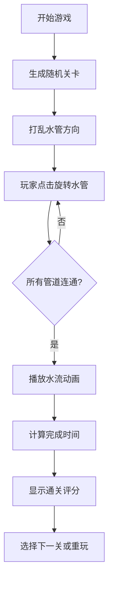

## 1. 产品概述
接水管管道工是一款益智解谜游戏，玩家通过旋转网格中的水管段，将水源与终点连接成完整通路。游戏考验玩家的空间思维能力和逻辑推理能力。
- 主要目的：提供休闲益智娱乐，锻炼玩家的空间思维能力
- 目标用户：各年龄段的休闲游戏玩家

## 2. 核心功能

### 2.1 Feature Module
1. **游戏主界面**: 水管网格、计时器、未连接管道统计
2. **游戏控制**: 开始/重置游戏、难度选择
3. **水流动画**: 可视化展示水流沿管道流动
4. **通关判定**: 自动检测管道连通性并判定通关
5. **评分系统**: 根据完成时间给出星级评分

### 2.3 Page Details
| Page Name | Module Name | Feature description |
|-----------|-------------|---------------------|
| 游戏主页面 | 水管网格 | 可点击旋转的水管段，包含直管、弯管、T型管等 |
| 游戏主页面 | 状态面板 | 显示用时、剩余未连接管道数、当前关卡 |
| 游戏主页面 | 控制面板 | 开始游戏、重置关卡、选择难度 |
| 游戏主页面 | 水流动画 | 通关时展示水流从起点流向终点的动画效果 |
| 游戏主页面 | 通关弹窗 | 显示完成时间、评分、重新开始按钮 |

## 3. 核心流程

## 4. 用户界面设计

### 4.1 Design Style
- **主色调**: 深蓝色 (#0ea5e9) 作为主色，代表水和管道
- **辅助色**: 绿色 (#22c55e) 表示连通状态，橙色 (#f97316) 表示未连通
- **背景**: 深灰色渐变背景，营造科技感
- **按钮风格**: 圆角按钮，带有悬停动画效果
- **字体**: 使用现代无衬线字体，数字显示使用等宽字体
- **水管样式**: 3D效果的管道，带有金属质感和高光

### 4.2 Page Design Overview
| Page Name | Module Name | UI Elements |
|-----------|-------------|-------------|
| 游戏主页面 | 水管网格 | 居中的网格布局，每个水管有旋转动画 |
| 游戏主页面 | 状态面板 | 顶部状态栏，透明背景，显示计时和统计 |
| 游戏主页面 | 控制面板 | 底部控制区，按钮带有悬浮效果 |
| 游戏主页面 | 通关弹窗 | 居中模态框，带有入场动画，显示星星评分 |

### 4.3 Responsiveness
- 桌面端优先，自适应屏幕尺寸
- 网格大小根据屏幕宽度自动调整
- 移动端优化触摸交互
- 支持窗口大小变化时重新布局
