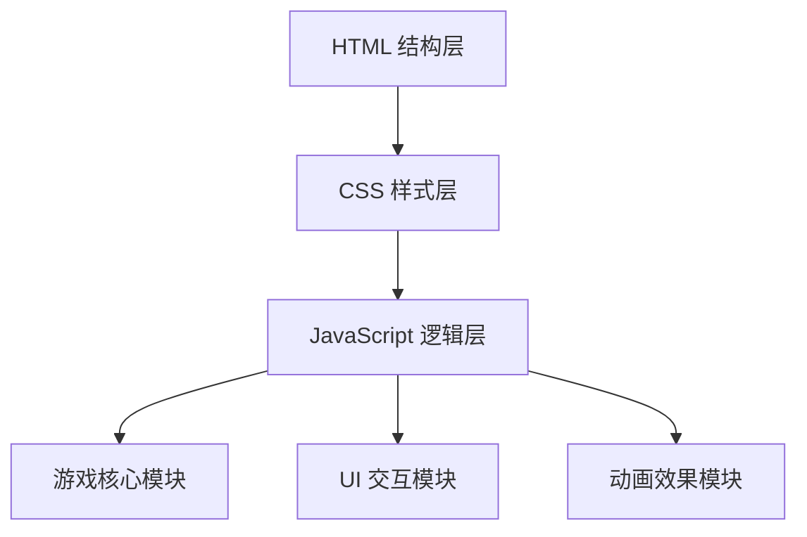

## 1. 架构设计



## 2. 技术描述

- **前端**: 原生 HTML5 + CSS3 + JavaScript (ES6+)
- **目录结构**:
  - `index.html` - 主页面结构
  - `css/style.css` - 样式文件
  - `js/game.js` - 游戏核心逻辑
  - `js/ui.js` - UI 交互逻辑
  - `js/pipe.js` - 水管类定义
- **无需后端**，纯前端实现
- **本地存储**: 使用 localStorage 保存最佳成绩

## 3. 目录结构

```
接水管管道工/
├── index.html              # 主页面
├── css/
│   └── style.css          # 样式文件
├── js/
│   ├── pipe.js            # 水管类定义
│   ├── game.js            # 游戏核心逻辑
│   └── ui.js              # UI 交互
└── .trae/
    └── documents/
        ├── prd.md
        └── technical-architecture.md
```

## 4. 核心数据结构

### 4.1 水管类型定义

| 类型 | 标识 | 连接方向 | 说明 |
|------|------|----------|------|
| 直管 | straight | [上, 下] 或 [左, 右] | 直线管道 |
| 弯管 | curve | [上, 右] 等组合 | 90度转弯 |
| T型管 | t-pipe | [上, 左, 右] 等 | 三向连接 |
| 十字管 | cross | [上, 下, 左, 右] | 四向连接 |
| 起点 | start | 单向出水 | 水源 |
| 终点 | end | 单向进水 | 目的地 |

### 4.2 水管类 (Pipe)

```javascript
class Pipe {
  type: string;           // 水管类型
  rotation: number;       // 旋转角度 (0, 90, 180, 270)
  row: number;            // 行位置
  col: number;            // 列位置
  isStart: boolean;       // 是否为起点
  isEnd: boolean;         // 是否为终点
  isConnected: boolean;   // 是否连通
  
  getOpenings(): number[];  // 获取当前开口方向
  rotate(): void;           // 旋转90度
}
```

### 4.3 游戏类 (Game)

```javascript
class Game {
  grid: Pipe[][];         // 水管网格
  rows: number;           // 行数
  cols: number;           // 列数
  startTime: number;      // 开始时间
  elapsedTime: number;    // 已用时间
  difficulty: string;     // 难度等级
  
  init(): void;           // 初始化游戏
  generateLevel(): void;  // 生成关卡
  checkWin(): boolean;    // 检查是否通关
  getUnconnectedCount(): number;  // 获取未连接管道数
}
```

## 5. 核心算法

### 5.1 关卡生成算法
1. 从起点开始，使用随机深度优先搜索生成连通路径
2. 在路径上放置各种类型的水管
3. 随机旋转所有可旋转水管
4. 确保起点和终点固定方向

### 5.2 连通性检测算法
- 使用 BFS 从起点开始遍历
- 检查相邻水管的开口是否匹配
- 标记所有连通的水管
- 判断终点是否在连通集合中

### 5.3 水流动画
- 按 BFS 遍历顺序依次点亮水管
- 使用 CSS 动画实现水流效果
- 动画速度可配置
