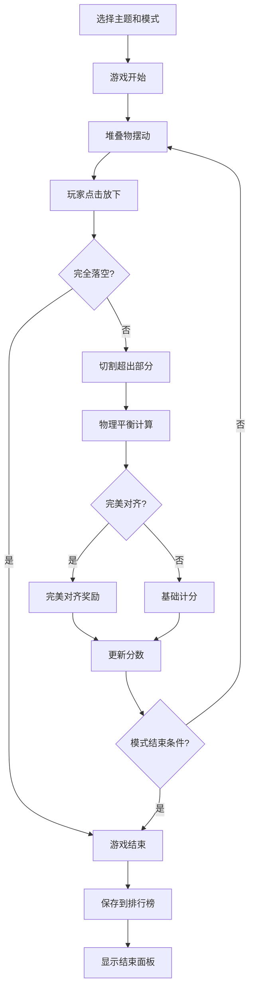

## 1. 产品概述

塔楼堆叠平衡游戏是一款3D休闲益智类网页游戏，玩家通过点击屏幕控制摆动的堆叠物下落，堆叠出尽可能高的塔楼。游戏支持多种主题、多种模式、道具系统、物理模拟和AR模式。

- 主要目的：提供沉浸式3D堆叠游戏体验，挑战玩家的反应和判断力
- 目标用户：所有年龄段的休闲游戏爱好者
- 产品价值：多模式+多主题+道具系统带来丰富的重玩价值

## 2. 核心功能

### 2.1 用户角色
| 角色 | 注册方式 | 核心权限 |
|------|----------|----------|
| 玩家 | 无需注册 | 直接开始游戏，选择主题/模式，使用道具，查看排行榜 |

### 2.2 功能模块
1. **3D游戏主界面**：Three.js渲染的3D场景、分数显示、控制区域、3D视角旋转
2. **游戏核心逻辑**：堆叠物摆动、下落、堆叠、切割、碰撞检测
3. **多主题系统**：水果、披萨、书籍、集装箱四种主题切换
4. **多游戏模式**：限时堆叠（60秒）、目标高度挑战、无尽模式
5. **物理平衡模拟**：重心偏移计算、塔楼倾斜震动视觉效果
6. **道具系统**：加宽方块、完美对齐磁吸、慢动作三种道具
7. **本地排行榜**：Top10本地存储排行、每日挑战塔高度
8. **AR模式**：WebXR基础框架，投射到真实桌面（预留）

### 2.3 页面详情
| 页面名称 | 模块名称 | 功能描述 |
|---------|---------|----------|
| 游戏主页面 | 3D游戏区域 | Three.js渲染3D塔楼，鼠标拖拽旋转视角 |
| 游戏主页面 | 分数面板 | 显示当前得分、完美对齐次数、堆叠高度、倒计时 |
| 游戏主页面 | 道具栏 | 三种道具图标，点击使用 |
| 游戏主页面 | 主题选择器 | 四种主题按钮切换 |
| 游戏主页面 | 模式选择器 | 三种模式选择 |
| 游戏主页面 | 排行榜按钮 | 打开本地排行榜弹窗 |
| 游戏主页面 | 开始/重新开始按钮 | 控制游戏开始和重置 |
| 排行榜弹窗 | 排行榜列表 | 显示Top10分数、日期、模式、主题 |
| 游戏结束弹窗 | 结束面板 | 显示最终得分、是否破记录、重新开始按钮 |

## 3. 核心流程

玩家进入游戏 → 选择主题和模式 → 点击开始 → 堆叠物从上方摆动 → 玩家点击放下方块 → 方块落在下方堆叠物上 → 超出部分被切掉 → 物理模拟重心偏移 → 新方块继续摆动 → 重复堆叠 → 完全落空或时间结束 → 显示最终得分并保存到排行榜 → 可重新开始

## 4. 用户界面设计

### 4.1 设计风格
- 主色调：深蓝渐变天空背景，3D地面
- 堆叠物：根据主题显示不同3D模型/纹理
- 完美对齐：金色光晕+粒子效果
- 字体：现代无衬线字体，清晰易读
- 整体风格：3D沉浸感，视觉丰富，动效流畅

### 4.2 动画效果
- 方块摆动：平滑的正弦曲线3D运动
- 方块下落：物理感的加速下落
- 切割效果：被切割部分向外飞出并淡出
- 完美对齐：金色闪光、粒子爆发
- 塔楼倾斜：重心偏移时塔楼左右轻微震动
- 3D视角：鼠标拖拽旋转、滚轮缩放

## 5. 道具系统

| 道具 | 效果 | 持续时间 |
|------|------|----------|
| 加宽方块 | 当前方块宽度+50% | 一次有效 |
| 完美对齐磁吸 | 本次堆叠自动完美对齐 | 一次有效 |
| 慢动作 | 方块摆动和下落速度降为50% | 5秒 |

## 6. 游戏模式

| 模式 | 规则 | 目标 |
|------|------|------|
| 无尽模式 | 无限制，直到完全落空 | 尽可能高 |
| 限时模式 | 60秒倒计时，时间到结束 | 时间内堆得最高 |
| 目标高度 | 目标100层，先到100层获胜 | 最快到达100层 |

## 7. 主题系统

| 主题 | 堆叠物 | 基座 | 颜色 |
|------|--------|------|------|
| 水果 | 西瓜/苹果/橙子切片 | 木质托盘 | 鲜艳多彩 |
| 披萨 | 披萨切片 | 餐盒 | 红黄配色 |
| 书籍 | 书籍/笔记本 | 书架 | 棕色绿色 |
| 集装箱 | 集装箱 | 码头 | 工业配色 |
