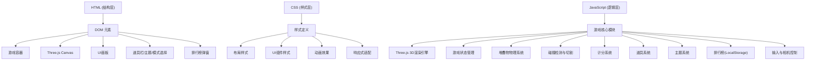

## 1. 架构设计



## 2. 技术描述

- 前端：原生 HTML5 + CSS3 + JavaScript (ES6+) + Three.js r128
- 渲染技术：Three.js (WebGL) 3D渲染
- 3D库：Three.js (CDN引入)
- 物理：自定义轻量物理模拟（重心偏移、震动）
- 数据存储：LocalStorage（本地排行榜）
- 无需后端，纯前端静态页面

### 目录结构
```
塔楼堆叠平衡/
├── index.html              # 主页面
├── css/
│   └── style.css           # 样式文件
├── js/
│   ├── game.js             # 游戏主逻辑
│   ├── themes.js           # 主题定义
│   ├── physics.js          # 物理模拟
│   └── storage.js          # 排行榜存储
└── .trae/
    └── documents/
        ├── PRD.md
        └── 技术架构.md
```

## 3. 核心数据结构

### 堆叠物对象
```javascript
{
  mesh: THREE.Mesh,        // Three.js网格
  x: number,               // X坐标（世界空间）
  z: number,               // Z坐标（固定为0）
  width: number,           // 宽度
  depth: number,           // 深度（Z方向）
  height: number,          // 高度
  color: string,           // 颜色
  isSwinging: boolean,     // 是否摆动中
}
```

### 游戏状态
```javascript
{
  score: number,
  perfectCount: number,
  stackHeight: number,
  gameOver: boolean,
  isPlaying: boolean,
  mode: 'endless' | 'timed' | 'target',
  theme: 'fruit' | 'pizza' | 'book' | 'container',
  timeLeft: number,
  powerUps: { wide: 0, magnet: 0, slowmo: 0 },
  slowmoActive: boolean,
  cameraAngle: number,
  cameraDistance: number,
  blocks: Array,
  currentBlock: Object,
  centerOfMass: { x: number, y: number },
  tilt: { x: number, z: number, targetX: number, targetZ: number }
}
```

### 排行榜条目
```javascript
{
  score: number,
  height: number,
  perfectCount: number,
  mode: string,
  theme: string,
  date: string
}
```

## 4. 核心算法

### 4.1 3D方块摆动
- 使用正弦函数：`x = centerX + amplitude * Math.sin(time * speed)`
- Three.js中通过 mesh.position.x 更新

### 4.2 碰撞检测与切割
- 计算下落方块与顶部方块的X轴重叠
- 重叠部分保留，创建新mesh
- 超出部分生成碎片mesh向外飞出

### 4.3 重心偏移与倾斜
- 每堆叠一层更新重心：`comX = Σ(x_i * width_i) / Σ(width_i)`
- 计算重心与中心的偏差
- 偏差越大，塔楼倾斜震动幅度越大

### 4.4 完美对齐判定
- 中心偏差 ≤ 阈值(0.05)时判定完美对齐
- 磁吸效果：方块自动吸附到下方方块中心

### 4.5 计分规则
- 基础分：每成功堆叠一块 +10分
- 高度加成：每层 +1分
- 完美对齐：每次 +20分
- 道具加成：根据道具效果额外加分

## 5. Three.js场景配置

```javascript
// 场景
scene: new THREE.Scene()
// 透视相机
camera: new THREE.PerspectiveCamera(60, aspect, 0.1, 1000)
// 渲染器
renderer: new THREE.WebGLRenderer({ antialias: true, alpha: true })
// 光照
- AmbientLight: 0xffffff, 0.6
- DirectionalLight: 0xffffff, 0.8 (从上方)
- HemisphereLight: 0x87ceeb, 0x362222, 0.3
// 地面
- PlaneGeometry: 20x20
- MeshStandardMaterial: 深色
// 基座
- BoxGeometry: BASE_W x BASE_H x BASE_D
- MeshStandardMaterial: 根据主题
```

## 6. 相机控制

- 鼠标拖拽：水平旋转相机角度 (cameraAngle)
- 滚轮：调整相机距离 (cameraDistance)
- 相机始终朝向塔楼中心
- 相机位置：`(cos(angle) * distance, height + 8, sin(angle) * distance)`

## 7. LocalStorage排行榜

- 存储键名：`tower_stack_leaderboard`
- 最多保存10条记录
- 按分数降序排列
- 每日挑战：记录每日最高高度，键名 `tower_stack_daily_YYYY-MM-DD`

## 8. 性能优化

- 使用 requestAnimationFrame 驱动Three.js渲染
- 碎片对象回收复用（对象池模式）
- 限制场景中同时存在的mesh数量
- 使用BufferGeometry减少draw call
- 合理管理材质共享
