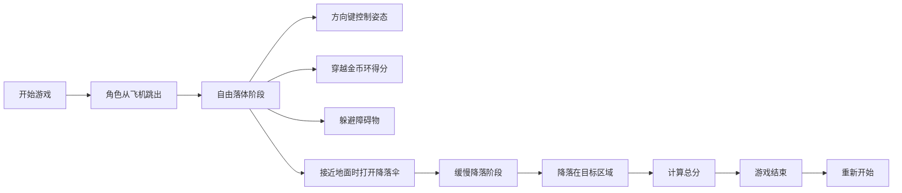

## 1. 产品概述

空中跳伞游戏是一款刺激的3D视角休闲游戏，玩家控制跳伞角色从高空飞机跳出，通过方向键控制空中姿态，穿越金币环收集分数，躲避飞鸟、气球、无人机等障碍物，在接近地面时打开降落伞，最终安全降落在目标区域获得高分。

- 主要目的：提供轻松有趣的休闲游戏体验，考验玩家的反应能力和操作技巧
- 目标用户：所有年龄段的休闲游戏玩家
- 产品价值：简单易上手的操作，紧张刺激的游戏体验，可重复挑战的高分机制

## 2. 核心功能

### 2.1 用户角色
| 角色 | 注册方式 | 核心权限 |
|------|----------|----------|
| 玩家 | 无需注册 | 进行游戏、查看分数 |

### 2.2 功能模块
1. **游戏主界面**：开始按钮、操作说明、最高分显示
2. **游戏场景**：3D视角跳伞场景、角色、金币环、障碍物
3. **分数系统**：金币收集、落地精度、总分计算
4. **游戏结束界面**：得分详情、重新开始按钮

### 2.3 页面详情
| 页面名称 | 模块名称 | 功能描述 |
|---------|----------|----------|
| 主界面 | 开始区域 | 游戏标题、开始按钮、操作说明、历史最高分 |
| 游戏界面 | 游戏画布 | 3D跳伞场景、角色控制、金币收集、障碍物躲避 |
| 游戏界面 | HUD显示 | 当前高度、金币数量、降落伞状态提示 |
| 结算界面 | 分数统计 | 金币得分、落地精度得分、总分、重新开始按钮 |

## 3. 核心流程

玩家点击开始按钮后，角色从高空飞机跳出进入自由落体状态。玩家使用方向键控制角色的空中姿态，引导角色穿越金币环获得分数，同时躲避飞鸟、气球和无人机等障碍物。当角色接近地面时，玩家需要点击打开降落伞，进入缓慢降落阶段，最终根据降落位置的精度计算落地得分。游戏结束后显示总分，玩家可选择重新开始。

## 4. 用户界面设计

### 4.1 设计风格
- **主色调**：天蓝色渐变（#87CEEB 到 #1E90FF），模拟天空效果
- **辅助色**：金黄色（#FFD700）用于金币环，红色（#FF6347）用于障碍物
- **按钮风格**：圆角矩形按钮，带有悬停动画效果
- **字体**：使用 Orbitron 作为游戏标题字体，Roboto 作为正文字体
- **布局风格**：全屏游戏画布，HUD 元素分布在四个角落
- **图标风格**：简洁的扁平化图标，使用 Emoji 增强视觉效果

### 4.2 页面设计概述
| 页面名称 | 模块名称 | UI 元素 |
|---------|----------|----------|
| 主界面 | 开始区域 | 渐变背景、大标题居中、开始按钮（跳动动画）、操作说明卡片、最高分显示 |
| 游戏界面 | 游戏画布 | 3D 天空背景、云朵动画、角色居中、金币环旋转、障碍物移动 |
| 游戏界面 | HUD显示 | 左上角高度计、右上角金币数、左下角降落伞状态提示 |
| 结算界面 | 分数统计 | 半透明黑色背景、分数大字显示、分项得分列表、重新开始按钮 |

### 4.3 响应性
- 桌面端优先，支持键盘方向键控制
- 移动端自适应，支持屏幕虚拟方向键
- 游戏画布保持 16:9 比例，黑边填充
- 触摸操作优化：点击屏幕任意位置打开降落伞

### 4.4 3D 场景指导
- **环境**：蓝天白云背景，使用多层视差滚动模拟深度
- **光照**：柔和的阳光效果，角色和物体带有轻微阴影
- **相机设置**：第三人称跟随视角，略微俯视角度
- **交互动画**：角色旋转动画、金币环旋转、降落伞打开动画
- **后期效果**：速度线效果增强下落速度感
