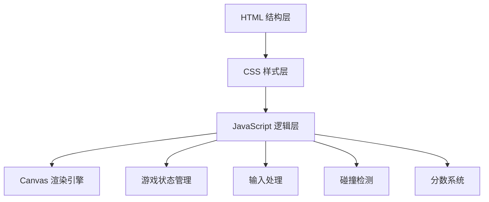

## 1. 架构设计



本项目采用纯前端架构，使用 HTML5 Canvas 进行游戏渲染，JavaScript 处理游戏逻辑，CSS 负责界面样式。采用分层设计，将结构、样式和逻辑分离到不同目录中。

## 2. 技术描述

- **前端技术栈**: 原生 HTML5 + CSS3 + JavaScript (ES6+)
- **渲染引擎**: HTML5 Canvas 2D API
- **初始化工具**: 无，直接创建文件结构
- **后端**: 无（纯前端游戏）
- **数据库**: LocalStorage 存储最高分
- **动画**: requestAnimationFrame 实现 60fps 游戏循环

## 3. 目录结构

```
空中跳伞/
├── index.html          # 主入口文件
├── css/
│   └── style.css       # 游戏样式文件
├── js/
│   ├── game.js         # 游戏主逻辑
│   ├── player.js       # 玩家角色类
│   ├── coin.js         # 金币环类
│   ├── obstacle.js     # 障碍物类
│   └── utils.js        # 工具函数
├── assets/
│   └── images/         # 游戏图片资源（可选）
└── .trae/
    └── documents/      # 项目文档
```

## 4. 游戏状态定义

| 状态 | 描述 |
|------|------|
| MENU | 游戏主菜单 |
| PLAYING | 游戏进行中 |
| PARACHUTE | 降落伞已打开 |
| LANDED | 已着陆 |
| GAME_OVER | 游戏结束 |

## 5. 核心类定义

### 5.1 Player 类
```javascript
class Player {
  x: number;           // X坐标
  y: number;           // Y坐标（高度）
  z: number;           // Z深度（伪3D）
  vx: number;          // X速度
  vy: number;          // Y下落速度
  rotation: number;    // 旋转角度
  parachuteOpen: boolean;  // 降落伞状态
}
```

### 5.2 Coin 类
```javascript
class Coin {
  x: number;
  y: number;
  z: number;
  radius: number;
  collected: boolean;
  rotation: number;
}
```

### 5.3 Obstacle 类
```javascript
class Obstacle {
  x: number;
  y: number;
  z: number;
  type: 'bird' | 'balloon' | 'drone';
  width: number;
  height: number;
}
```

## 6. 输入处理

| 输入 | 动作 |
|------|------|
| 方向键← / A | 向左移动 |
| 方向键→ / D | 向右移动 |
| 方向键↑ / W | 向前移动（加速） |
| 方向键↓ / S | 向后移动（减速） |
| 空格键 / 点击屏幕 | 打开降落伞 |

## 7. 分数计算

- **金币收集**: 每个金币环 = 100分
- **落地精度**: 
  - 靶心区域: +500分
  - 内圈区域: +300分
  - 中圈区域: +150分
  - 外圈区域: +50分
  - 区域外: 0分
- **时间奖励**: 快速完成额外加分
- **总分**: 金币得分 + 落地精度得分
