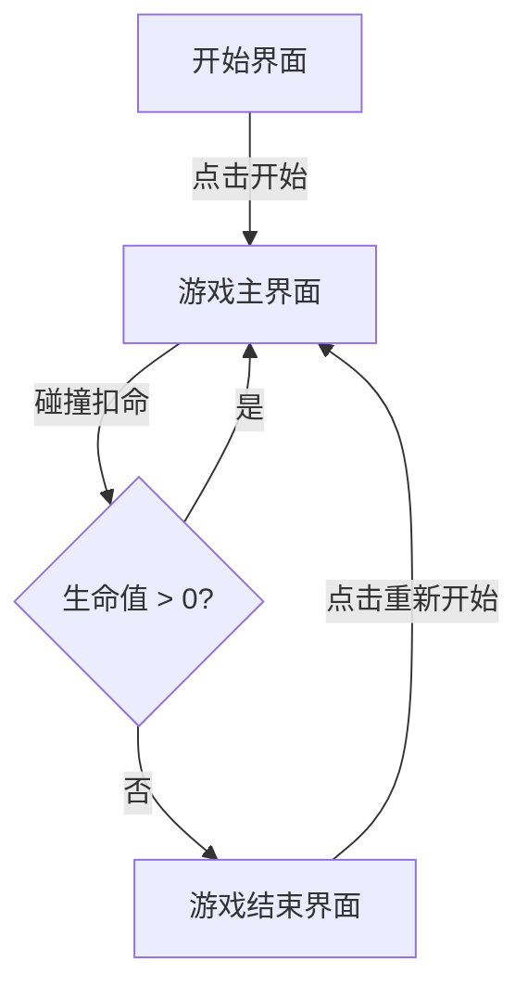

## 1. 产品概述
赛车换道躲避游戏 — 一款俯视视角的高速公路赛车游戏，玩家操控赛车在三车道间切换，躲避前方车辆和障碍物，收集金币获取高分。
- 主要用途：休闲娱乐、反应力训练
- 目标用户：所有年龄段玩家
- 核心价值：简单易上手、紧张刺激、适合碎片化时间游玩

## 2. 核心功能

### 2.1 功能模块
1. **游戏主界面**：Canvas 游戏画布、HUD 信息面板（分数/生命/距离）
2. **开始界面**：游戏标题、操作说明、开始按钮
3. **游戏结束界面**：最终得分、行驶距离、重新开始按钮

### 2.2 页面详情
| 页面名称 | 模块名称 | 功能描述 |
|----------|----------|----------|
| 游戏主界面 | 游戏画布 | 俯视视角高速公路，三车道，赛车自动前进 |
| 游戏主界面 | HUD 信息 | 实时显示分数、生命值、行驶距离、金币数量 |
| 游戏主界面 | 车道切换 | 左/右方向键或 A/D 键切换车道，移动端支持触摸滑动 |
| 游戏主界面 | 障碍物系统 | 前方随机生成车辆和障碍物，碰撞扣命并减速 |
| 游戏主界面 | 金币系统 | 随机生成金币，收集后增加分数 |
| 开始界面 | 标题和说明 | 显示游戏名称、操作指引、开始按钮 |
| 游戏结束界面 | 结算面板 | 显示最终得分、距离、重新开始按钮 |

## 3. 核心流程
玩家打开游戏 → 看到开始界面 → 点击"开始游戏" → 进入游戏主界面 → 赛车自动前进 → 玩家通过方向键/滑动切换车道躲避障碍物 → 碰撞障碍物扣命，收集金币增加分数 → 生命值归零或选择退出 → 显示游戏结束界面 → 点击重新开始回到游戏主界面

## 4. 用户界面设计

### 4.1 设计风格
- **主色调**：深色背景（#0a0a1a）搭配霓虹青蓝（#00ffff）和品红（#ff00ff）渐变
- **辅助色**：警示红（#ff3366）、金币黄（#ffcc00）、成功绿（#00ff88）
- **按钮风格**：圆角矩形，霓虹发光边框，悬停时发光增强
- **字体**：Orbitron（科技感），数字用等宽字体
- **布局风格**：全屏 Canvas 居中，HUD 面板浮动在顶部和底部
- **图标风格**：简洁几何线条图标

### 4.2 页面设计概览
| 页面名称 | 模块名称 | UI 元素 |
|----------|----------|----------|
| 开始界面 | 标题 | 霓虹灯效大字标题，闪烁动画 |
| 开始界面 | 操作说明 | 半透明卡片，键盘和触摸图标 |
| 开始界面 | 开始按钮 | 霓虹边框按钮，脉冲发光效果 |
| 游戏主界面 | 游戏画布 | 三车道高速公路，车道线动画滚动 |
| 游戏主界面 | HUD | 顶部分数面板、左上角生命值、底部金币计数 |
| 游戏结束界面 | 结算面板 | 半透明玻璃拟态卡片，显示最终数据 |
| 游戏结束界面 | 重新开始按钮 | 同开始按钮风格 |

### 4.3 响应式设计
- 桌面端：全屏游戏，键盘操作
- 移动端：自适应屏幕尺寸，触摸滑动操作
- 触摸优化：支持左右滑动切换车道，点击按钮交互
