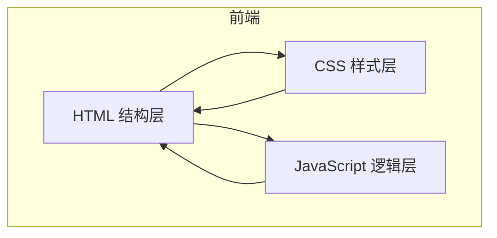

## 1. 架构设计



## 2. 技术说明
- **前端**：原生 HTML5 + CSS3 + Vanilla JavaScript（ES6+）
- **渲染引擎**：HTML5 Canvas 2D
- **构建工具**：无（纯静态页面，直接浏览器打开即可运行）
- **后端**：无（纯前端游戏，无需服务端）
- **数据库**：无（分数仅在内存中保存）

## 3. 文件结构
```
.
├── index.html          # 主 HTML 页面
├── css/
│   └── style.css       # 游戏样式
└── js/
    └── game.js         # 游戏核心逻辑
```

## 4. 模块划分
| 模块 | 文件 | 职责 |
|------|------|------|
| 页面结构 | `index.html` | 定义 Canvas 画布、HUD 面板、开始/结束界面 DOM |
| 视觉样式 | `css/style.css` | 霓虹合成波配色、UI 面板样式、动画效果 |
| 游戏核心 | `js/game.js` | 游戏循环、物体生成、碰撞检测、输入处理、分数系统 |
