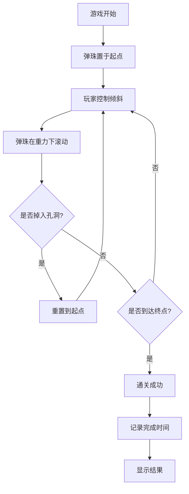

## 1. 产品概述

一款基于HTML5 Canvas的弹珠迷宫平衡游戏，玩家通过倾斜平面控制弹珠滚动，避开孔洞陷阱抵达终点。

- 核心玩法：利用物理模拟重力，通过键盘或设备倾斜控制迷宫平面角度，引导弹珠穿越迷宫
- 目标用户：休闲游戏爱好者，适合全年龄段
- 市场价值：经典平衡迷宫游戏的网页版实现，简单易上手，具有挑战性和趣味性

## 2. 核心功能

### 2.1 功能模块

1. **游戏主界面**：迷宫渲染、弹珠物理模拟、倾斜控制、计时系统
2. **开始/重置控制**：游戏开始、重新开始、关卡选择
3. **结果展示**：通关提示、用时记录、最佳成绩保存

### 2.2 页面详情

| 页面名称 | 模块名称 | 功能描述 |
|-----------|-------------|---------------------|
| 游戏主界面 | 迷宫渲染 | Canvas绘制迷宫墙壁、起点、终点、孔洞陷阱 |
| 游戏主界面 | 弹珠物理 | 基于倾斜角度的重力模拟，弹珠滚动与碰撞检测 |
| 游戏主界面 | 倾斜控制 | 键盘方向键控制平面倾斜，支持设备方向传感器（移动端） |
| 游戏主界面 | 计时系统 | 从游戏开始到通关的时间统计 |
| 游戏主界面 | 状态显示 | 当前用时、最佳成绩、游戏状态提示 |
| 游戏主界面 | 游戏控制 | 开始按钮、重置按钮、关卡切换 |

## 3. 核心流程

## 4. 用户界面设计

### 4.1 设计风格

- 主色调：暖木色 (#8B4513) 搭配米黄色 (#F5DEB3) 背景，营造木质迷宫质感
- 强调色：弹珠银色渐变，终点金色光晕，孔洞深黑阴影
- 按钮风格：圆润3D木质按钮，带微阴影
- 字体：标题使用 "Ma Shan Zheng" 手写风格，正文使用系统无衬线字体
- 布局：居中卡片式布局，迷宫画布居中，控制按钮在下方
- 图标风格：简洁几何图标

### 4.2 页面设计概览

| 页面名称 | 模块名称 | UI元素 |
|-----------|-------------|-------------|
| 游戏主界面 | 迷宫画布 | 木质纹理背景，深棕色墙壁，弹珠带光泽渐变 |
| 游戏主界面 | 信息面板 | 半透明卡片，显示时间和成绩，使用圆角和微阴影 |
| 游戏主界面 | 控制按钮 | 木质风格按钮，悬停上浮效果，点击反馈 |
| 游戏主界面 | 通关弹窗 | 居中模态框，金色边框，庆祝动画 |

### 4.3 响应式设计

- 桌面端：迷宫画布最大800x600，侧边信息面板
- 移动端：画布自适应屏幕宽度，控制按钮放大便于触摸
- 支持设备方向传感器（DeviceOrientation API）控制倾斜
