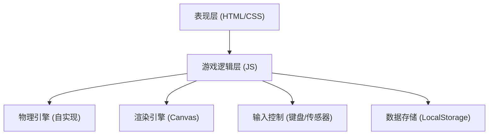

## 1. 架构设计



## 2. 技术说明

- 前端：原生 HTML5 + CSS3 + JavaScript (ES6+)，无需框架
- 构建工具：无需构建工具，纯静态文件
- 后端：无
- 数据库：LocalStorage 存储最佳成绩
- 渲染：HTML5 Canvas 2D API
- 物理模拟：自实现重力与碰撞检测

## 3. 目录结构

```
弹珠迷宫平衡/
├── index.html
├── css/
│   └── style.css
└── js/
    └── game.js
```

## 4. 核心模块设计

### 4.1 迷宫数据结构

```
{
  width: 800,
  height: 600,
  walls: [
    { x1, y1, x2, y2 },
    ...
  ],
  holes: [
    { x, y, radius },
    ...
  ],
  start: { x, y },
  end: { x, y, radius }
}
```

### 4.2 弹珠物理模型

- 位置：(x, y)
- 速度：(vx, vy)
- 加速度：由平面倾斜角度决定
- 摩擦系数：控制弹珠滚动阻尼
- 碰撞检测：圆形 vs 线段（墙壁），圆形 vs 圆形（孔洞/终点）

### 4.3 游戏状态

```
{
  running: boolean,
  completed: boolean,
  startTime: number,
  elapsedTime: number,
  bestTime: number,
  currentLevel: number
}
```

## 5. API 定义

无后端API，使用 LocalStorage 存储最佳成绩：

```javascript
// 保存最佳成绩
localStorage.setItem('marbleMaze_bestTime', JSON.stringify({ level: time }));

// 读取最佳成绩
const bestTime = JSON.parse(localStorage.getItem('marbleMaze_bestTime') || '{}');
```

## 6. 数据模型

### 6.1 游戏记录

| 字段 | 类型 | 说明 |
|------|------|------|
| level | number | 关卡编号 |
| bestTime | number | 最佳通关时间（毫秒） |
| lastTime | number | 最近通关时间（毫秒） |

### 6.2 迷宫关卡定义

| 字段 | 类型 | 说明 |
|------|------|------|
| walls | array | 墙壁线段数组 |
| holes | array | 陷阱孔洞数组 |
| start | object | 起点坐标 |
| end | object | 终点坐标 |
