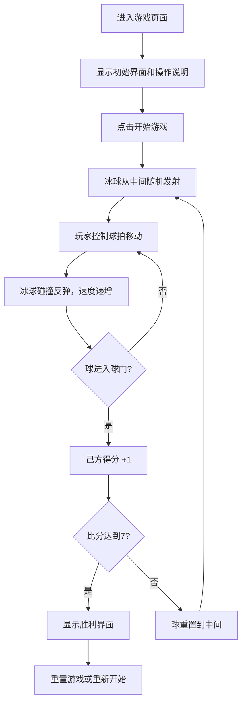

## 1. 产品概述
冰球对碰是一款双人对战的网页小游戏，玩家通过控制球拍击打冰球，争取将球打入对方球门得分。游戏目标是率先获得7分赢得比赛。

- 主要用途：休闲娱乐、双人对战
- 目标用户：喜欢简单对战小游戏的玩家
- 产品价值：提供简单易上手、紧张刺激的双人对战体验

## 2. 核心功能

### 2.1 用户角色
| 角色 | 注册方式 | 核心权限 |
|------|----------|----------|
| 玩家1 | 键盘W/S键控制 | 控制左侧球拍上下移动 |
| 玩家2 | 键盘↑/↓键控制 | 控制右侧球拍上下移动 |

### 2.2 功能模块
1. **游戏主界面**：冰球场、球拍、冰球、比分显示、时间显示
2. **游戏控制系统**：键盘监听、球拍移动控制
3. **物理碰撞系统**：球与边界反弹、球与球拍碰撞、速度递增机制
4. **计分系统**：进球判定、比分更新、胜负判定
5. **游戏状态管理**：开始、暂停、重置、游戏结束

### 2.3 页面详情
| 页面名称 | 模块名称 | 功能描述 |
|---------|----------|----------|
| 游戏主页面 | 冰球场区域 | 横向冰球场，中间有中线分隔，上下边界，两侧球门 |
| 游戏主页面 | 球拍控制 | 两名玩家各控制一个球拍上下移动 |
| 游戏主页面 | 冰球运动 | 球在场内反弹，球拍击打球反弹，球速随反弹次数逐渐加快 |
| 游戏主页面 | 计分显示 | 显示双方比分，先到7分者获胜 |
| 游戏主页面 | 时间显示 | 显示比赛已进行时间 |
| 游戏主页面 | 控制按钮 | 开始游戏、暂停、重置功能 |

## 3. 核心流程

### 游戏流程
1. 进入游戏页面，显示初始界面和操作说明
2. 玩家点击"开始游戏"按钮，冰球从中间随机方向发射
3. 两名玩家分别使用键盘控制各自球拍移动
4. 冰球在场内碰撞反弹，每次碰撞后球速略微加快
5. 冰球进入对方球门则己方得分，球重置到中间重新发射
6. 率先获得7分的玩家获胜，显示胜利界面
7. 可随时暂停或重置游戏

## 4. 用户界面设计

### 4.1 设计风格
- **主色调**：冰球蓝（#1e40af）作为主色，冰白（#f0f9ff）作为场地色，红色（#dc2626）和蓝色（#2563eb）作为双方队伍色
- **辅助色**：金色（#f59e0b）用于高亮和按钮
- **按钮风格**：圆角矩形，带有悬停和点击动效
- **字体**：使用 Orbitron 作为数字显示字体（运动感），Noto Sans SC 作为中文显示
- **布局风格**：全屏游戏画布，顶部信息栏，底部控制区
- **视觉效果**：冰面纹理背景、发光效果、碰撞粒子效果

### 4.2 页面设计概述
| 页面名称 | 模块名称 | UI 元素 |
|---------|----------|---------|
| 游戏主页面 | 顶部信息栏 | 玩家1比分（蓝色）、比赛时间、玩家2比分（红色），居中对称布局 |
| 游戏主页面 | 冰球场地 | 横向长方形，冰白色背景，中线虚线，球门区域，圆角边框 |
| 游戏主页面 | 球拍 | 长方形，左侧蓝色，右侧红色，带有渐变和阴影 |
| 游戏主页面 | 冰球 | 圆形，黑色带高光，运动时有拖尾效果 |
| 游戏主页面 | 底部控制区 | 开始、暂停、重置按钮，操作说明文字 |
| 游戏主页面 | 胜利弹窗 | 半透明遮罩，显示获胜方，动画效果 |

### 4.3 响应式
- 桌面端优先，画布自适应窗口大小
- 保持场地宽高比，最小尺寸 800x400
- 按钮和文字在不同屏幕尺寸下自适应

### 4.4 动画与交互
- 冰球移动时带有拖尾效果
- 碰撞时有短暂的发光闪烁
- 进球时有庆祝动画和粒子效果
- 按钮悬停有缩放和颜色变化
- 胜利界面有淡入和缩放动画
