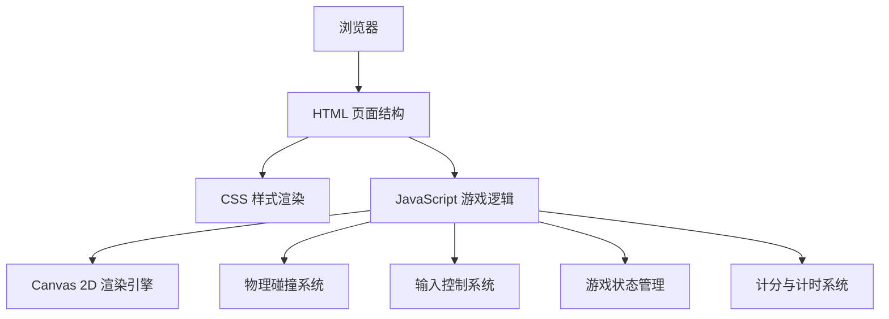

## 1. 架构设计



## 2. 技术描述

- **前端技术栈**：原生 HTML5 + CSS3 + JavaScript (ES6+)
- **渲染方式**：HTML5 Canvas 2D API
- **无需后端**：纯客户端游戏，所有逻辑在浏览器端运行
- **目录结构**：HTML/CSS/JS 分别存放在不同目录

## 3. 目录结构

```
冰球对碰/
├── index.html          # 主页面入口
├── css/
│   └── style.css       # 样式文件
├── js/
│   └── game.js         # 游戏逻辑
└── .trae/
    └── documents/
        ├── PRD.md
        └── 技术架构.md
```

## 4. 核心模块设计

### 4.1 游戏对象类

| 类/对象 | 属性 | 方法 |
|--------|------|------|
| Paddle (球拍) | x, y, width, height, speed, color | moveUp(), moveDown(), draw(), update() |
| Ball (冰球) | x, y, radius, speedX, speedY, baseSpeed, bounceCount | draw(), update(), reset(), increaseSpeed() |
| Game (游戏主类) | canvas, ctx, paddle1, paddle2, ball, score1, score2, gameTime, isRunning, isPaused | init(), start(), pause(), reset(), gameLoop(), checkCollisions(), checkGoal(), updateScore(), updateTime() |

### 4.2 物理碰撞系统

- **边界碰撞**：球碰到上下边界时 Y 方向速度反向
- **球拍碰撞**：球碰到球拍时 X 方向速度反向，根据碰撞点调整 Y 方向速度
- **速度递增**：每次碰撞（边界或球拍）后速度增加 2%，最多增加到初始速度的 2 倍
- **进球判定**：球完全越过球门线时判定得分

### 4.3 输入控制

- **玩家1（左侧）**：W 键向上，S 键向下
- **玩家2（右侧）**：↑ 键向上，↓ 键向下
- **空格键**：暂停/继续游戏
- **按键状态**：使用 keydown/keyup 事件监听，支持同时按键

## 5. 游戏参数配置

| 参数 | 值 | 说明 |
|------|----|------|
| 场地宽度 | 900 | 像素 |
| 场地高度 | 500 | 像素 |
| 球拍宽度 | 15 | 像素 |
| 球拍高度 | 100 | 像素 |
| 球拍速度 | 8 | 像素/帧 |
| 球半径 | 12 | 像素 |
| 球初始速度 | 5 | 像素/帧 |
| 速度增长率 | 1.02 | 每次碰撞 |
| 最大速度倍数 | 2.0 | 相对于初始速度 |
| 球门高度 | 180 | 像素 |
| 获胜分数 | 7 | 分 |
| 帧率 | 60 | FPS |

## 6. 关键实现点

1. **Canvas 渲染优化**：使用 requestAnimationFrame 实现流畅动画
2. **碰撞检测优化**：使用 AABB (Axis-Aligned Bounding Box) 算法
3. **时间计时**：使用 Date.now() 计算游戏进行时间
4. **响应式布局**：监听窗口 resize 事件，动态调整 canvas 尺寸
5. **状态管理**：使用状态机管理游戏状态（等待开始、进行中、暂停、结束）
