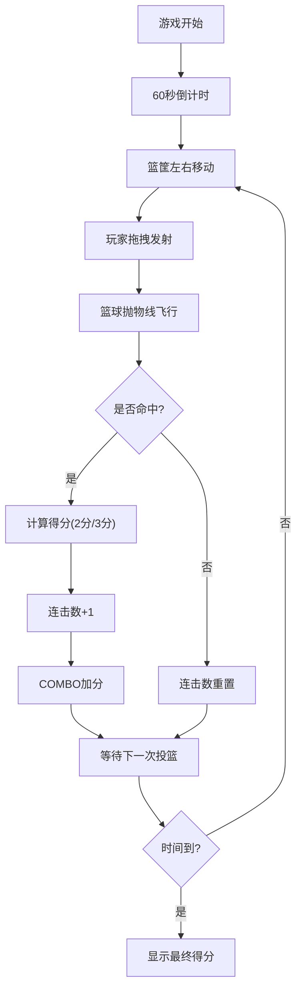

## 1. 产品概述
一款基于Web的投篮机篮球游戏，玩家通过拖拽控制篮球发射角度和力度，在60秒内尽可能多地投篮得分。
- 主要目的：提供休闲娱乐体验，锻炼玩家手眼协调能力
- 目标用户：休闲游戏玩家、网页游戏爱好者

## 2. 核心功能

### 2.1 功能模块
1. **游戏主界面**：游戏画布、计分板、计时器、连击显示
2. **游戏控制**：拖拽发射控制、力度角度指示
3. **游戏逻辑**：篮球物理运动、篮筐移动、碰撞检测、计分系统

### 2.2 页面详情
| 页面名称 | 模块名称 | 功能描述 |
|-----------|-------------|---------------------|
| 游戏主页面 | 游戏画布 | 显示篮筐、篮球、发射轨迹、得分线 |
| 游戏主页面 | 信息面板 | 实时显示得分、剩余时间、连击数 |
| 游戏主页面 | 开始/结束界面 | 游戏开始按钮、结束时显示最终得分 |

## 3. 核心流程

## 4. 用户界面设计
### 4.1 设计风格
- **主色调**：橙色系（#FF6B35）代表篮球活力，搭配深蓝色（#1A365D）作为背景
- **辅助色**：金色（#FFD700）用于高分和连击特效
- **按钮风格**：圆角按钮，带有悬浮动效和按压反馈
- **字体**：使用Google Fonts的Bangers（标题）和Roboto（数据显示）
- **布局风格**：全屏游戏画布，顶部信息面板固定显示

### 4.2 页面设计概述
| 页面名称 | 模块名称 | UI Elements |
|-----------|-------------|-------------|
| 游戏主页面 | 游戏画布 | 篮球纹理背景、动态篮筐、发光3分线、拖轨迹动画 |
| 游戏主页面 | 信息面板 | 半透明玻璃质感、数字跳动动画、连击特效 |
| 游戏主页面 | 开始/结束界面 | 居中弹窗、渐变按钮、分数展示动画 |

### 4.3 响应性
- 桌面端优先，支持全屏游戏体验
- 自适应屏幕尺寸，保持游戏比例
- 支持触屏拖拽操作

## 5. 音效与动画
- 投篮发射音效
- 得分成功音效
- 连击升级特效
- 篮球物理运动动画
- 得分数字弹跳动画
