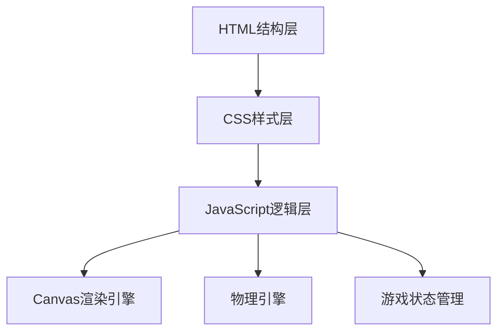

## 1. 架构设计


## 2. 技术描述
- **前端**: 原生HTML5 + CSS3 + JavaScript (ES6+)
- **渲染**: Canvas 2D API
- **物理引擎**: 自定义抛物线物理计算
- **目录结构**: 分离式设计（html/、css/、js/）

## 3. 目录结构
```
投篮机篮球/
├── index.html          # 主页面入口
├── css/
│   └── style.css       # 游戏样式
├── js/
│   └── game.js         # 游戏核心逻辑
└── assets/             # 资源文件(可选)
```

## 4. 核心技术点

### 4.1 Canvas渲染
- 使用requestAnimationFrame实现60fps动画循环
- 分层渲染：背景层、游戏元素层、UI层

### 4.2 物理系统
- 重力模拟：gravity = 0.5
- 速度向量：vx, vy
- 碰撞检测：圆形与矩形碰撞算法

### 4.3 游戏状态
```javascript
const GameState = {
    READY: 'ready',
    PLAYING: 'playing',
    AIMING: 'aiming',
    SHOOTING: 'shooting',
    ENDED: 'ended'
};
```

### 4.4 得分规则
- 2分区：篮筐正下方区域
- 3分区：超出2分线区域
- COMBO加成：连击数 × 0.5 额外加分

## 5. 关键算法

### 5.1 抛物线计算
```javascript
// 初始速度由拖拽距离决定
vx = (startX - endX) * powerMultiplier;
vy = (startY - endY) * powerMultiplier;

// 每帧更新
vy += gravity;
x += vx;
y += vy;
```

### 5.2 碰撞检测
- 篮筐检测：篮球进入篮筐区域且下落状态
- 边界检测：屏幕边界反弹
