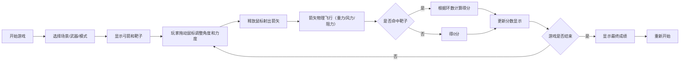

## 1. 产品概述

弓箭射击模拟游戏是一款基于网页的休闲射击游戏，玩家通过鼠标拖动控制弓箭的瞄准角度和拉弓力度，释放鼠标射出箭矢，根据命中靶子的不同环数获得分数。

- 主要目的：提供娱乐休闲的射箭体验，模拟真实物理效果
- 目标用户：休闲游戏玩家、射箭爱好者
- 产品价值：通过简单有趣的物理模拟射箭游戏

## 2. 核心功能

### 2.1 用户角色
无角色区分，所有用户均可直接开始游戏

### 2.2 功能模块
1. **游戏主界面**：弓箭、靶子、风力指示、分数显示
2. **物理引擎**：抛物线飞行、重力、风力、空气阻力
3. **计分系统**：环数判定、累计总分
4. **场景系统**：射箭场、森林狩猎、中世纪城堡
5. **武器系统**：长弓、复合弓、弩
6. **游戏模式**：经典模式、移动靶模式、限时速射模式
7. **瞄准系统**：第三人称视角、第一人称瞄准镜

### 2.3 页面详情
| 页面名称 | 模块名称 | 功能描述 |
|-----------|-------------|---------------------|
| 游戏主界面 | 弓箭控制 | 鼠标拖动调整角度和力度 |
| 游戏主界面 | 箭矢飞行 | 抛物线物理模拟，受风力影响 |
| 游戏主界面 | 靶子系统 | 多层环形靶子，环数判定 |
| 游戏主界面 | 信息面板 | 显示当前箭数、单箭得分、累计总分、风力 |
| 游戏主界面 | 游戏结束 | 10支箭用完后显示最终成绩 |
| 游戏主界面 | 场景选择 | 切换不同游戏场景 |
| 游戏主界面 | 武器选择 | 切换不同弓箭类型 |
| 游戏主界面 | 模式选择 | 切换经典/移动靶/限时模式 |

## 3. 核心流程

## 4. 用户界面设计

### 4.1 设计风格
- **主色调**：深绿色（#2D5016 - 代表弓箭主题
- **辅助色**：棕色（#8B4513）、金黄色（#FFD700）
- **按钮风格**：圆角矩形，木质纹理效果
- **字体**：使用具有复古风格的字体，标题大号醒目
- **布局风格**：全屏画布，信息面板位于顶部
- **图标风格**：使用emoji或简单矢量图标

### 4.2 页面设计概述
| 页面名称 | 模块名称 | UI元素 |
|-----------|-------------|-------------|
| 游戏主界面 | 画布区域 | 全屏Canvas，动态场景背景 |
| 游戏主界面 | 弓箭 | 左侧位置，可旋转角度，拉弓动画 |
| 游戏主界面 | 靶子 | 右侧位置，多层环形设计 |
| 游戏主界面 | 信息面板 | 顶部半透明背景，显示箭数、分数、风力 |
| 游戏主界面 | 力度指示器 | 弓箭旁显示拉弓力度条 |
| 游戏主界面 | 选择面板 | 场景、武器、模式选择按钮 |

### 4.3 响应性
- 桌面端优先设计
- 支持窗口大小自适应
- 触屏设备支持触摸拖动操作

### 4.4 视觉效果
- 弓箭拉弓时的张力动画
- 箭矢飞行轨迹残影效果
- 命中靶子时的击中特效
- 风力指示器动态变化
- 场景切换过渡动画
- 瞄准镜放大效果

## 5. 新功能说明

### 5.1 物理模拟增强
- 重力：真实的重力加速度
- 风力：动态变化的水平风力
- 空气阻力：箭矢速度越快阻力越大
- 箭矢下坠：长距离飞行时的明显下坠效果

### 5.2 场景系统
- 射箭场：蓝天白云、标准射箭场地
- 森林狩猎：绿色森林背景、动物靶子
- 中世纪城堡：石墙城堡、城垛靶子

### 5.3 弓箭类型
- 长弓：威力大、精准度中、拉弓慢
- 复合弓：威力中、精准度高、拉弓快
- 弩：威力大、精准度极高、拉弓很慢

### 5.4 游戏模式
- 经典模式：10支箭，固定靶子
- 移动靶模式：靶子上下移动
- 限时速射：60秒内尽可能多射箭

### 5.5 瞄准系统
- 第三人称：默认视角，全局视野
- 第一人称瞄准镜：放大视野，精准瞄准
