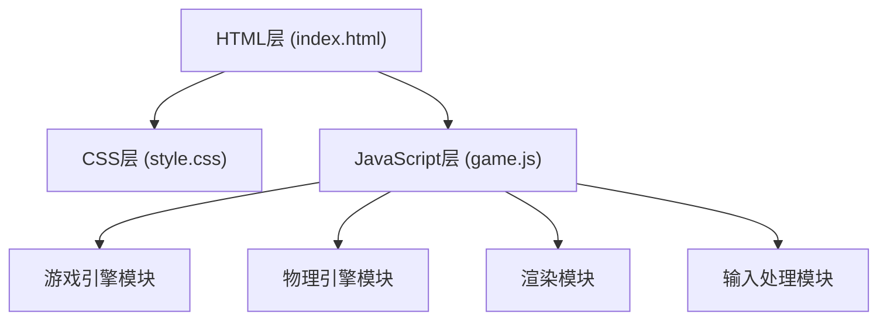

## 1. 架构设计



## 2. 技术描述

- **前端技术栈**：原生HTML5 + CSS3 + JavaScript (ES6+)
- **渲染技术**：HTML5 Canvas 2D
- **构建工具**：无（纯静态文件）
- **后端**：无（纯前端游戏）
- **数据库**：无

## 3. 目录结构

```
弓箭射击模拟/
├── index.html          # 主HTML文件
├── css/
│   └── style.css     # 样式文件
├── js/
│   └── game.js        # 游戏逻辑文件
└── .trae/
    └── documents/
        ├── prd.md
        └── tech-architecture.md
```

## 4. 核心模块定义

### 4.1 游戏状态对象
```javascript
const GameState = {
  // 弓箭属性
  bow: { x, y, angle, power },
  // 箭矢数组
  arrows: [{ x, y, vx, vy, active },
  // 靶子属性
  target: { x, y, radius, rings },
  // 游戏状态
  currentArrow: 0,
  totalArrows: 10,
  currentScore: 0,
  totalScore: 0,
  wind: { speed, direction },
  isDragging: false,
  gameOver: false
};
```

### 4.2 核心函数
- `initGame()` - 初始化游戏
- `handleMouseDown()` - 鼠标按下事件
- `handleMouseMove()` - 鼠标移动事件
- `handleMouseUp()` - 鼠标释放事件
- `updatePhysics()` - 更新物理状态
- `checkCollision()` - 碰撞检测
- `calculateScore()` - 计算得分
- `render()` - 渲染游戏画面
