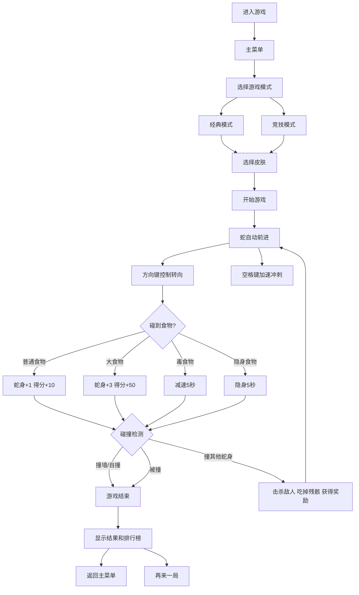

## 1. 产品概述

贪吃蛇大作战是一款多人竞技休闲游戏，玩家控制蛇在开放区域中与其他AI蛇对战，通过收集食物增长身体、使用加速冲刺技能、击败其他蛇来获得高分。游戏包含经典模式和竞技模式，支持多种皮肤和特效。

- 核心目标：提供紧张刺激的多人竞技体验，结合策略与操作技巧
- 目标用户：休闲竞技游戏爱好者，喜欢io类游戏的玩家
- 市场价值：经典贪吃蛇玩法的现代竞技化升级，增加深度和重玩性

## 2. 核心功能

### 2.1 游戏模式

1. **经典模式**：单人游玩，躲避墙壁和自身，挑战最高分
2. **竞技模式**：多人同屏竞技，与AI蛇群对战，击杀敌人获得奖励

### 2.2 功能模块

1. **游戏主界面**：游戏画布、实时得分显示、蛇身长度显示、技能状态
2. **游戏控制**：键盘方向键控制转向、空格键加速冲刺
3. **食物系统**：普通食物、大食物、毒食物、隐身食物
4. **技能系统**：加速冲刺（消耗长度）、隐身技能
5. **AI系统**：进攻型AI、逃避型AI、巡逻型AI
6. **碰撞检测**：墙壁碰撞、自身碰撞、蛇蛇碰撞击杀
7. **摄像机系统**：屏幕随蛇头移动而滚动、视野限制
8. **小地图**：右下角显示全局地图和所有蛇的位置
9. **皮肤系统**：多种蛇身皮肤、渐变颜色、拖尾粒子特效
10. **排行榜系统**：本地排行榜、赛季积分系统

### 2.3 功能详情

| 页面名称 | 模块名称 | 功能描述 |
|----------|----------|----------|
| 主菜单 | 模式选择 | 经典模式/竞技模式切换、皮肤选择、排行榜入口 |
| 游戏主界面 | 游戏画布 | 渲染地图、蛇、食物、粒子特效、视野限制 |
| 游戏主界面 | HUD信息栏 | 实时显示长度、得分、击杀数、技能冷却 |
| 游戏主界面 | 小地图 | 右下角显示全局概览 |
| 游戏主界面 | 技能栏 | 显示加速技能状态和可用次数 |
| 游戏结束界面 | 结果展示 | 最终长度、得分、击杀数、排名、赛季积分变化 |
| 排行榜界面 | 榜单展示 | 历史最高分、击杀榜、赛季排行榜 |
| 皮肤商店 | 皮肤选择 | 解锁和选择不同的蛇身皮肤和特效 |

## 3. 核心流程

## 4. 用户界面设计

### 4.1 设计风格

- **主色调**：深色宇宙背景（#0a0a1a），营造科技竞技感
- **辅助色**：霓虹色系、渐变色皮肤、多彩粒子特效
- **蛇身颜色**：多种可选皮肤（霓虹绿、烈焰红、海洋蓝、暗夜紫等）
- **食物颜色**：
  - 普通：绿/黄/蓝/紫
  - 大食物：金色带光环
  - 毒食物：紫色带骷髅图标
  - 隐身食物：半透明蓝色
- **按钮样式**：圆角矩形，渐变边框，发光悬浮效果
- **字体**：现代等宽字体 + 无衬线字体组合
- **布局风格**：全屏游戏，HUD环绕式布局，右下角小地图
- **动效**：粒子爆炸、拖尾特效、击杀动画、屏幕震动

### 4.2 页面设计概览

| 页面名称 | 模块名称 | UI元素 |
|----------|----------|--------|
| 主菜单 | 标题区域 | 霓虹发光游戏标题，动态背景粒子 |
| 主菜单 | 模式选择 | 两个大卡片按钮，悬停缩放动画 |
| 主菜单 | 皮肤预览 | 中间展示当前选中皮肤动画 |
| 主菜单 | 底部按钮 | 排行榜、设置按钮 |
| 游戏主界面 | 左上角HUD | 长度、得分、击杀数 |
| 游戏主界面 | 右上角HUD | 当前排名、剩余AI数 |
| 游戏主界面 | 底部技能栏 | 加速技能图标、冷却进度条 |
| 游戏主界面 | 右下角小地图 | 圆形小地图，红点表示敌人 |
| 游戏主界面 | 状态效果 | Buff/Debuff图标显示 |

### 4.3 响应式设计

- 桌面端：全屏游戏画布，键盘+鼠标控制
- 移动端：虚拟方向摇杆，加速按钮，适配屏幕
- 触摸优化：大触摸区域，手势滑动识别

## 5. 玩法平衡设计

### 5.1 数值平衡

- 初始长度：5节
- 普通食物：+1长度，10分
- 大食物：+3长度，50分
- 加速消耗：每2秒消耗1节长度
- 击杀奖励：获得敌人长度的30% + 100分
- 毒食物减速：速度降低50%，持续5秒
- 隐身持续：5秒

### 5.2 AI难度梯度

- 简单AI：巡逻型，反应较慢
- 普通AI：混合策略
- 困难AI：进攻型，精准预判
