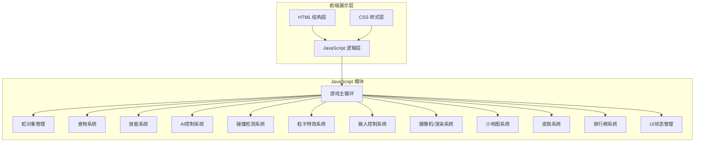

## 1. 架构设计



## 2. 技术说明

- **前端**：原生 HTML5 + CSS3 + JavaScript (ES6+)
- **渲染**：HTML5 Canvas 2D API
- **动画**：requestAnimationFrame 实现60fps平滑动画
- **状态管理**：原生 JavaScript 对象状态机
- **数据存储**：localStorage 存储排行榜和皮肤解锁
- **无后端**：纯前端项目，AI本地模拟

## 3. 文件结构

```
项目根目录/
├── html/
│   └── index.html              # 游戏入口页面
├── css/
│   └── style.css               # 游戏样式
├── js/
│   ├── game.js                 # 游戏主逻辑
│   ├── snake.js                # 蛇对象类（支持技能、特效）
│   ├── ai-snake.js             # AI蛇控制器
│   ├── food.js                 # 多种食物类
│   ├── skills.js               # 技能系统
│   ├── particles.js            # 粒子特效系统
│   ├── camera.js               # 摄像机/渲染系统
│   ├── minimap.js              # 小地图系统
│   ├── skins.js                # 皮肤系统
│   ├── leaderboard.js          # 排行榜系统
│   ├── input.js                # 输入控制
│   └── ui-manager.js           # UI管理器
└── .trae/
    └── documents/
        ├── prd.md
        └── technical.md
```

## 4. 核心数据结构

### 4.1 蛇 (Snake)

```javascript
{
    id: string,
    name: string,
    body: [{x, y}, ...],
    direction: {x, y},
    nextDirection: {x, y},
    baseSpeed: number,
    currentSpeed: number,
    isPlayer: boolean,
    isAlive: boolean,
    skin: SkinData,
    
    // 技能状态
    isBoosting: boolean,
    boostEnergy: number,
    isInvisible: boolean,
    invisibleTimer: number,
    isSlowed: boolean,
    slowTimer: number,
    
    // 统计
    kills: number,
    score: number,
    
    // 特效
    trailParticles: Particle[]
}
```

### 4.2 食物类型

```javascript
{
    type: 'normal' | 'large' | 'poison' | 'invisible',
    x: number,
    y: number,
    color: string,
    value: number,           // 长度增量
    scoreValue: number,      // 分数
    duration: number,        // 效果持续时间(ms)
    pulsePhase: number
}
```

### 4.3 AI 策略

```javascript
{
    type: 'aggressive' | 'evasive' | 'patrol',
    target: null | Snake,
    targetFood: null | Food,
    patrolPoint: {x, y},
    reactionTime: number,
    decisionTimer: number,
    riskThreshold: number
}
```

### 4.4 皮肤系统

```javascript
{
    id: string,
    name: string,
    unlocked: boolean,
    price: number,
    
    // 外观
    headColor: string,
    bodyColors: string[],     // 支持渐变
    bodyGradient: boolean,
    
    // 特效
    hasTrail: boolean,
    trailColor: string,
    hasGlow: boolean,
    glowColor: string,
    particleType: 'sparkle' | 'fire' | 'water' | 'magic'
}
```

### 4.5 游戏状态

```javascript
{
    gameMode: 'classic' | 'battle',
    snakes: Snake[],
    playerSnake: Snake,
    foods: Food[],
    particles: Particle[],
    
    camera: {x, y},
    cameraTarget: Snake,
    fogOfWar: boolean,
    viewRadius: number,
    
    score: number,
    kills: number,
    rank: number,
    gameStatus: 'menu' | 'playing' | 'paused' | 'gameOver',
    
    season: {
        currentSeason: number,
        rating: number,
        gamesPlayed: number,
        wins: number
    }
}
```

## 5. 配置常量

```javascript
{
    // 地图配置
    GRID_SIZE: 15,
    MAP_WIDTH: 200,
    MAP_HEIGHT: 200,
    VIEW_RADIUS: 30,
    
    // 游戏配置
    TICK_RATE: 60,
    BASE_SPEED: 8,
    BOOST_SPEED: 14,
    BOOST_COST_PER_SECOND: 0.5,
    
    // 初始配置
    INITIAL_LENGTH: 5,
    AI_COUNT: 8,
    
    // 食物配置
    FOOD_COUNT: 50,
    NORMAL_FOOD_VALUE: 1,
    LARGE_FOOD_VALUE: 3,
    NORMAL_FOOD_SCORE: 10,
    LARGE_FOOD_SCORE: 50,
    
    // 状态效果
    SLOW_DURATION: 5000,
    INVISIBLE_DURATION: 5000,
    
    // 技能
    MAX_BOOST_ENERGY: 100,
    BOOST_REGEN_RATE: 5,
    
    // 排行
    LEADERBOARD_SIZE: 20,
    SEASON_DURATION_DAYS: 30
}
```

## 6. 碰撞规则

### 6.1 击杀判定
- 蛇头撞到其他蛇的身体 → 被撞者存活，撞者死亡
- 死亡的蛇会变成食物残骸供其他蛇食用
- 击杀者获得被击杀者长度的30%作为奖励

### 6.2 特殊情况
- 隐身状态下被撞 → 正常死亡（隐身在碰撞时解除）
- 加速状态下击杀 → 额外获得20%奖励
- 头碰头相撞 → 两条蛇都死亡

## 7. 性能优化

1. **对象池**：复用粒子和食物对象，减少GC
2. **空间分区**：网格空间索引，优化碰撞检测
3. **视锥剔除**：只渲染视野内的对象
4. **帧率控制**：游戏逻辑与渲染分离
5. **粒子上限**：限制最大粒子数量