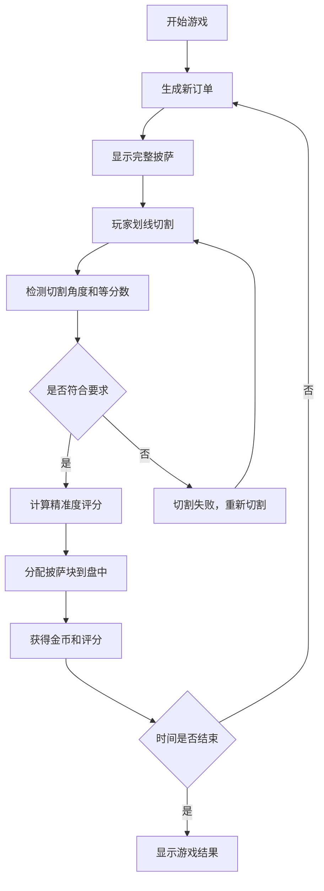

## 1. 产品概述

切披萨烹饪小游戏是一款休闲益智类网页游戏，玩家通过鼠标或手指在披萨上划线切割，按照订单要求将披萨切成指定等分数，在倒计时内完成尽可能多的订单获取高分。

- 核心玩法：模拟真实切披萨体验，考验玩家的精准度和反应速度
- 目标用户：休闲游戏爱好者，适合各年龄段玩家
- 市场价值：轻松有趣的碎片化时间娱乐产品，具有较强的成瘾性和传播性

## 2. 核心功能

### 2.1 用户角色

| 角色 | 注册方式 | 核心权限 |
|------|----------|----------|
| 玩家 | 无需注册 | 进行游戏、查看分数、获取金币 |

### 2.2 功能模块

1. **游戏主界面**：披萨展示区、切割交互区、订单显示区、状态栏
2. **订单系统**：随机生成3/4/6/8等分切割要求
3. **切割系统**：鼠标/触摸划线检测、切割角度识别
4. **评分系统**：根据切割精准度计算得分
5. **奖励系统**：完成订单获得金币和评分
6. **计时系统**：倒计时模式，时间结束统计总分

### 2.3 页面详情

| 页面名称 | 模块名称 | 功能描述 |
|----------|----------|----------|
| 游戏主页面 | 披萨展示区 | 渲染完整披萨及各类配料 |
| 游戏主页面 | 切割交互区 | 支持鼠标/触摸划线切割 |
| 游戏主页面 | 订单显示区 | 显示当前订单要求（等分数） |
| 游戏主页面 | 状态栏 | 显示倒计时、金币数、当前评分 |
| 游戏结束弹窗 | 结果展示 | 显示最终得分、完成订单数、总金币 |
| 游戏结束弹窗 | 重新开始 | 重置游戏状态开始新一局 |

## 3. 核心流程

## 4. 用户界面设计

### 4.1 设计风格

- 主色调：温暖的橙黄色系（#FF9500、#FF6B00）代表披萨和食物
- 辅助色：红色（#FF3B30）代表番茄、绿色（#34C759）代表蔬菜
- 背景色：浅棕色木纹质感，营造餐厅氛围
- 按钮风格：圆角按钮，带有微妙阴影和悬停动效
- 字体：标题使用圆润可爱的字体，正文使用清晰易读的无衬线字体
- 图标风格：食物主题emoji和手绘风格图标
- 整体风格：卡通可爱、温馨治愈的餐厅风格

### 4.2 页面设计概述

| 页面名称 | 模块名称 | UI元素 |
|----------|----------|--------|
| 游戏主页面 | 披萨展示区 | 圆形披萨、随机分布的配料（香肠、蘑菇、青椒、橄榄、芝士） |
| 游戏主页面 | 切割交互区 | 切割线实时绘制、切割完成动画效果 |
| 游戏主页面 | 订单显示区 | 订单卡片、目标等分数图标、示例切割示意图 |
| 游戏主页面 | 状态栏 | 倒计时进度条、金币图标+数字、星级评分显示 |
| 游戏结束弹窗 | 结果展示 | 大号最终分数、完成订单列表、金币总计数 |
| 游戏结束弹窗 | 重新开始 | 醒目的再来一局按钮 |

### 4.3 响应式设计

- 桌面端优先设计，自适应不同屏幕尺寸
- 移动端触摸优化，支持手指滑动切割
- 披萨大小根据屏幕自适应，保持圆形比例
- 按钮最小触控区域44x44px

### 4.4 动效设计

- 披萨出现：弹性缩放动画
- 切割过程：切割线发光效果，轻微震动反馈
- 切割完成：披萨块分离并飞落到盘中的动画
- 获得金币：金币弹出+数字跳动动画
- 倒计时警告：剩余10秒时红色闪烁提示
