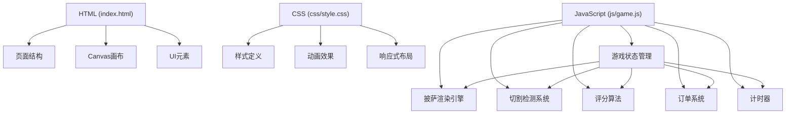

## 1. 架构设计



## 2. 技术描述

- 前端技术栈：原生 HTML5 + CSS3 + JavaScript (ES6+)
- 渲染技术：HTML5 Canvas 2D 用于披萨和切割线绘制
- 无后端依赖，纯前端游戏
- 数据存储：localStorage 存储最高分记录
- 零外部依赖，纯原生实现

## 3. 目录结构

```
切披萨烹饪游戏/
├── index.html              # 主页面
├── css/
│   └── style.css           # 样式文件
├── js/
│   └── game.js             # 游戏核心逻辑
└── .trae/
    └── documents/
        ├── PRD.md          # 产品需求文档
        └── 技术架构.md     # 技术架构文档
```

## 4. 核心数据结构

### 4.1 游戏状态 (GameState)

```javascript
{
  score: number,           // 当前总分
  coins: number,           // 当前金币数
  timeLeft: number,        // 剩余时间（秒）
  currentOrder: Order,     // 当前订单
  pizza: Pizza,            // 当前披萨
  cuts: Cut[],             // 已完成的切割线
  isPlaying: boolean,      // 游戏是否进行中
  completedOrders: number  // 已完成订单数
}
```

### 4.2 订单 (Order)

```javascript
{
  id: string,
  slices: number,          // 目标等分数: 3, 4, 6, 8
  toppings: string[],      // 披萨配料列表
  reward: {
    coins: number,         // 金币奖励
    minScore: number       // 基础分数
  }
}
```

### 4.3 披萨 (Pizza)

```javascript
{
  x: number,               // 中心X坐标
  y: number,               // 中心Y坐标
  radius: number,          // 半径
  toppings: Topping[],     // 配料列表
  slices: Slice[]          // 切割后的披萨块
}
```

### 4.4 切割线 (Cut)

```javascript
{
  startX: number,
  startY: number,
  endX: number,
  endY: number,
  angle: number            // 切割角度（弧度）
}
```

## 5. 核心算法

### 5.1 切割角度检测算法

1. 计算每条切割线的角度：`Math.atan2(endY - startY, endX - startX)`
2. 将角度标准化到 [0, 2π) 范围
3. 对所有切割角度进行排序
4. 计算相邻切割线之间的角度差
5. 理想角度差 = `2π / targetSlices`
6. 精准度评分 = `100 - (平均角度误差 / 理想角度差) * 100`

### 5.2 等分数验证

1. 检测有效切割线数量是否为 `targetSlices / 2`
2. 验证所有相邻角度差是否在误差范围内（±15度）
3. 验证所有切割线是否都经过披萨中心区域

### 5.3 评分公式

```
精准度分 = max(0, 100 - 角度误差 * 2)
基础分 = order.reward.minScore
最终得分 = 基础分 * (精准度分 / 100)
金币奖励 = order.reward.coins * (精准度分 / 100) 取整
```

## 6. 模块职责划分

### 6.1 HTML 模块
- 定义页面基本结构
- 创建 Canvas 元素用于游戏渲染
- 创建 UI 容器（状态栏、订单区、盘子区）
- 创建游戏结束弹窗

### 6.2 CSS 模块
- 全局样式和主题变量定义
- 响应式布局适配
- 动画和过渡效果定义
- 按钮和卡片样式

### 6.3 JavaScript 模块

**Game 类** - 游戏主控
- 初始化游戏状态
- 管理游戏循环
- 处理开始/暂停/结束逻辑

**PizzaRenderer 类** - 披萨渲染
- 绘制披萨底、芝士、酱料
- 绘制各类配料（香肠、蘑菇、青椒、橄榄）
- 绘制切割后的披萨块
- 绘制切割线动画

**CutDetector 类** - 切割检测
- 监听鼠标/触摸事件
- 记录切割路径
- 验证切割有效性
- 计算切割角度

**OrderSystem 类** - 订单管理
- 随机生成新订单
- 验证订单完成条件
- 计算奖励

**ScoreSystem 类** - 评分系统
- 计算切割精准度
- 更新总分和金币
- 存储最高分记录

## 7. 浏览器兼容性

- Chrome 60+
- Firefox 55+
- Safari 12+
- Edge 79+
- 移动端主流浏览器
