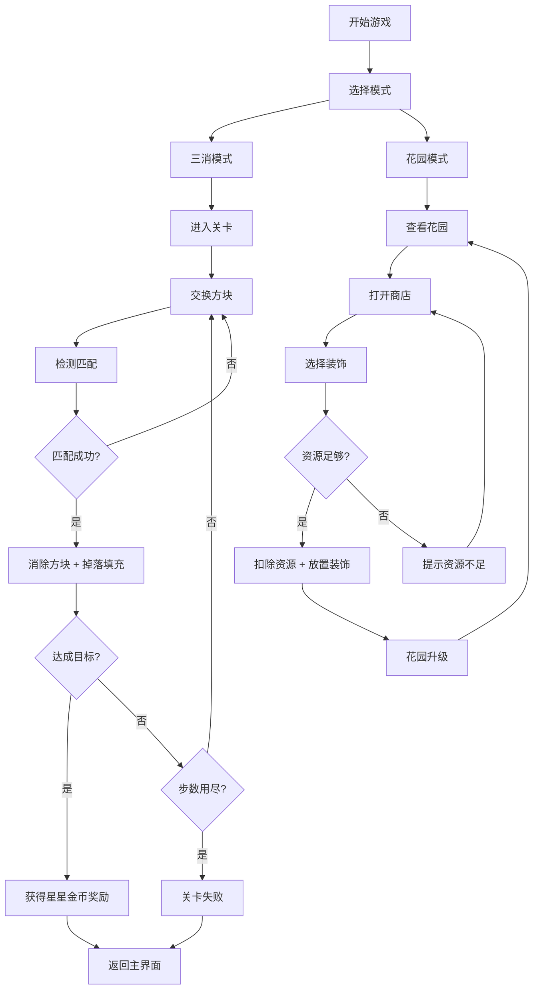

## 1. 产品概述

消消花园是一款结合三消玩法与花园养成的休闲游戏。玩家通过完成三消关卡获取星星和金币，逐步解锁并装饰属于自己的花园，从一片空地打造为繁花似锦的梦幻花园。

- 核心目标：融合消除类游戏的爽快感与养成类游戏的成就感
- 目标用户：休闲游戏爱好者，女性玩家居多，年龄覆盖18-45岁
- 市场价值：在三消品类中加入养成元素，提升用户粘性和留存率

## 2. 核心功能

### 2.1 用户角色

| 角色 | 注册方式 | 核心权限 |
|------|----------|----------|
| 玩家 | 无需注册（本地存储） | 进行三消游戏、购买装饰、建造花园 |

### 2.2 功能模块

1. **三消游戏模块**：棋盘消除、关卡目标、奖励结算
2. **花园养成模块**：装饰购买、花园建造、进度展示
3. **资源系统**：金币、星星、关卡进度管理
4. **界面切换**：在游戏棋盘与花园场景间自由切换

### 2.3 页面详情

| 页面名称 | 模块名称 | 功能描述 |
|----------|----------|----------|
| 主界面 | 导航栏 | 显示金币、星星数量，切换游戏/花园模式 |
| 三消游戏页 | 游戏棋盘 | 8x8消除棋盘，支持拖拽交换方块 |
| 三消游戏页 | 关卡信息 | 显示当前关卡目标、剩余步数 |
| 三消游戏页 | 结算弹窗 | 关卡完成/失败时显示奖励和结果 |
| 花园场景页 | 花园视图 | 展示花园当前状态，可放置装饰 |
| 花园场景页 | 商店面板 | 展示可购买的装饰和建筑，显示价格 |
| 花园场景页 | 放置系统 | 选择装饰后可在花园中放置 |

## 3. 核心流程

## 4. 界面设计

### 4.1 设计风格

- **主色调**：清新绿色系（代表自然和花园），搭配明亮的彩色方块
- **辅助色**：金色（星星）、黄色（金币）
- **按钮风格**：圆润可爱风格，带有轻微阴影和渐变
- **字体**：使用圆润可爱的中文字体，标题加粗醒目
- **布局风格**：卡片式布局，圆角设计，柔和阴影
- **图标风格**：卡通风格emoji图标，色彩鲜艳

### 4.2 页面设计概览

| 页面名称 | 模块名称 | UI元素 |
|----------|----------|--------|
| 主界面 | 导航栏 | 资源显示区（金币、星星）、模式切换按钮 |
| 三消游戏页 | 游戏棋盘 | 8x8彩色方块网格、选中高亮、消除动画 |
| 三消游戏页 | 顶部信息栏 | 关卡号、目标进度条、剩余步数 |
| 三消游戏页 | 结算弹窗 | 通关动画、奖励展示、继续/重玩按钮 |
| 花园场景页 | 花园视图 | 网格布局的花园地块、已放置装饰、空地块提示 |
| 花园场景页 | 商店面板 | 横向滚动的商品列表、价格标签、购买按钮 |
| 花园场景页 | 放置预览 | 拖拽预览、半透明效果、确认放置按钮 |

### 4.3 响应式设计

- 采用桌面优先设计，适配平板和移动端
- 棋盘大小根据屏幕尺寸自适应调整
- 触摸操作优化：增大点击区域，支持滑动交换
- 横屏/竖屏均有良好体验

### 4.4 动画与交互

- 方块消除：缩放消失 + 粒子效果
- 方块掉落：缓动动画
- 奖励获得：弹跳动画 + 数字递增
- 花园装饰放置：淡入效果
- 按钮悬停：缩放 + 阴影加深
