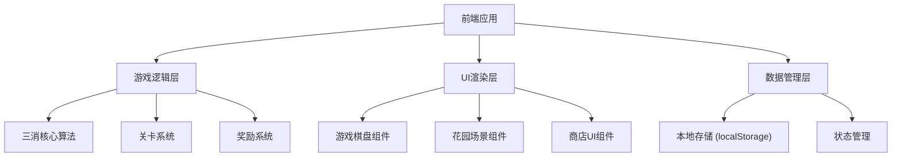

## 1. 架构设计



## 2. 技术选型

- **前端框架**：原生 HTML5 + CSS3 + JavaScript (ES6+)
- **构建工具**：无（纯静态文件，直接运行）
- **样式方案**：CSS3 + CSS Variables
- **动画**：CSS3 Animations + JavaScript 控制
- **数据存储**：localStorage 本地存储
- **图标**：Emoji 表情符号

## 3. 目录结构

```
消消花园三消养成/
├── index.html              # 主入口文件
├── css/
│   ├── style.css           # 主样式文件
│   ├── game.css            # 游戏棋盘样式
│   └── garden.css          # 花园场景样式
├── js/
│   ├── main.js             # 主程序入口
│   ├── game/
│   │   ├── board.js        # 棋盘逻辑
│   │   ├── match.js        # 匹配检测
│   │   └── level.js        # 关卡系统
│   ├── garden/
│   │   ├── garden.js       # 花园管理
│   │   └── shop.js         # 商店系统
│   └── utils/
│       ├── storage.js      # 本地存储
│       └── animation.js    # 动画工具
└── assets/
    └── images/             # 图片资源（如有需要）
```

## 4. 核心模块定义

### 4.1 游戏棋盘模块 (Board)

```javascript
// 棋盘类
class Board {
  constructor(rows, cols) {
    this.rows = rows;
    this.cols = cols;
    this.grid = []; // 二维数组存储方块
    this.selected = null; // 当前选中的方块
  }
  
  init() {} // 初始化棋盘
  swap(row1, col1, row2, col2) {} // 交换方块
  findMatches() {} // 查找匹配
  removeMatches() {} // 移除匹配
  dropBlocks() {} // 方块下落
  fillEmpty() {} // 填充空白
}
```

### 4.2 关卡系统 (Level)

```javascript
// 关卡配置
const LEVELS = [
  {
    id: 1,
    name: "初识花园",
    target: { red: 10, blue: 10 },
    moves: 20,
    reward: { coins: 100, stars: 1 }
  }
];
```

### 4.3 花园系统 (Garden)

```javascript
// 花园数据结构
class Garden {
  constructor() {
    this.grid = []; // 5x5 花园地块
    this.decorations = []; // 已购买的装饰
  }
  
  placeDecoration(row, col, decorationId) {} // 放置装饰
  getAvailableDecorations() {} // 获取可放置的装饰
}
```

### 4.4 商店系统 (Shop)

```javascript
// 商店物品配置
const SHOP_ITEMS = [
  {
    id: "flower_1",
    name: "玫瑰花丛",
    emoji: "🌹",
    price: { coins: 50, stars: 0 },
    description: "美丽的红色玫瑰"
  },
  {
    id: "tree_1",
    name: "小树苗",
    emoji: "🌳",
    price: { coins: 100, stars: 1 },
    description: "一棵茁壮的小树"
  }
];
```

## 5. 数据模型

### 5.1 玩家数据

```javascript
{
  coins: number,           // 金币数量
  stars: number,           // 星星数量
  currentLevel: number,    // 当前关卡
  levelsCompleted: number, // 已完成关卡数
  garden: {
    grid: Array,           // 花园布局
    decorations: Array     // 已拥有装饰
  },
  statistics: {
    totalMatches: number,  // 总消除次数
    totalCoins: number     // 总获得金币
  }
}
```

### 5.2 方块类型

```javascript
const BLOCK_TYPES = [
  { id: "red", color: "#FF6B6B", emoji: "🔴" },
  { id: "blue", color: "#4ECDC4", emoji: "🔵" },
  { id: "green", color: "#95E1A3", emoji: "🟢" },
  { id: "yellow", color: "#FFE66D", emoji: "🟡" },
  { id: "purple", color: "#C44DFF", emoji: "🟣" },
  { id: "orange", color: "#FFA07A", emoji: "🟠" }
];
```

## 6. 状态管理

使用简单的发布订阅模式实现状态管理：

```javascript
class Store {
  constructor(initialState) {
    this.state = initialState;
    this.listeners = [];
  }
  
  setState(newState) {
    this.state = { ...this.state, ...newState };
    this.listeners.forEach(fn => fn(this.state));
  }
  
  subscribe(fn) {
    this.listeners.push(fn);
    return () => {
      this.listeners = this.listeners.filter(l => l !== fn);
    };
  }
}
```
