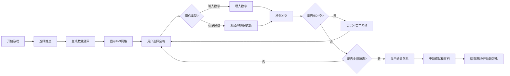

## 1. 产品概述
数独益智游戏是一款经典的数字逻辑游戏，通过在9×9网格中填入1-9数字，锻炼玩家的逻辑思维能力。
- 主要用途：休闲娱乐、脑力训练
- 目标用户：各年龄段的数独爱好者
- 产品价值：提供便捷的在线数独体验，自动检测错误，记录完成时间，支持多种难度和辅助功能

## 2. 核心功能

### 2.1 功能模块
1. **游戏主界面**：9×9数独网格、数字键盘、计时器
2. **难度选择**：简单/中等/困难/专家四级难度
3. **候选数系统**：铅笔标记功能，支持自动填入候选数
4. **提示系统**：检查错误、提示一个格子、显示解法步骤
5. **可视化求解器**：回溯算法演示
6. **每日挑战**：每日一题，连续打卡记录
7. **成就系统**：解锁各类成就
8. **游戏存档**：本地存储游戏进度

### 2.2 页面详情
| 页面名称 | 模块名称 | 功能描述 |
|-----------|-------------|---------------------|
| 游戏主页面 | 数独网格 | 9×9网格，3×3宫格划分，预填数字与可编辑格子，候选数显示 |
| 游戏主页面 | 数字键盘 | 1-9数字输入按钮，清除按钮，候选数模式切换 |
| 游戏主页面 | 游戏信息 | 计时器、难度显示、新游戏按钮、重置按钮 |
| 游戏主页面 | 工具栏 | 难度选择、提示按钮、检查错误、自动候选数、求解器演示 |
| 游戏主页面 | 冲突检测 | 同行/同列/同宫重复数字高亮显示 |
| 游戏主页面 | 通关提示 | 完成时显示恭喜信息和用时 |

## 3. 核心流程
用户打开页面 → 选择难度或继续上次游戏 → 生成/加载数独题目 → 用户点击空格选择 → 输入数字或标记候选数 → 系统自动检测冲突 → 正确填入后继续 → 全部填满且无冲突 → 显示通关信息、用时、成就更新 → 保存进度

## 4. 用户界面设计

### 4.1 设计风格
- **主色调**：深蓝色 (#1e3a5f) - 体现专业与专注
- **辅助色**：金黄色 (#f5a623) - 用于强调和交互元素
- **候选数色**：灰色 (#6b7280) - 小字显示候选数字
- **背景色**：浅灰色渐变 (#f0f4f8) - 营造舒适视觉体验
- **冲突色**：红色 (#e74c3c) - 高亮错误
- **选中色**：浅蓝色 (#3498db) - 标识当前选中单元格
- **提示色**：绿色 (#27ae60) - 提示正确答案
- **按钮风格**：圆角矩形，轻微阴影，悬停效果
- **字体**：现代无衬线字体，数字清晰易读
- **布局风格**：居中对称布局，卡片式设计
- **图标风格**：简洁线性图标

### 4.2 页面设计概述
| 页面名称 | 模块名称 | UI 元素 |
|-----------|-------------|-------------|
| 游戏主页面 | 数独网格 | 边框分明的宫格、不同样式的预填/可编辑/候选数格子、悬停效果、选中高亮、冲突高亮 |
| 游戏主页面 | 数字键盘 | 3×4按钮布局、数字按钮、清除按钮、候选数模式切换按钮 |
| 游戏主页面 | 工具栏 | 难度选择下拉、提示按钮、检查错误、自动候选数、求解器演示按钮 |
| 游戏主页面 | 顶部信息栏 | 计时器显示、难度标签、新游戏按钮、重置按钮 |
| 游戏主页面 | 通关弹窗 | 半透明背景遮罩、居中卡片、恭喜文字、用时显示、成就解锁、再来一局按钮 |

### 4.3 响应性
- 桌面端优先设计
- 适配平板和移动设备
- 触摸友好的按钮尺寸
- 小屏幕下自动调整布局
