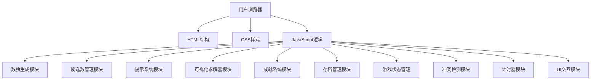

## 1. 架构设计



## 2. 技术描述
- **前端技术栈**：原生 HTML5 + CSS3 + JavaScript (ES6+)
- **初始化方式**：手动创建目录结构和文件
- **构建工具**：无需构建工具，纯静态页面
- **依赖库**：无外部依赖，使用原生API实现所有功能
- **本地存储**：localStorage

## 3. 目录结构

```
数独益智/
├── index.html          # 主页面
├── css/
│   └── style.css       # 样式文件
├── js/
│   └── app.js          # 游戏逻辑
└── .trae/
    └── documents/      # 文档目录
```

## 4. 核心数据结构

### 4.1 数独棋盘数据
```javascript
// 9x9 二维数组存储棋盘状态
type SudokuBoard = number[][];  // 0 表示空格，1-9 表示已填数字

// 候选数数据
type Candidates = Set<number>[][];  // 每个格子的候选数集合

// 游戏状态对象
interface GameState {
  solution: SudokuBoard;           // 完整解
  puzzle: SudokuBoard;             // 题目（含空格）
  currentBoard: SudokuBoard;       // 当前玩家填写状态
  initialCells: boolean[][];       // 标记是否为初始给定格子
  candidates: Candidates;          // 候选数
  selectedCell: {row, col} | null; // 当前选中格子
  isNoteMode: boolean;             // 候选数模式
  difficulty: string;              // 难度级别
  timer: number;                   // 计时器秒数
  timerInterval: any;              // 计时器interval ID
  isComplete: boolean;             // 是否完成
}

// 成就系统
interface Achievements {
  firstWin: boolean;              // 首次通关
  speedWin: boolean;              // 快速通关（<5分钟）
  expertWin: boolean;             // 通关专家难度
  streakDays: number;             // 连续游戏天数
  lastPlayDate: string;           // 上次游戏日期
  totalWins: number;              // 总通关次数
}

// 存档数据
interface SaveData {
  gameState: GameState;           // 游戏状态
  achievements: Achievements;     // 成就数据
  savedAt: number;                // 保存时间戳
}
```

## 5. 核心模块设计

### 5.1 数独生成模块 (SudokuGenerator)
- `generateSolution()`: 生成完整的数独解
- `generatePuzzle(difficulty)`: 基于难度挖空生成题目
- `countSolutions(board)`: 计算解的数量
- 难度对应挖空数量：简单(35-40)、中等(45-50)、困难(50-55)、专家(55-60)

### 5.2 候选数管理模块 (CandidateManager)
- `initCandidates()`: 初始化候选数
- `updateCandidates(row, col, num)`: 更新相关格子候选数
- `autoFillCandidates()`: 自动填入所有候选数
- `toggleCandidate(row, col, num)`: 切换候选数
- `clearCandidates()`: 清除所有候选数

### 5.3 提示系统模块 (HintSystem)
- `checkErrors()`: 检查所有错误，高亮错误格子
- `hintOneCell()`: 提示一个可确定的格子
- `getSolutionStep()`: 获取下一步解法建议

### 5.4 可视化求解器模块 (SolverVisualizer)
- `startVisualization()`: 开始求解可视化
- `pauseVisualization()`: 暂停
- `stepVisualization()`: 单步执行
- `resetVisualization()`: 重置
- 使用异步递归 + 动画展示回溯过程

### 5.5 成就系统模块 (AchievementSystem)
- `initAchievements()`: 初始化成就
- `checkAchievements()`: 检查并更新成就
- `unlockAchievement(name)`: 解锁成就
- `getAchievementDisplay()`: 获取成就显示信息

### 5.6 存档管理模块 (SaveManager)
- `saveGame()`: 保存游戏进度
- `loadGame()`: 加载游戏进度
- `clearSave()`: 清除存档
- `hasSavedGame()`: 检查是否有存档

## 6. 关键算法

### 6.1 数独生成算法
1. 使用回溯法填充完整的9x9数独解
2. 根据难度随机移除格子
3. 验证唯一性：确保题目有唯一解

### 6.2 候选数计算算法
- 对每个空格，遍历1-9，排除同行/同列/同宫已有的数字
- 剩余数字即为候选数

### 6.3 提示算法
- 查找只有唯一候选数的格子
- 或查找行/列/宫中唯一可填某数字的格子
- 返回该格子的正确答案

### 6.4 回溯求解可视化
- 使用异步递归（async/await）
- 每填入一个数字延迟展示（约50-100ms）
- 支持暂停和单步执行
- 高亮当前尝试的格子和数字
