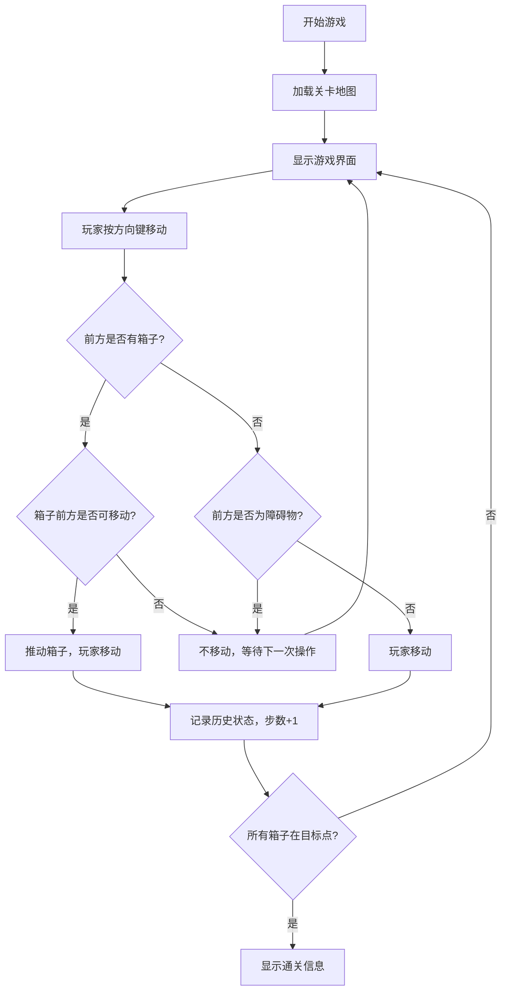

## 1. 产品概述
推箱子（Sokoban）是一款经典的益智解谜游戏，玩家需要在网格地图上将所有箱子推到指定目标点上。
- 主要目的：通过逻辑思维规划移动路径，锻炼空间推理能力
- 目标用户：所有年龄段的益智游戏爱好者

## 2. 核心功能

### 2.1 功能模块
1. **游戏主界面**：网格地图、游戏状态显示、操作提示
2. **关卡系统**：多关卡递进，难度递增
3. **操作控制**：键盘方向键控制玩家移动
4. **撤销功能**：支持无限步撤销回退
5. **步数统计**：实时显示当前步数和关卡号

### 2.2 页面详情
| 页面名称 | 模块名称 | 功能描述 |
|-----------|-------------|---------------------|
| 游戏主界面 | 网格地图 | 显示玩家、箱子、目标点、障碍物 |
| 游戏主界面 | 状态栏 | 显示当前关卡号、总步数 |
| 游戏主界面 | 操作提示 | 显示键盘控制说明、撤销按钮 |
| 游戏主界面 | 通关提示 | 所有箱子到位后显示通关信息 |

## 3. 核心流程
玩家通过方向键控制角色移动，每次移动可以推动前方的箱子。箱子只能推动不能拉动，且前方必须为空地或目标点才能推动。当所有箱子都被推到目标点上时，关卡通关。

## 4. 用户界面设计

### 4.1 设计风格
- **主色调**：深蓝色 (#1a365d) 作为背景，营造专注思考氛围
- **辅助色**：暖橙色 (#ed8936) 用于箱子，绿色 (#48bb78) 用于目标点
- **按钮风格**：圆角矩形，有悬停和点击反馈
- **字体**：使用清晰易读的无衬线字体
- **布局风格**：居中对称布局，游戏区域为视觉焦点

### 4.2 页面设计概述
| 页面名称 | 模块名称 | UI元素 |
|-----------|-------------|-------------|
| 游戏主界面 | 网格地图 | 方格背景、角色图标、箱子图标、目标点标记、墙壁 |
| 游戏主界面 | 状态栏 | 关卡号标签、步数计数器、简洁卡片样式 |
| 游戏主界面 | 控制区 | 撤销按钮、重置按钮、下一关按钮 |

### 4.3 响应性
- 桌面端优先，支持键盘操作
- 移动端适配，支持触摸滑动操作
- 游戏区域自适应屏幕大小
