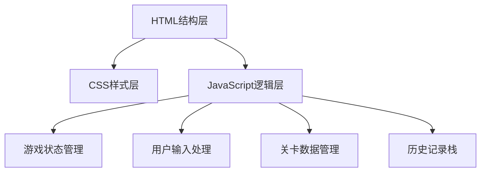

## 1. 架构设计



## 2. 技术说明

- **前端技术栈**: 原生 HTML5 + CSS3 + JavaScript (ES6+)
- **目录结构**: 
  - `index.html` - 入口文件
  - `css/style.css` - 样式文件
  - `js/game.js` - 游戏逻辑
  - `js/levels.js` - 关卡数据

## 3. 目录结构

```
推箱子益智/
├── index.html              # 主页面
├── css/
│   └── style.css          # 样式文件
├── js/
│   ├── game.js            # 游戏核心逻辑
│   └── levels.js          # 关卡数据
└── .trae/
    └── documents/
        ├── PRD.md
        └── technical-architecture.md
```

## 4. 核心数据模型

### 4.1 地图元素定义
```javascript
// 地图元素编码
const TILE = {
  EMPTY: 0,      // 空地
  WALL: 1,       // 墙壁
  TARGET: 2,     // 目标点
  BOX: 3,        // 箱子
  PLAYER: 4,     // 玩家
  BOX_ON_TARGET: 5,  // 箱子在目标点上
  PLAYER_ON_TARGET: 6  // 玩家在目标点上
};
```

### 4.2 游戏状态
```javascript
{
  currentLevel: number,      // 当前关卡号
  moves: number,             // 步数
  map: number[][],           // 当前地图状态
  playerPos: {x, y},         // 玩家位置
  history: state[]           // 历史状态栈（用于撤销）
}
```

### 4.3 关卡数据格式
```javascript
[
  [1,1,1,1,1],
  [1,0,0,0,1],
  [1,0,3,2,1],
  [1,4,0,0,1],
  [1,1,1,1,1]
]
```

## 5. 核心功能模块

### 5.1 游戏初始化模块
- 加载指定关卡地图
- 初始化游戏状态
- 渲染初始画面

### 5.2 移动处理模块
- 监听键盘方向键输入
- 验证移动合法性（边界、墙壁）
- 处理箱子推动逻辑
- 更新游戏状态

### 5.3 撤销功能模块
- 使用栈数据结构保存历史状态
- 每次有效移动前保存当前状态
- 撤销时恢复上一状态

### 5.4 通关检测模块
- 检查所有箱子是否在目标点上
- 触发通关提示

### 5.5 渲染模块
- 根据游戏状态更新DOM
- 使用CSS类控制不同元素样式
