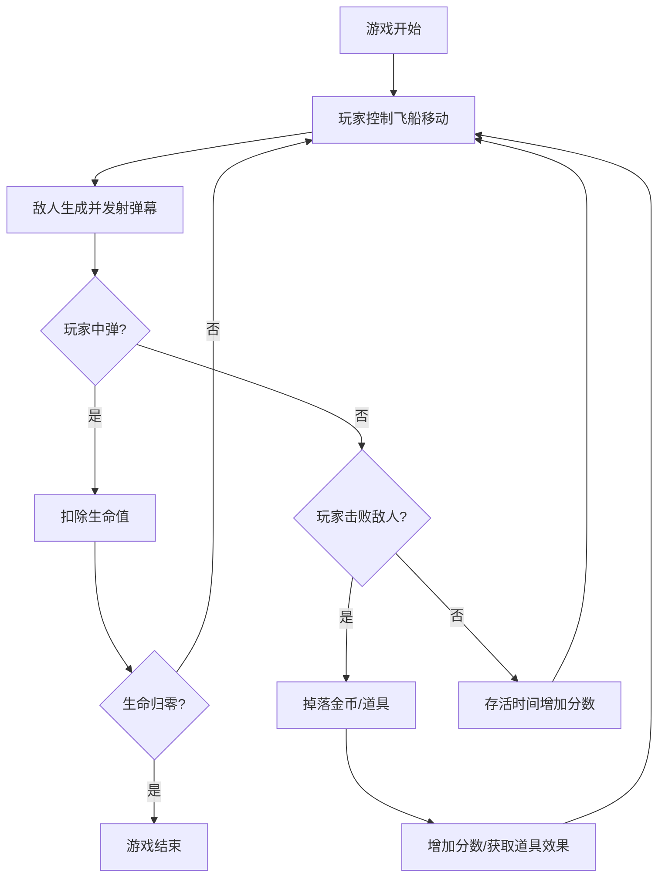

## 1. 产品概述
弹幕射击生存游戏是一款经典的街机风格游戏，玩家控制飞船在弹幕中躲避敌人攻击并击败敌人获取高分。
- 核心玩法：生存 + 射击 + 躲避，考验玩家反应能力和操作技巧
- 目标用户：休闲游戏玩家，喜欢弹幕类游戏的用户

## 2. 核心功能

### 2.1 功能模块
1. **游戏主界面**：游戏画布、分数显示、生命值显示
2. **玩家控制系统**：方向键/WASD 移动，空格键射击
3. **敌人系统**：多种敌人类型，不同弹幕模式
4. **道具系统**：金币收集、生命值恢复、火力增强
5. **游戏状态管理**：开始、暂停、游戏结束

### 2.2 页面详情
| 页面名称 | 模块名称 | 功能描述 |
|---------|---------|----------|
| 游戏主界面 | HUD 显示 | 实时显示分数、生命值、金币数量 |
| 游戏主界面 | 玩家角色 | 位于屏幕底部，可左右移动和上下微调 |
| 游戏主界面 | 敌人区域 | 屏幕上方生成敌人并发射弹幕 |
| 游戏结束界面 | 结算面板 | 显示最终分数、存活时间、重新开始按钮 |

## 3. 核心流程

## 4. 用户界面设计

### 4.1 设计风格
- **主色调**：深邃太空黑 (#0a0a1a) + 霓虹蓝 (#00ffff) + 霓虹粉 (#ff00ff)
- **辅助色**：警告红 (#ff4444)、金币黄 (#ffd700)、生命绿 (#00ff88)
- **字体**：像素风格字体 Press Start 2P，营造复古街机氛围
- **视觉效果**：发光效果、粒子特效、屏幕震动

### 4.2 页面设计概述
| 页面名称 | 模块名称 | UI 元素 |
|---------|---------|---------|
| 游戏主界面 | 游戏画布 | 全屏 Canvas，星空背景，动态粒子 |
| 游戏主界面 | HUD | 左上角分数、右上角生命值、金币数量 |
| 游戏主界面 | 玩家飞船 | 霓虹风格飞船，尾焰粒子效果 |
| 游戏主界面 | 敌人 | 多种颜色和形状，发光边框 |
| 游戏结束界面 | 结算面板 | 半透明背景，霓虹边框，大字体分数显示 |

### 4.3 响应式
- 桌面端：全屏游戏，键盘控制
- 自适应游戏画布大小，保持宽高比

## 5. 交互设计
- **移动**：WASD 或方向键控制飞船移动，支持斜向移动
- **射击**：按住空格键自动连续射击
- **暂停**：ESC 键暂停/继续游戏
- **反馈**：中弹时屏幕闪烁红色，获得道具时播放粒子特效
