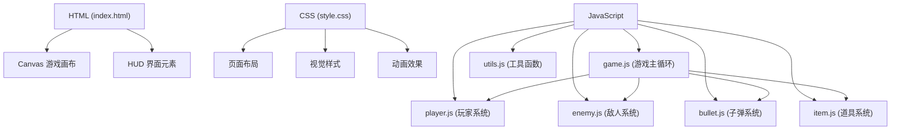

## 1. 架构设计



## 2. 技术描述
- **前端技术栈**：原生 HTML5 + CSS3 + JavaScript (ES6+)
- **渲染引擎**：HTML5 Canvas 2D API
- **无外部依赖**：纯原生实现，无需安装任何 npm 包
- **目录结构**：
  - `index.html` - 游戏入口页面
  - `css/style.css` - 样式文件
  - `js/` - JavaScript 模块目录

## 3. 目录结构
```
弹幕射击生存/
├── index.html              # 主页面
├── css/
│   └── style.css           # 样式文件
├── js/
│   ├── game.js             # 游戏主控制器
│   ├── player.js           # 玩家类
│   ├── enemy.js            # 敌人类
│   ├── bullet.js           # 子弹类
│   ├── item.js             # 道具类
│   └── utils.js            # 工具函数
└── .trae/
    └── documents/
        ├── prd.md
        └── tech_arch.md
```

## 4. 核心模块设计

### 4.1 Game 模块 (game.js)
- 游戏主循环 (requestAnimationFrame)
- 碰撞检测系统
- 游戏状态管理 (开始/运行/暂停/结束)
- 分数和生命值管理
- 按键事件监听

### 4.2 Player 模块 (player.js)
- 位置和速度属性
- 移动控制方法 (moveUp/moveDown/moveLeft/moveRight)
- 射击方法 (shoot)
- 生命值管理
- 碰撞盒定义

### 4.3 Enemy 模块 (enemy.js)
- 多种敌人类型配置
- 移动模式 (直线/正弦/追踪)
- 弹幕发射模式 (单发/散射/圆形)
- 生命值和掉落概率

### 4.4 Bullet 模块 (bullet.js)
- 玩家子弹和敌人子弹区分
- 位置更新
- 速度和方向控制
- 碰撞检测

### 4.5 Item 模块 (item.js)
- 金币收集
- 生命值恢复道具
- 火力增强道具
- 道具自动吸引效果

## 5. 游戏参数配置

| 参数 | 数值 | 说明 |
|------|------|------|
| 玩家初始生命 | 3 | 初始生命值 |
| 玩家移动速度 | 5 | 像素/帧 |
| 射击间隔 | 150ms | 连续射击冷却时间 |
| 敌人生成间隔 | 1000ms | 随时间缩短 |
| 子弹速度 | 8 | 玩家子弹速度 |
| 敌人子弹速度 | 3-6 | 敌人子弹速度 |
| 分数增加速率 | 10/秒 | 存活时间加分 |

## 6. 性能优化
- 对象池复用子弹和敌人对象
- 离屏渲染减少重绘开销
- 合理的碰撞检测范围优化
- 粒子效果数量限制
