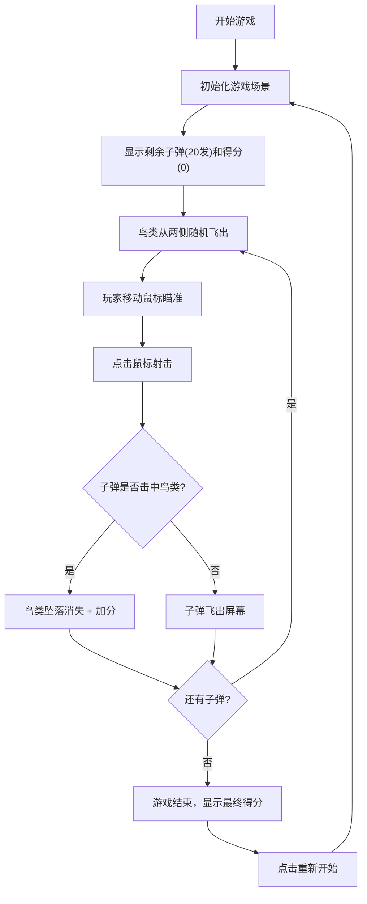

## 1. 产品概述

捕鸟达人射击游戏是一款休闲射击类网页游戏，玩家通过移动鼠标控制准星瞄准并射击屏幕上随机飞出的鸟类，体验经典狩猎游戏的乐趣。

- 主要目的：提供简单有趣的休闲射击体验
- 目标用户：各年龄段休闲游戏玩家
- 产品价值：轻量化、无需安装、即开即玩的网页游戏

## 2. 核心功能

### 2.1 功能模块

1. **游戏主界面**：游戏画布、UI信息展示、准星
2. **鸟类生成系统**：多种鸟类随机生成、不同飞行轨迹
3. **射击系统**：鼠标瞄准、子弹发射、碰撞检测
4. **计分系统**：击中加分、不同鸟类分值不同
5. **资源管理**：子弹数量限制、游戏结束判定

### 2.2 页面详情

| 页面名称 | 模块名称 | 功能描述 |
|-----------|-------------|---------------------|
| 游戏主界面 | 游戏画布 | 显示天空背景、飞行的鸟类、子弹轨迹 |
| 游戏主界面 | 准星系统 | 跟随鼠标移动的十字准星，提供瞄准反馈 |
| 游戏主界面 | 信息面板 | 显示剩余子弹数、当前得分、游戏状态 |
| 游戏主界面 | 射击效果 | 点击时的射击动画、击中效果 |
| 游戏主界面 | 游戏结束 | 子弹用完时显示最终得分和重新开始按钮 |

## 3. 核心流程

### 3.1 游戏流程

## 4. 用户界面设计

### 4.1 设计风格

- **主色调**：天空蓝渐变（#87CEEB → #4A90D9），营造自然天空氛围
- **点缀色**：橙红色（#FF6B35）用于准星和重要UI元素
- **中性色**：白色、深灰色用于文字和信息面板
- **整体风格**：卡通休闲风格，色彩明快，元素生动

### 4.2 页面设计概述

| 页面名称 | 模块名称 | UI元素 |
|-----------|-------------|-------------|
| 游戏主界面 | 游戏画布 | 渐变天空背景、云朵装饰、动态飞鸟 |
| 游戏主界面 | 准星系统 | 十字准星+中心点，跟随鼠标平滑移动 |
| 游戏主界面 | 信息面板 | 顶部信息栏，半透明背景，图标+数字显示 |
| 游戏主界面 | 射击效果 | 点击时的圆形扩散动画、击中时的羽毛效果 |
| 游戏主界面 | 游戏结束 | 居中弹窗，显示最终得分，重新开始按钮 |

### 4.3 响应性

- 采用Canvas自适应布局，保持游戏区域比例
- UI元素使用相对定位，适配不同屏幕尺寸
- 确保在主流浏览器（Chrome、Firefox、Safari、Edge）正常运行

### 4.4 动画效果

- 鸟类飞行：翅膀扇动动画、身体上下浮动
- 击中效果：坠落旋转动画、羽毛飘散粒子
- 射击反馈：点击瞬间的准星缩放、枪口闪光
- 界面过渡：游戏结束弹窗的淡入效果
