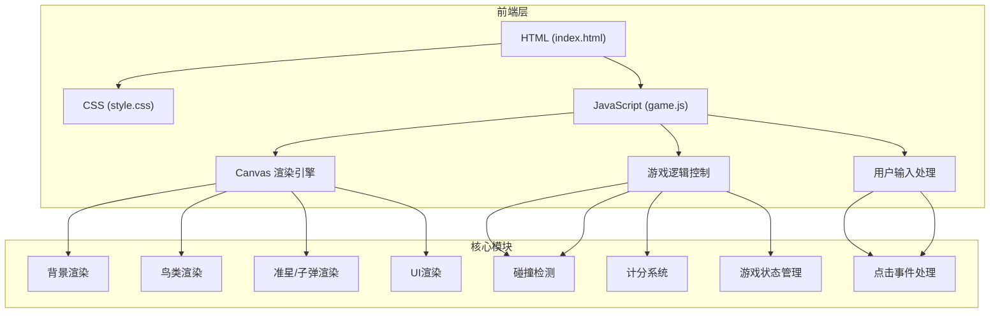

## 1. 架构设计



## 2. 技术描述

- **前端技术栈**：原生 HTML5 + CSS3 + JavaScript (ES6+)
- **渲染技术**：HTML5 Canvas 2D API
- **目录结构**：
  - `/index.html` - 主入口HTML文件
  - `/css/style.css` - 样式文件
  - `/js/game.js` - 游戏核心逻辑
- **无后端依赖**：纯前端游戏，无需服务器支持

## 3. 目录结构

```
捕鸟达人射击/
├── index.html          # 主页面
├── css/
│   └── style.css       # 样式文件
├── js/
│   └── game.js         # 游戏核心逻辑
└── .trae/
    └── documents/      # 项目文档
```

## 4. 核心数据模型

### 4.1 鸟类配置

| 鸟类类型 | 分值 | 飞行速度 | 大小 | 出现概率 |
|---------|------|---------|------|---------|
| 野鸭 | 10分 | 中等 | 中 | 高 |
| 鸽子 | 15分 | 较慢 | 小 | 中 |
| 老鹰 | 25分 | 较快 | 大 | 低 |

### 4.2 游戏状态

```javascript
{
  score: number,           // 当前得分
  bullets: number,         // 剩余子弹数
  maxBullets: number,      // 最大子弹数(20)
  isGameOver: boolean,     // 游戏是否结束
  birds: Bird[],           // 当前飞行的鸟类数组
  bulletsArray: Bullet[],  // 当前飞行的子弹数组
  crosshair: {             // 准星位置
    x: number,
    y: number
  }
}
```

### 4.3 鸟类对象

```javascript
{
  id: number,
  type: string,            // 'duck' | 'pigeon' | 'eagle'
  x: number,
  y: number,
  width: number,
  height: number,
  speedX: number,
  speedY: number,
  score: number,
  wingPhase: number,       // 翅膀动画相位
  isHit: boolean,          // 是否被击中
  fallSpeed: number        // 坠落速度
}
```

### 4.4 子弹对象

```javascript
{
  id: number,
  x: number,
  y: number,
  targetX: number,
  targetY: number,
  speed: number,
  isActive: boolean
}
```

## 5. 核心函数定义

| 函数名 | 功能描述 |
|--------|---------|
| `initGame()` | 初始化游戏状态，重置分数和子弹 |
| `spawnBird()` | 随机生成新的鸟类 |
| `updateBirds()` | 更新所有鸟类位置和动画 |
| `shoot(targetX, targetY)` | 发射子弹到目标位置 |
| `updateBullets()` | 更新子弹位置，检测碰撞 |
| `checkCollision(bird, bullet)` | 检测子弹与鸟类的碰撞 |
| `render()` | 渲染所有游戏元素到Canvas |
| `gameLoop()` | 游戏主循环，更新+渲染 |
| `showGameOver()` | 显示游戏结束界面 |
