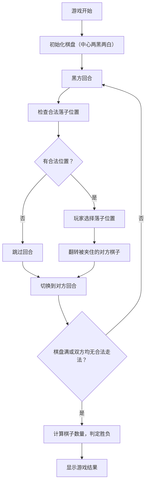

## 1. 产品概述
黑白棋（翻转棋）游戏应用，提供标准规则的双人对战体验。
- 主要目的：让用户可以在网页上体验经典的黑白棋游戏
- 目标用户：喜欢策略棋类游戏的玩家

## 2. 核心功能

### 2.1 功能模块
1. **游戏主界面**：8×8 棋盘、棋子显示、计分面板
2. **游戏逻辑**：落子验证、棋子翻转、回合切换、游戏结束判定

### 2.2 页面详情
| 页面名称 | 模块名称 | 功能描述 |
|-----------|-------------|---------------------|
| 游戏主页 | 棋盘区域 | 标准8×8棋盘，显示黑白棋子，高亮合法落子位置 |
| 游戏主页 | 计分面板 | 显示双方当前棋子数量，当前回合提示 |
| 游戏主页 | 游戏控制 | 重新开始按钮，游戏状态显示 |

## 3. 核心流程

## 4. 用户界面设计
### 4.1 设计风格
- **主色调**：深绿色棋盘背景（经典棋盘风格），米白色边框
- **棋子颜色**：纯黑、纯白，带轻微3D效果
- **按钮风格**：圆角矩形，悬浮效果
- **字体**：现代无衬线字体，清晰易读
- **布局风格**：居中布局，棋盘为视觉中心

### 4.2 页面设计概述
| 页面名称 | 模块名称 | UI Elements |
|-----------|-------------|-------------|
| 游戏主页 | 棋盘区域 | 8×8网格，绿色背景，木纹边框，棋子翻转动画 |
| 游戏主页 | 计分面板 | 两侧显示黑白棋子图标和数量，当前回合高亮 |
| 游戏主页 | 游戏控制 | 底部重新开始按钮，游戏状态文字提示 |

### 4.3 响应性
- Desktop-first 设计，棋盘固定尺寸
- 移动端自适应，棋盘尺寸根据屏幕调整
- 触摸操作优化

### 4.4 动画效果
- 棋子放置动画
- 棋子翻转动画（3D翻转效果）
- 合法落子位置提示动画（呼吸效果）
- 游戏结束结果显示动画
