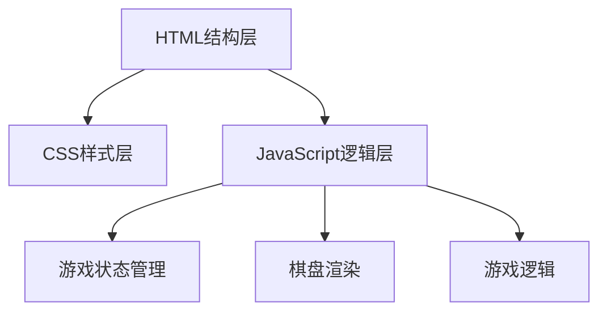

## 1. 架构设计


## 2. 技术描述
- **前端**：原生 HTML5 + CSS3 + JavaScript (ES6+)
- **构建工具**：无构建工具，直接浏览器运行
- **目录结构**：
  - `index.html` - 主页面入口
  - `css/` - 样式文件目录
  - `js/` - JavaScript 脚本目录

## 3. 目录结构
```
黑白棋翻转棋/
├── index.html
├── css/
│   └── style.css
└── js/
    └── game.js
```

## 4. 核心数据结构
### 4.1 棋盘状态
```javascript
// 8x8 二维数组
// 0: 空, 1: 黑棋, 2: 白棋
const board = [
  [0, 0, 0, 0, 0, 0, 0, 0],
  [0, 0, 0, 0, 0, 0, 0, 0],
  [0, 0, 0, 0, 0, 0, 0, 0],
  [0, 0, 0, 2, 1, 0, 0, 0],
  [0, 0, 0, 1, 2, 0, 0, 0],
  [0, 0, 0, 0, 0, 0, 0, 0],
  [0, 0, 0, 0, 0, 0, 0, 0],
  [0, 0, 0, 0, 0, 0, 0, 0]
];
```

### 4.2 游戏状态
```javascript
const gameState = {
  currentPlayer: 1,  // 1: 黑方, 2: 白方
  blackCount: 2,
  whiteCount: 2,
  isGameOver: false,
  winner: null,      // 1, 2, or 'draw'
  validMoves: []     // 当前玩家的合法落子位置
};
```

## 5. 核心函数定义
| 函数名 | 功能描述 | 参数 | 返回值 |
|--------|----------|------|--------|
| `initGame()` | 初始化游戏 | 无 | 无 |
| `getValidMoves(player)` | 获取指定玩家的所有合法落子位置 | player: 1\|2 | Array<{row, col}> |
| `isValidMove(row, col, player)` | 检查指定位置是否为合法落子 | row, col, player | boolean |
| `makeMove(row, col)` | 在指定位置落子并翻转棋子 | row, col | boolean（是否成功） |
| `flipPieces(row, col, player)` | 翻转被夹住的对方棋子 | row, col, player | 无 |
| `countPieces()` | 计算双方棋子数量 | 无 | {black, white} |
| `checkGameOver()` | 检查游戏是否结束 | 无 | boolean |
| `switchPlayer()` | 切换当前玩家 | 无 | 无 |
| `renderBoard()` | 渲染棋盘到DOM | 无 | 无 |
| `updateScore()` | 更新分数显示 | 无 | 无 |
