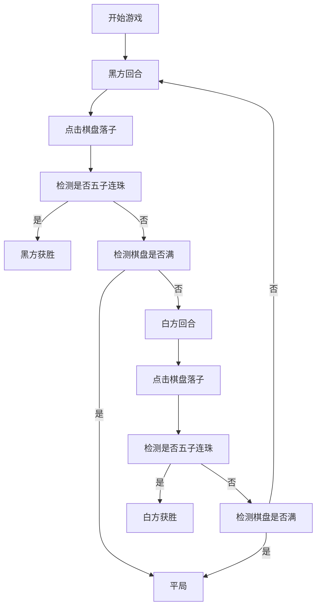

## 1. 产品概述
双人五子棋游戏是一款经典的两人对弈棋类游戏，提供简洁优雅的网页版体验。
- 主要目的：为用户提供一个可以双人对战的五子棋游戏平台
- 目标用户：所有喜欢五子棋的休闲游戏玩家
- 市场价值：传承经典棋类游戏，提供便捷的网页对战体验

## 2. 核心功能

### 2.1 功能模块
1. **游戏主页面**：棋盘展示、游戏状态显示、游戏控制

### 2.2 页面详情
| 页面名称 | 模块名称 | 功能描述 |
|-----------|-------------|---------------------|
| 游戏主页面 | 15×15棋盘 | 标准围棋棋盘，玩家点击交叉点落子 |
| 游戏主页面 | 状态显示 | 显示当前执子方、走棋步数 |
| 游戏主页面 | 游戏控制 | 显示胜负结果、平局判定 |

## 3. 核心流程
玩家打开游戏页面，黑方先行，双方轮流在棋盘交叉点点击落子。系统自动检测是否有五子连珠（横、竖、斜任意方向），若有则判定该方获胜；若棋盘满格仍无人获胜，则判定为平局。最后一手棋子高亮显示。

## 4. 用户界面设计

### 4.1 设计风格
- **主色调**：深木色棋盘背景，体现传统围棋文化
- **辅助色**：黑色和白色棋子，经典配色
- **高亮色**：红色标记最后一手落子位置
- **字体**：优雅的衬线字体，体现传统韵味
- **布局**：居中对称布局，棋盘为视觉中心
- **整体风格**：简约优雅，传统与现代结合

### 4.2 页面设计概述
| 页面名称 | 模块名称 | UI元素 |
|-----------|-------------|-------------|
| 游戏主页面 | 标题区域 | 游戏名称、副标题 |
| 游戏主页面 | 状态区域 | 当前执子方指示、步数统计 |
| 游戏主页面 | 棋盘区域 | 15×15木质棋盘、黑白棋子、高亮标记 |
| 游戏主页面 | 结果区域 | 获胜提示、平局提示 |

### 4.3 响应式
- 桌面端优先设计
- 棋盘自适应屏幕大小
- 移动端保持棋盘可点击区域大小
