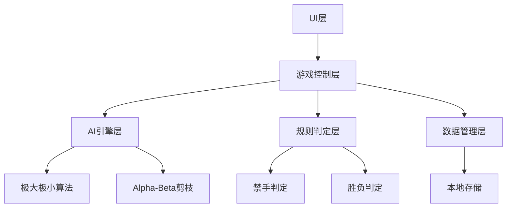

## 1. 架构设计（增强版）



## 2. 新增功能模块

### 2.1 AI引擎模块
- **极大极小算法**: 搜索最佳走法
- **Alpha-Beta剪枝**: 优化搜索效率
- **评估函数**: 局面打分（活四、冲四、活三等）
- **搜索深度**: 可配置（2-4层）

### 2.2 禁手规则模块
- **三三禁手**: 同时形成两个活三
- **四四禁手**: 同时形成两个四
- **长连禁手**: 形成6子及以上连珠
- 仅对黑棋生效

### 2.3 历史记录模块
- **走法栈**: 保存所有历史走法
- **悔棋功能**: 支持多步撤销
- **棋谱回放**: 逐步回放对局

### 2.4 主题系统模块
- 木质主题（默认）
- 经典黑白主题
- 海洋蓝色主题
- 抹茶绿色主题

### 2.5 棋谱导出模块
- **SGF格式导出**: 标准棋谱格式
- **本地下载**: 导出为.sgf文件

### 2.6 AI分析模块
- **推荐走法**: AI推荐的最佳位置
- **胜率评估**: 当前局面胜率
- **候选点高亮**: 显示热门落子点

### 2.7 音效模块
- 落子音效
- 获胜音效
- 禁手提示音效

## 3. 新增文件结构
```
双人五子棋/
├── html/
│   └── index.html
├── css/
│   └── style.css
├── js/
│   ├── game.js          # 主游戏逻辑
│   ├── ai.js            # AI引擎
│   ├── rules.js         # 规则判定（含禁手）
│   ├── history.js       # 历史记录和回放
│   ├── themes.js        # 主题系统
│   ├── sgf.js           # SGF导出
│   └── audio.js         # 音效系统
└── assets/
    └── sounds/          # 音效文件
```

## 4. 核心数据结构扩展

### 4.1 游戏状态扩展
```javascript
const gameState = {
  // ...原有字段
  mode: 'pvp',           // 'pvp' | 'pve'
  aiLevel: 2,            // AI难度 1-3
  history: [],           // 走法历史
  currentMoveIndex: -1,  // 当前回放位置
  forbiddenRule: true,   // 是否启用禁手
  theme: 'wood'          // 当前主题
};
```

### 4.2 走法记录
```javascript
{
  x: number,
  y: number,
  player: 1|2,
  timestamp: number,
  isForbidden?: boolean
}
```
