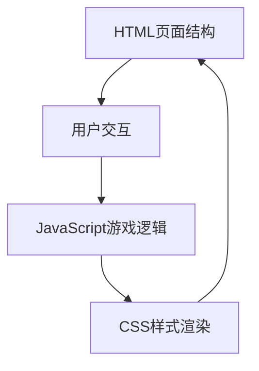

## 1. 架构设计



## 2. 技术描述
- **前端技术栈**：原生 HTML5 + CSS3 + JavaScript (ES6+)
- **无后端**：纯前端实现，所有逻辑在浏览器端运行
- **目录结构**：
  - `html/` - 存放 HTML 文件
  - `css/` - 存放 CSS 样式文件
  - `js/` - 存放 JavaScript 逻辑文件

## 3. 目录结构
```
双人五子棋/
├── html/
│   └── index.html
├── css/
│   └── style.css
└── js/
    └── game.js
```

## 4. 核心数据结构

### 4.1 棋盘数据
```javascript
// 15x15 棋盘数组，0表示空，1表示黑子，2表示白子
const board = Array(15).fill(null).map(() => Array(15).fill(0));
```

### 4.2 游戏状态
```javascript
const gameState = {
  currentPlayer: 1,  // 1: 黑方, 2: 白方
  moveCount: 0,      // 走棋步数
  lastMove: null,    // 最后一手位置 {x, y}
  gameOver: false,   // 游戏是否结束
  winner: null       // 获胜方 1|2|null
};
```

## 5. 核心函数定义

| 函数名 | 参数 | 返回值 | 功能描述 |
|--------|------|--------|----------|
| `initGame()` | 无 | 无 | 初始化游戏，重置棋盘和状态 |
| `placePiece(x, y)` | x: 列坐标, y: 行坐标 | boolean | 在指定位置落子，返回是否成功 |
| `checkWin(x, y, player)` | x, y: 位置, player: 玩家 | boolean | 检测该玩家是否获胜 |
| `checkDirection(x, y, dx, dy, player)` | dx, dy: 方向向量 | number | 统计某方向连续棋子数 |
| `checkDraw()` | 无 | boolean | 检测是否为平局 |
| `renderBoard()` | 无 | 无 | 渲染棋盘到页面 |
| `updateStatus()` | 无 | 无 | 更新游戏状态显示 |
